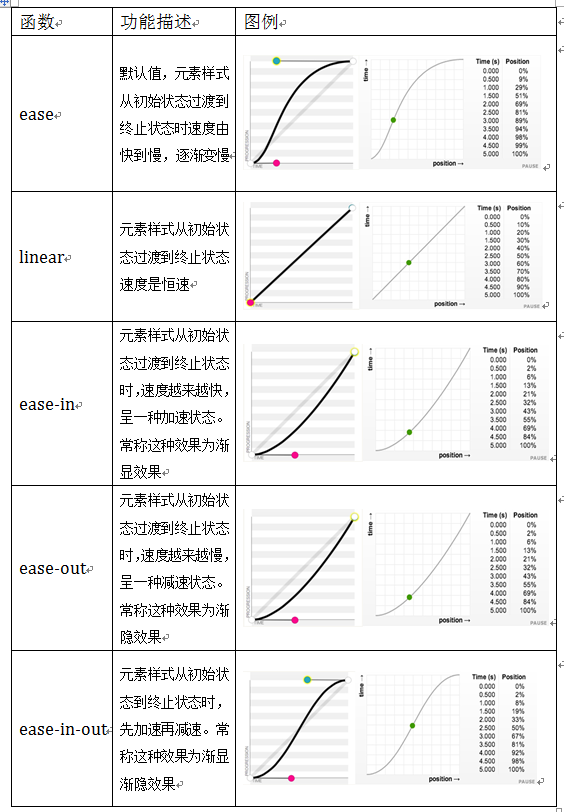

# Css3

## Css3_中新特性样式篇

### 背景

| background-origin：   | 规定背景图片的定位区域。                                     |
| --------------------- | ------------------------------------------------------------ |
| 属性值 :              |                                                              |
| padding-box（默认值） | 背景图像相对内边距定位                                       |
| border-box            | 背景图像相对边框定位【以边框左上角为参照进行位置设置】       |
| content-box           | 背景图像相对内容区域定位【以内容区域左上角为参照进行位置设置】 |

备注：	

默认背景图片是在盒子的内边距左上角对齐。

如果是文本 , 默认是内容区域(content)

| background-clip：   | 规定背景的绘制区域。                                         |
| ------------------- | ------------------------------------------------------------ |
| 属性值 :            | clip:裁剪 (这里是直接裁掉)                                   |
| border-box (默认值) | 背景被裁切到边框盒子位置                                     |
| padding-box         | 背景被裁切到内边距区域【将背景图片在内边距区域（包含内容区域）显示】 |
| content-box         | 背景被裁切到内容区域【将背景图片在内容区域显示】             |

备注 : 

会裁掉多余的部分 , 有需要时可以配合background-origin使用

| background-size： | 规定背景图片的尺寸。                                         |
| ----------------- | ------------------------------------------------------------ |
| 属性值 :          |                                                              |
| 固定值: 10px      | 百分百: 100%                                                 |
| cover             | 将背景图片按照原来的缩放比 , 将整个容器铺满                  |
| contain           | 将背景图片按照原来的缩放比 , 完整的显示到容器中(不确定容器是否会被填充满) |

### 边框

| 新增 :          |          |
| --------------- | -------- |
| border-radius： | 边框圆角 |
| border-image:   | 边框图片 |
| box-shadow：    | 盒子阴影 |

```css
border-image:　边框图片

	/* 设置边框图片 */
	border-image-source: url("2.png");

	/* 边框图片裁切 : 不需要带单位*/
	border-image-slice: 20;

	/* 设置边框图片的平铺方式 */
	/* border-image-repeat: stretch; */
	border-image-repeat: round;
	／*  border-image-repeat: repeat; */

	border-image-width: 20px;
```

### 文本阴影

```
text-shadow : 设置文本阴影	
```

## Css3_新特性之选择器篇

备注:　（w3c规范） :　

一个 : 是伪类

两个:: 是伪元素　（伪元素，两个冒号，如果只写一个冒号，浏览器会自动补全）

伪类和伪元素的区别: 

伪类是一个选择器,

伪元素可以理解为是一个元素 , 只不过是通过css代码去实现的

### 属性选择器

```
属性选择器：
	[属性名=值] {}
	[属性名] {}	   匹配对应的属性即可
	[属性名^=值] {}    以值开头
	[属性名*=值] {}    包含
	[属性名$=值] {}	   以值结束
```

### 结构伪类选择器

```css
:first-child {} - 选中父元素中第一个子元素 (必须是第一个,前面不能有其它元素)
:last-child {} - 选中父元素中最后一个子元素 (必须是最后一个,后面不能有其它元素)

-------------

:nth-child(n) {} - 选中父元素中正数第n个子元素 
:nth-last-child(n) {} - 选中父元素中倒数第n个子元素
备注：　
选中父元素的整数第Ｎ个元素，与:nth-child前面的元素没关系,
更多是通过定位他的父级元素来选中第几个子元素

n 可以设置预定义的值 (n 的取值大于等于0)
	odd[选中奇数位置的元素]  
	even【选中偶数位置的元素】
n 可以是一个表达式：
    an+b的格式 例如: 2n+1
```

### 其他选择器

```css
	:target       -被锚链接指向的时候会触发该选择器 (比如a标签调到指定标签的地方的时候 , 跳转后生效)
	::selection	  -当被用户鼠标选中的时候的样式 (比如文字被选中)
	::first-line  - 选中第一行 (选中内容的第一行)
	::first-letter - 选中第一个字符 (选中内容的第一个字符)
```

## CSS3新特性之颜色渐变

备注 :　渐变一般是当背景（background-image）

既然是背景 , 就可以通过: background-size改变大小

### 线性渐变

```css
线性渐变：linear-gradient()
	1. 渐变的方向
		1. to + right | top | bottom | left 
		2. 通过角度表示一个方向
			0deg  [从下向上渐变] 
			90deg [从左到右]
	2. 开始颜色和结束颜色
	3. 渐变的范围
		比如: red 50% (表示红色开百分之50的地方开始渐变)
```

### 镜像渐变

```css
径向渐变：radial-gradient()
		   /* 径向渐变 */
			background-image: radial-gradient(
				 100px at center, /* 表示在圆形画100px的圆 */
				 red,
				 blue
			);
```

## 2D转换

### 属性

| 属性                                                         | 描述                         |
| ------------------------------------------------------------ | ---------------------------- |
| [transform](http://www.w3school.com.cn/cssref/pr_transform.asp) | 向元素应用 2D 或 3D 转换。   |
| [transform-origin](http://www.w3school.com.cn/cssref/pr_transform-origin.asp) | 允许你改变被转换元素的位置。 |

### 2D Transform 方法

| 函数                            | 描述                                                     |
| ------------------------------- | -------------------------------------------------------- |
| matrix(*n*,*n*,*n*,*n*,*n*,*n*) | 定义 2D 转换，使用六个值的矩阵。                         |
| translate(*x*,*y*)              | 定义 2D 转换，沿着 X 和 Y 轴移动元素。                   |
| translateX(*n*)                 | 定义 2D 转换，沿着 X 轴移动元素。                        |
| translateY(*n*)                 | 定义 2D 转换，沿着 Y 轴移动元素。                        |
| scale(*x*,*y*)                  | 定义 2D 缩放转换，改变元素的宽度和高度。(2d缩放x轴和y轴) |
| scaleX(*n*)                     | 定义 2D 缩放转换，改变元素的宽度。(2d缩放x轴)            |
| scaleY(*n*)                     | 定义 2D 缩放转换，改变元素的高度。(2d缩放y轴)            |
| rotate(*angle*)                 | 定义 2D 旋转，在参数中规定角度。                         |
| skew(*x-angle*,*y-angle*)       | 定义 2D 倾斜转换，沿着 X 和 Y 轴。                       |
| skewX(*angle*)                  | 定义 2D 倾斜转换，沿着 X 轴。                            |
| skewY(*angle*)                  | 定义 2D 倾斜转换，沿着 Y 轴。                            |

## 3D 转换

备注 :

transform-style: preserve-3d;　－　将平面图形转换为立体图形 (一般在父元素身上使用)

perspective :  

​	perspective 属性定义 3D 元素距视图的距离，以像素计。 

​	例如: perspective : 300  (不需要带单位)

#### 转换属性

| 属性                                                         | 描述                                 |
| ------------------------------------------------------------ | ------------------------------------ |
| [transform](http://www.w3school.com.cn/cssref/pr_transform.asp) | 向元素应用 2D 或 3D 转换。           |
| [transform-origin](http://www.w3school.com.cn/cssref/pr_transform-origin.asp) | 允许你改变被转换元素的位置。         |
| [transform-style](http://www.w3school.com.cn/cssref/pr_transform-style.asp) | 规定被嵌套元素如何在 3D 空间中显示。 |
| [perspective](http://www.w3school.com.cn/cssref/pr_perspective.asp) | 规定 3D 元素的透视效果。             |
| [perspective-origin](http://www.w3school.com.cn/cssref/pr_perspective-origin.asp) | 规定 3D 元素的底部位置。             |
| [backface-visibility](http://www.w3school.com.cn/cssref/pr_backface-visibility.asp) | 定义元素在不面对屏幕时是否可见。     |

#### 3D Transform 方法


| 函数                                                         | 描述                                      |
| ------------------------------------------------------------ | ----------------------------------------- |
| matrix3d(*n*,*n*,*n*,*n*,*n*,*n*, *n*,*n*,*n*,*n*,*n*,*n*,*n*,*n*,*n*,*n*) | 定义 3D 转换，使用 16 个值的 4x4 矩阵。   |
| translate3d(*x*,*y*,*z*)                                     | 定义 3D 转化。                            |
| translateX(*x*)                                              | 定义 3D 转化，仅使用用于 X 轴的值。       |
| translateY(*y*)                                              | 定义 3D 转化，仅使用用于 Y 轴的值。       |
| translateZ(*z*)                                              | 定义 3D 转化，仅使用用于 Z 轴的值。       |
| scale3d(*x*,*y*,*z*)                                         | 定义 3D 缩放转换。                        |
| scaleX(*x*)                                                  | 定义 3D 缩放转换，通过给定一个 X 轴的值。 |
| scaleY(*y*)                                                  | 定义 3D 缩放转换，通过给定一个 Y 轴的值。 |
| scaleZ(*z*)                                                  | 定义 3D 缩放转换，通过给定一个 Z 轴的值。 |
| rotate3d(*x*,*y*,*z*,*angle*)                                | 定义 3D 旋转。                            |
| rotateX(*angle*)                                             | 定义沿 X 轴的 3D 旋转。                   |
| rotateY(*angle*)                                             | 定义沿 Y 轴的 3D 旋转。                   |
| rotateZ(*angle*)                                             | 定义沿 Z 轴的 3D 旋转。                   |
| perspective(*n*)                                             | 定义 3D 转换元素的透视视图。              |

## Css3_新特性之动画篇

### 过渡

#### 过度属性

| 属性                                                         | 描述                                         |
| ------------------------------------------------------------ | -------------------------------------------- |
| [transition](http://www.w3school.com.cn/cssref/pr_transition.asp) (简写) | 简写属性，用于在一个属性中设置四个过渡属性。 |
| [transition-property](http://www.w3school.com.cn/cssref/pr_transition-property.asp) | 规定应用过渡的 CSS 属性的名称。              |
| [transition-duration](http://www.w3school.com.cn/cssref/pr_transition-duration.asp) | 定义过渡效果花费的时间。默认是 0。           |
| [transition-timing-function](http://www.w3school.com.cn/cssref/pr_transition-timing-function.asp) | 规定过渡效果的时间曲线。默认是 "ease"。      |
| [transition-delay](http://www.w3school.com.cn/cssref/pr_transition-delay.asp) | 规定过渡效果何时开始。默认是 0。             |

#### 过度效果函数 

备注:  (使用在transition-timing-function)



### 动画

备注:

1.先定义动画集

2.再通过动画的属性来定义循环次数 , 播放暂停 , ...

#### 动画属性

| 属性                                                         | 描述                                                     |
| ------------------------------------------------------------ | -------------------------------------------------------- |
| [@keyframes](http://www.w3school.com.cn/cssref/pr_keyframes.asp)  (定义动画集) | 规定动画。                                               |
| [animation](http://www.w3school.com.cn/cssref/pr_animation.asp) | 所有动画属性的简写属性，除了 animation-play-state 属性。 |
| [animation-name](http://www.w3school.com.cn/cssref/pr_animation-name.asp) | 规定 @keyframes 动画的名称。                             |
| [animation-duration](http://www.w3school.com.cn/cssref/pr_animation-duration.asp) | 规定动画完成一个周期所花费的秒或毫秒。默认是 0。         |
| [animation-timing-function](http://www.w3school.com.cn/cssref/pr_animation-timing-function.asp) | 规定动画的速度曲线。默认是 "ease"。                      |
| [animation-delay](http://www.w3school.com.cn/cssref/pr_animation-delay.asp) | 规定动画何时开始。默认是 0。                             |
| [animation-iteration-count](http://www.w3school.com.cn/cssref/pr_animation-iteration-count.asp) | 规定动画被播放的次数。默认是 1。                         |
| [animation-direction](http://www.w3school.com.cn/cssref/pr_animation-direction.asp) | 规定动画是否在下一周期逆向地播放。默认是 "normal"。      |
| [animation-play-state](http://www.w3school.com.cn/cssref/pr_animation-play-state.asp) (控制动画暂停播放) | 规定动画是否正在运行或暂停。默认是 "running"。           |
| [animation-fill-mode](http://www.w3school.com.cn/cssref/pr_animation-fill-mode.asp) | 规定对象动画时间之外的状态。                             |

##### @keyframes 定义动画集

```css
@keyframes mymove
{
from { 
    transform: translateX(200px)
}
to {
    transform: translateX(400px)
}
}

备注:
如果是百分百 , 相对的是整个动画时间的 
```

## 伸缩布局或者弹性布局[响应式布局]

```css
 1. 设置父元素为伸缩盒子【直接父元素】
	    display： flex
	
    为什么在伸缩盒子中，子元素会在一行上显示？
	1. 子元素是按照伸缩盒子中主轴方向显示
	2. 只有伸缩盒子才有主轴和侧轴
	3. 主轴： 默认水平从左向右显示
	4. 侧轴： 始终要垂直于主轴

 2. 设置伸缩盒子主轴方向（flex-direction）
	flex-direction: row; 【默认值】
	flex-direction: row-reverse;
	flex-direction: column;
	flex-direction: column-reverse;

 3. 设置元素在主轴的对齐方式( justify-content)
		/* 设置子元素在主轴方向的对齐方式 */
	justify-content: flex-start;
	justify-content: flex-end;
	justify-content: center;
	justify-content: space-between;
	justify-content: space-around;

  4. 设置元素在侧轴的对齐方式 （align-items）
	align-items: flex-start;
	align-items: flex-end;
	align-items: center;

	/* 默认值 */ (当子元素不设置高的时候 , 会被拉伸)
	align-items: stretch;
	
	备注: stretch: 拉伸

  5. 设置元素是否换行显示（flex-wrap）
		1. 在伸缩盒子中所有的元素默认都会在一行上显示
		2. 如果希望换行：
			flex-wrap: wrap | nowrap;

  6. 设置元素换行后的对齐方式（ align-content）
		    align-content: flex-start;
			align-content: flex-end;
			align-content: center;
			align-content: space-around;
			align-content: space-between;
			/* 换行后的默认值 */
			align-content: stretch;
7.   如果想要平分等分 , 在子元素上加上flex:xxx即可
	 例如: flex: 1
```


# Css总结

## CSS3 动画属性（Animation）

| 属性                                                         | 描述                                                     | CSS  |
| ------------------------------------------------------------ | -------------------------------------------------------- | ---- |
| [@keyframes](http://www.w3school.com.cn/cssref/pr_keyframes.asp) | 规定动画。                                               | 3    |
| [animation](http://www.w3school.com.cn/cssref/pr_animation.asp) | 所有动画属性的简写属性，除了 animation-play-state 属性。 | 3    |
| [animation-name](http://www.w3school.com.cn/cssref/pr_animation-name.asp) | 规定 @keyframes 动画的名称。                             | 3    |
| [animation-duration](http://www.w3school.com.cn/cssref/pr_animation-duration.asp) | 规定动画完成一个周期所花费的秒或毫秒。                   | 3    |
| [animation-timing-function](http://www.w3school.com.cn/cssref/pr_animation-timing-function.asp) | 规定动画的速度曲线。                                     | 3    |
| [animation-delay](http://www.w3school.com.cn/cssref/pr_animation-delay.asp) | 规定动画何时开始。                                       | 3    |
| [animation-iteration-count](http://www.w3school.com.cn/cssref/pr_animation-iteration-count.asp) | 规定动画被播放的次数。                                   | 3    |
| [animation-direction](http://www.w3school.com.cn/cssref/pr_animation-direction.asp) | 规定动画是否在下一周期逆向地播放。                       | 3    |
| [animation-play-state](http://www.w3school.com.cn/cssref/pr_animation-play-state.asp) | 规定动画是否正在运行或暂停。                             | 3    |
| [animation-fill-mode](http://www.w3school.com.cn/cssref/pr_animation-fill-mode.asp) | 规定对象动画时间之外的状态。                             | 3    |

## CSS 背景属性（Background）

| 属性                                                         | 描述                                             | CSS  |
| ------------------------------------------------------------ | ------------------------------------------------ | ---- |
| [background](http://www.w3school.com.cn/cssref/pr_background.asp) | 在一个声明中设置所有的背景属性。                 | 1    |
| [background-attachment](http://www.w3school.com.cn/cssref/pr_background-attachment.asp) | 设置背景图像是否固定或者随着页面的其余部分滚动。 | 1    |
| [background-color](http://www.w3school.com.cn/cssref/pr_background-color.asp) | 设置元素的背景颜色。                             | 1    |
| [background-image](http://www.w3school.com.cn/cssref/pr_background-image.asp) | 设置元素的背景图像。                             | 1    |
| [background-position](http://www.w3school.com.cn/cssref/pr_background-position.asp) | 设置背景图像的开始位置。                         | 1    |
| [background-repeat](http://www.w3school.com.cn/cssref/pr_background-repeat.asp) | 设置是否及如何重复背景图像。                     | 1    |
| [background-clip](http://www.w3school.com.cn/cssref/pr_background-clip.asp) | 规定背景的绘制区域。                             | 3    |
| [background-origin](http://www.w3school.com.cn/cssref/pr_background-origin.asp) | 规定背景图片的定位区域。                         | 3    |
| [background-size](http://www.w3school.com.cn/cssref/pr_background-size.asp) | 规定背景图片的尺寸。                             | 3    |

## CSS 边框属性（Border 和 Outline）

| 属性                                                         | 描述                                                         | CSS  |
| ------------------------------------------------------------ | ------------------------------------------------------------ | ---- |
| [border](http://www.w3school.com.cn/cssref/pr_border.asp)    | 在一个声明中设置所有的边框属性。                             | 1    |
| [border-bottom](http://www.w3school.com.cn/cssref/pr_border-bottom.asp) | 在一个声明中设置所有的下边框属性。                           | 1    |
| [border-bottom-color](http://www.w3school.com.cn/cssref/pr_border-bottom_color.asp) | 设置下边框的颜色。                                           | 2    |
| [border-bottom-style](http://www.w3school.com.cn/cssref/pr_border-bottom_style.asp) | 设置下边框的样式。                                           | 2    |
| [border-bottom-width](http://www.w3school.com.cn/cssref/pr_border-bottom_width.asp) | 设置下边框的宽度。                                           | 1    |
| [border-color](http://www.w3school.com.cn/cssref/pr_border-color.asp) | 设置四条边框的颜色。                                         | 1    |
| [border-left](http://www.w3school.com.cn/cssref/pr_border-left.asp) | 在一个声明中设置所有的左边框属性。                           | 1    |
| [border-left-color](http://www.w3school.com.cn/cssref/pr_border-left_color.asp) | 设置左边框的颜色。                                           | 2    |
| [border-left-style](http://www.w3school.com.cn/cssref/pr_border-left_style.asp) | 设置左边框的样式。                                           | 2    |
| [border-left-width](http://www.w3school.com.cn/cssref/pr_border-left_width.asp) | 设置左边框的宽度。                                           | 1    |
| [border-right](http://www.w3school.com.cn/cssref/pr_border-right.asp) | 在一个声明中设置所有的右边框属性。                           | 1    |
| [border-right-color](http://www.w3school.com.cn/cssref/pr_border-right_color.asp) | 设置右边框的颜色。                                           | 2    |
| [border-right-style](http://www.w3school.com.cn/cssref/pr_border-right_style.asp) | 设置右边框的样式。                                           | 2    |
| [border-right-width](http://www.w3school.com.cn/cssref/pr_border-right_width.asp) | 设置右边框的宽度。                                           | 1    |
| [border-style](http://www.w3school.com.cn/cssref/pr_border-style.asp) | 设置四条边框的样式。                                         | 1    |
| [border-top](http://www.w3school.com.cn/cssref/pr_border-top.asp) | 在一个声明中设置所有的上边框属性。                           | 1    |
| [border-top-color](http://www.w3school.com.cn/cssref/pr_border-top_color.asp) | 设置上边框的颜色。                                           | 2    |
| [border-top-style](http://www.w3school.com.cn/cssref/pr_border-top_style.asp) | 设置上边框的样式。                                           | 2    |
| [border-top-width](http://www.w3school.com.cn/cssref/pr_border-top_width.asp) | 设置上边框的宽度。                                           | 1    |
| [border-width](http://www.w3school.com.cn/cssref/pr_border-width.asp) | 设置四条边框的宽度。                                         | 1    |
| [outline](http://www.w3school.com.cn/cssref/pr_outline.asp)  | 在一个声明中设置所有的轮廓属性。                             | 2    |
| [outline-color](http://www.w3school.com.cn/cssref/pr_outline-color.asp) | 设置轮廓的颜色。                                             | 2    |
| [outline-style](http://www.w3school.com.cn/cssref/pr_outline-style.asp) | 设置轮廓的样式。                                             | 2    |
| [outline-width](http://www.w3school.com.cn/cssref/pr_outline-width.asp) | 设置轮廓的宽度。                                             | 2    |
| [border-bottom-left-radius](http://www.w3school.com.cn/cssref/pr_border-bottom-left-radius.asp) | 定义边框左下角的形状。                                       | 3    |
| [border-bottom-right-radius](http://www.w3school.com.cn/cssref/pr_border-bottom-right-radius.asp) | 定义边框右下角的形状。                                       | 3    |
| [border-image](http://www.w3school.com.cn/cssref/pr_border-image.asp) | 简写属性，设置所有 border-image-* 属性。                     | 3    |
| [border-image-outset](http://www.w3school.com.cn/cssref/pr_border-image-outset.asp) | 规定边框图像区域超出边框的量。                               | 3    |
| [border-image-repeat](http://www.w3school.com.cn/cssref/pr_border-image-repeat.asp) | 图像边框是否应平铺(repeated)、铺满(rounded)或拉伸(stretched)。 | 3    |
| [border-image-slice](http://www.w3school.com.cn/cssref/pr_border-image-slice.asp) | 规定图像边框的向内偏移。                                     | 3    |
| [border-image-source](http://www.w3school.com.cn/cssref/pr_border-image-source.asp) | 规定用作边框的图片。                                         | 3    |
| [border-image-width](http://www.w3school.com.cn/cssref/pr_border-image-width.asp) | 规定图片边框的宽度。                                         | 3    |
| [border-radius](http://www.w3school.com.cn/cssref/pr_border-radius.asp) | 简写属性，设置所有四个 border-*-radius 属性。                | 3    |
| [border-top-left-radius](http://www.w3school.com.cn/cssref/pr_border-top-left-radius.asp) | 定义边框左上角的形状。                                       | 3    |
| [border-top-right-radius](http://www.w3school.com.cn/cssref/pr_border-top-right-radius.asp) | 定义边框右下角的形状。                                       | 3    |
| box-decoration-break                                         |                                                              | 3    |
| [box-shadow](http://www.w3school.com.cn/cssref/pr_box-shadow.asp) | 向方框添加一个或多个阴影。                                   | 3    |

## Box 属性

| 属性                                                         | 描述                                                        | CSS  |
| ------------------------------------------------------------ | ----------------------------------------------------------- | ---- |
| [overflow-x](http://www.w3school.com.cn/cssref/pr_overflow-x.asp) | 如果内容溢出了元素内容区域，是否对内容的左/右边缘进行裁剪。 | 3    |
| [overflow-y](http://www.w3school.com.cn/cssref/pr_overflow-y.asp) | 如果内容溢出了元素内容区域，是否对内容的上/下边缘进行裁剪。 | 3    |
| [overflow-style](http://www.w3school.com.cn/cssref/pr_overflow-style.asp) | 规定溢出元素的首选滚动方法。                                | 3    |
| [rotation](http://www.w3school.com.cn/cssref/pr_rotation.asp) | 围绕由 rotation-point 属性定义的点对元素进行旋转。          | 3    |
| [rotation-point](http://www.w3school.com.cn/cssref/pr_rotation-point.asp) | 定义距离上左边框边缘的偏移点。                              | 3    |

## Color 属性

| 属性                                                        | 描述                                           | CSS  |
| ----------------------------------------------------------- | ---------------------------------------------- | ---- |
| color-profile                                               | 允许使用源的颜色配置文件的默认以外的规范。     | 3    |
| [opacity](http://www.w3school.com.cn/cssref/pr_opacity.asp) | 规定元素的不透明级别。                         | 3    |
| rendering-intent                                            | 允许使用颜色配置文件渲染意图的默认以外的规范。 | 3    |

## CSS 尺寸属性（Dimension）

| 属性                                                         | 描述                 | CSS  |
| ------------------------------------------------------------ | -------------------- | ---- |
| [height](http://www.w3school.com.cn/cssref/pr_dim_height.asp) | 设置元素高度。       | 1    |
| [max-height](http://www.w3school.com.cn/cssref/pr_dim_max-height.asp) | 设置元素的最大高度。 | 2    |
| [max-width](http://www.w3school.com.cn/cssref/pr_dim_max-width.asp) | 设置元素的最大宽度。 | 2    |
| [min-height](http://www.w3school.com.cn/cssref/pr_dim_min-height.asp) | 设置元素的最小高度。 | 2    |
| [min-width](http://www.w3school.com.cn/cssref/pr_dim_min-width.asp) | 设置元素的最小宽度。 | 2    |
| [width](http://www.w3school.com.cn/cssref/pr_dim_width.asp)  | 设置元素的宽度。     | 1    |

## CSS 字体属性（Font）

| 属性                                                         | 描述                                   | CSS  |
| ------------------------------------------------------------ | -------------------------------------- | ---- |
| [font](http://www.w3school.com.cn/cssref/pr_font_font.asp)   | 在一个声明中设置所有字体属性。         | 1    |
| [font-family](http://www.w3school.com.cn/cssref/pr_font_font-family.asp) | 规定文本的字体系列。                   | 1    |
| [font-size](http://www.w3school.com.cn/cssref/pr_font_font-size.asp) | 规定文本的字体尺寸。                   | 1    |
| [font-size-adjust](http://www.w3school.com.cn/cssref/pr_font_font-size-adjust.asp) | 为元素规定 aspect 值。                 | 2    |
| [font-stretch](http://www.w3school.com.cn/cssref/pr_font_font-stretch.asp) | 收缩或拉伸当前的字体系列。             | 2    |
| [font-style](http://www.w3school.com.cn/cssref/pr_font_font-style.asp) | 规定文本的字体样式。                   | 1    |
| [font-variant](http://www.w3school.com.cn/cssref/pr_font_font-variant.asp) | 规定是否以小型大写字母的字体显示文本。 | 1    |
| [font-weight](http://www.w3school.com.cn/cssref/pr_font_weight.asp) | 规定字体的粗细。                       | 1    |

## Hyperlink 属性 (a标签)

| 属性                                                         | 描述                                                         | CSS  |
| ------------------------------------------------------------ | ------------------------------------------------------------ | ---- |
| [target](http://www.w3school.com.cn/cssref/pr_target.asp)    | 简写属性，设置target-name、target-new以及target-position属性。 | 3    |
| [target-name](http://www.w3school.com.cn/cssref/pr_target-name.asp) | 规定在何处打开链接（链接的目标）。                           | 3    |
| [target-new](http://www.w3school.com.cn/cssref/pr_target-new.asp) | 规定目标链接在新窗口还是在已有窗口的新标签页中打开。         | 3    |
| [target-position](http://www.w3school.com.cn/cssref/pr_target-position.asp) | 规定在何处放置新的目标链接。                                 | 3    |

## CSS 列表属性（List）

| 属性                                                         | 描述                             | CSS  |
| ------------------------------------------------------------ | -------------------------------- | ---- |
| [list-style](http://www.w3school.com.cn/cssref/pr_list-style.asp) | 在一个声明中设置所有的列表属性。 | 1    |
| [list-style-image](http://www.w3school.com.cn/cssref/pr_list-style-image.asp) | 将图象设置为列表项标记。         | 1    |
| [list-style-position](http://www.w3school.com.cn/cssref/pr_list-style-position.asp) | 设置列表项标记的放置位置。       | 1    |
| [list-style-type](http://www.w3school.com.cn/cssref/pr_list-style-type.asp) | 设置列表项标记的类型。           | 1    |

## CSS 外边距属性（Margin）

| 属性                                                         | 描述                             | CSS  |
| ------------------------------------------------------------ | -------------------------------- | ---- |
| [margin](http://www.w3school.com.cn/cssref/pr_margin.asp)    | 在一个声明中设置所有外边距属性。 | 1    |
| [margin-bottom](http://www.w3school.com.cn/cssref/pr_margin-bottom.asp) | 设置元素的下外边距。             | 1    |
| [margin-left](http://www.w3school.com.cn/cssref/pr_margin-left.asp) | 设置元素的左外边距。             | 1    |
| [margin-right](http://www.w3school.com.cn/cssref/pr_margin-right.asp) | 设置元素的右外边距。             | 1    |
| [margin-top](http://www.w3school.com.cn/cssref/pr_margin-top.asp) | 设置元素的上外边距。             | 1    |

## Marquee 属性

| 属性               | 描述                 | CSS  |
| ------------------ | -------------------- | ---- |
| marquee-direction  | 设置移动内容的方向。 | 3    |
| marquee-play-count | 设置内容移动多少次。 | 3    |
| marquee-speed      | 设置内容滚动得多快。 | 3    |
| marquee-style      | 设置移动内容的样式。 | 3    |

## 多列属性（Multi-column）

| 属性                                                         | 描述                                               | CSS  |
| ------------------------------------------------------------ | -------------------------------------------------- | ---- |
| [column-count](http://www.w3school.com.cn/cssref/pr_column-count.asp) | 规定元素应该被分隔的列数。                         | 3    |
| [column-fill](http://www.w3school.com.cn/cssref/pr_column-fill.asp) | 规定如何填充列。                                   | 3    |
| [column-gap](http://www.w3school.com.cn/cssref/pr_column-gap.asp) | 规定列之间的间隔。                                 | 3    |
| [column-rule](http://www.w3school.com.cn/cssref/pr_column-rule.asp) | 设置所有 column-rule-* 属性的简写属性。            | 3    |
| [column-rule-color](http://www.w3school.com.cn/cssref/pr_column-rule-color.asp) | 规定列之间规则的颜色。                             | 3    |
| [column-rule-style](http://www.w3school.com.cn/cssref/pr_column-rule-style.asp) | 规定列之间规则的样式。                             | 3    |
| [column-rule-width](http://www.w3school.com.cn/cssref/pr_column-rule-width.asp) | 规定列之间规则的宽度。                             | 3    |
| [column-span](http://www.w3school.com.cn/cssref/pr_column-span.asp) | 规定元素应该横跨的列数。                           | 3    |
| [column-width](http://www.w3school.com.cn/cssref/pr_column-width.asp) | 规定列的宽度。                                     | 3    |
| [columns](http://www.w3school.com.cn/cssref/pr_columns.asp)  | 规定设置 column-width 和 column-count 的简写属性。 | 3    |

## CSS 内边距属性（Padding）

| 属性                                                         | 描述                             | CSS  |
| ------------------------------------------------------------ | -------------------------------- | ---- |
| [padding](http://www.w3school.com.cn/cssref/pr_padding.asp)  | 在一个声明中设置所有内边距属性。 | 1    |
| [padding-bottom](http://www.w3school.com.cn/cssref/pr_padding-bottom.asp) | 设置元素的下内边距。             | 1    |
| [padding-left](http://www.w3school.com.cn/cssref/pr_padding-left.asp) | 设置元素的左内边距。             | 1    |
| [padding-right](http://www.w3school.com.cn/cssref/pr_padding-right.asp) | 设置元素的右内边距。             | 1    |
| [padding-top](http://www.w3school.com.cn/cssref/pr_padding-top.asp) | 设置元素的上内边距。             | 1    |

## CSS 定位属性（Positioning）

| 属性                                                         | 描述                                                   | CSS  |
| ------------------------------------------------------------ | ------------------------------------------------------ | ---- |
| [bottom](http://www.w3school.com.cn/cssref/pr_pos_bottom.asp) | 设置定位元素下外边距边界与其包含块下边界之间的偏移。   | 2    |
| [clear](http://www.w3school.com.cn/cssref/pr_class_clear.asp) | 规定元素的哪一侧不允许其他浮动元素。                   | 1    |
| [clip](http://www.w3school.com.cn/cssref/pr_pos_clip.asp)    | 剪裁绝对定位元素。                                     | 2    |
| [cursor](http://www.w3school.com.cn/cssref/pr_class_cursor.asp) | 规定要显示的光标的类型（形状）。                       | 2    |
| [display](http://www.w3school.com.cn/cssref/pr_class_display.asp) | 规定元素应该生成的框的类型。                           | 1    |
| [float](http://www.w3school.com.cn/cssref/pr_class_float.asp) | 规定框是否应该浮动。                                   | 1    |
| [left](http://www.w3school.com.cn/cssref/pr_pos_left.asp)    | 设置定位元素左外边距边界与其包含块左边界之间的偏移。   | 2    |
| [overflow](http://www.w3school.com.cn/cssref/pr_pos_overflow.asp) | 规定当内容溢出元素框时发生的事情。                     | 2    |
| [position](http://www.w3school.com.cn/cssref/pr_class_position.asp) | 规定元素的定位类型。                                   | 2    |
| [right](http://www.w3school.com.cn/cssref/pr_pos_right.asp)  | 设置定位元素右外边距边界与其包含块右边界之间的偏移。   | 2    |
| [top](http://www.w3school.com.cn/cssref/pr_pos_top.asp)      | 设置定位元素的上外边距边界与其包含块上边界之间的偏移。 | 2    |
| [vertical-align](http://www.w3school.com.cn/cssref/pr_pos_vertical-align.asp) | 设置元素的垂直对齐方式。                               | 1    |
| [visibility](http://www.w3school.com.cn/cssref/pr_class_visibility.asp) | 规定元素是否可见。                                     | 2    |
| [z-index](http://www.w3school.com.cn/cssref/pr_pos_z-index.asp) | 设置元素的堆叠顺序。                                   | 2    |

## CSS 文本属性（Text）

| 属性                                                         | 描述                                                    | CSS  |
| ------------------------------------------------------------ | ------------------------------------------------------- | ---- |
| [color](http://www.w3school.com.cn/cssref/pr_text_color.asp) | 设置文本的颜色。                                        | 1    |
| [direction](http://www.w3school.com.cn/cssref/pr_text_direction.asp) | 规定文本的方向 / 书写方向。                             | 2    |
| [letter-spacing](http://www.w3school.com.cn/cssref/pr_text_letter-spacing.asp) | 设置字符间距。                                          | 1    |
| [line-height](http://www.w3school.com.cn/cssref/pr_dim_line-height.asp) | 设置行高。                                              | 1    |
| [text-align](http://www.w3school.com.cn/cssref/pr_text_text-align.asp) | 规定文本的水平对齐方式。                                | 1    |
| [text-decoration](http://www.w3school.com.cn/cssref/pr_text_text-decoration.asp) | 规定添加到文本的装饰效果。                              | 1    |
| [text-indent](http://www.w3school.com.cn/cssref/pr_text_text-indent.asp) | 规定文本块首行的缩进。                                  | 1    |
| text-shadow                                                  | 规定添加到文本的阴影效果。                              | 2    |
| [text-transform](http://www.w3school.com.cn/cssref/pr_text_text-transform.asp) | 控制文本的大小写。                                      | 1    |
| [unicode-bidi](http://www.w3school.com.cn/cssref/pr_unicode-bidi.asp) | 设置文本方向。                                          | 2    |
| [white-space](http://www.w3school.com.cn/cssref/pr_text_white-space.asp) | 规定如何处理元素中的空白。                              | 1    |
| [word-spacing](http://www.w3school.com.cn/cssref/pr_text_word-spacing.asp) | 设置单词间距。                                          | 1    |
| [hanging-punctuation](http://www.w3school.com.cn/cssref/pr_hanging-punctuation.asp) | 规定标点字符是否位于线框之外。                          | 3    |
| [punctuation-trim](http://www.w3school.com.cn/cssref/pr_punctuation-trim.asp) | 规定是否对标点字符进行修剪。                            | 3    |
| text-align-last                                              | 设置如何对齐最后一行或紧挨着强制换行符之前的行。        | 3    |
| [text-emphasis](http://www.w3school.com.cn/cssref/pr_text-emphasis.asp) | 向元素的文本应用重点标记以及重点标记的前景色。          | 3    |
| [text-justify](http://www.w3school.com.cn/cssref/pr_text-justify.asp) | 规定当 text-align 设置为 "justify" 时所使用的对齐方法。 | 3    |
| [text-outline](http://www.w3school.com.cn/cssref/pr_text-outline.asp) | 规定文本的轮廓。                                        | 3    |
| [text-overflow](http://www.w3school.com.cn/cssref/pr_text-overflow.asp) | 规定当文本溢出包含元素时发生的事情。                    | 3    |
| [text-shadow](http://www.w3school.com.cn/cssref/pr_text-shadow.asp) | 向文本添加阴影。                                        | 3    |
| [text-wrap](http://www.w3school.com.cn/cssref/pr_text-wrap.asp) | 规定文本的换行规则。                                    | 3    |
| [word-break](http://www.w3school.com.cn/cssref/pr_word-break.asp) | 规定非中日韩文本的换行规则。                            | 3    |
| [word-wrap](http://www.w3school.com.cn/cssref/pr_word-wrap.asp) | 允许对长的不可分割的单词进行分割并换行到下一行。        | 3    |

## 用户界面属性（User-interface）

| 属性                                                         | 描述                                               | CSS  |
| ------------------------------------------------------------ | -------------------------------------------------- | ---- |
| [appearance](http://www.w3school.com.cn/cssref/pr_appearance.asp) | 允许您将元素设置为标准用户界面元素的外观           | 3    |
| [box-sizing](http://www.w3school.com.cn/cssref/pr_box-sizing.asp) | 允许您以确切的方式定义适应某个区域的具体内容。     | 3    |
| [icon](http://www.w3school.com.cn/cssref/pr_icon.asp)        | 为创作者提供使用图标化等价物来设置元素样式的能力。 | 3    |
| [nav-down](http://www.w3school.com.cn/cssref/pr_nav-down.asp) | 规定在使用 arrow-down 导航键时向何处导航。         | 3    |
| [nav-index](http://www.w3school.com.cn/cssref/pr_nav-index.asp) | 设置元素的 tab 键控制次序。                        | 3    |
| [nav-left](http://www.w3school.com.cn/cssref/pr_nav-left.asp) | 规定在使用 arrow-left 导航键时向何处导航。         | 3    |
| [nav-right](http://www.w3school.com.cn/cssref/pr_nav-right.asp) | 规定在使用 arrow-right 导航键时向何处导航。        | 3    |
| [nav-up](http://www.w3school.com.cn/cssref/pr_nav-up.asp)    | 规定在使用 arrow-up 导航键时向何处导航。           | 3    |
| [outline-offset](http://www.w3school.com.cn/cssref/pr_outline-offset.asp) | 对轮廓进行偏移，并在超出边框边缘的位置绘制轮廓。   | 3    |
| [resize](http://www.w3school.com.cn/cssref/pr_resize.asp)    | 规定是否可由用户对元素的尺寸进行调整。             | 3    |

# Css3技巧

备注:

```
zoom : 设置或检索对象的缩放比例
```


## 清除浮动(八大种)

### 0 - 最常用的两种种 

备注: 

```
 清除浮动：根据情况需要来清楚浮动 。

 清除浮动的目的： 就是为了解决 父 盒子高度为0 的问题。
```

#### **伪元素**  (网易搜狐常用)

```css
clearfix:after{
          content:””;
          visibility:hidden; 
          display:block;
          height:0;
          clear:both;
     }
    .clearfix{  //IE6模式下

      zoom:1;

}

清除浮动：  真正的叫法  闭合浮动

```

#### **4、 双伪元素** (小米 , 淘宝常用)

```css
<!DOCTYPE html>
<html lang="en">
<head>
<meta charset="UTF-8">
<title>Document</title>
<style type="text/css">
.father{
width: 600px;
height: auto;
border:1px solid red;
}
.child1,.child2{
background: pink;
width: 250px;
height: 250px;
float: left;
}
/*真正意义上的闭合浮动----------------*/

.clearfix:before,.clearfix:after{  
display: table;
content: "";
}
.clearfix:after{
clear:both;
}
.clearfix{ //IE6
	zoom:1;
}

/*真正意义上的闭合浮动*----------------*/
</style>
</head>
<body>
<div class="father clearfix">
<div class="child1">哥哥</div>
<div class="child2">妹妹</div>
</div>
</body>
</html>

```


### 1 - 父级div定义 height  

```html
<style type="text/css"> 
.div1{background:#000080;border:1px solid red;/*解决代码*/height:200px;} 
.left{float:left;width:20%;height:200px;background:#DDD} 
.right{float:right;width:30%;height:80px;background:#DDD} 
</style> 
<div class="div1"> 
<div class="left">Left</div> 
<div class="right">Right</div> 
</div> 


原理：父级div手动定义height，就解决了父级div无法自动获取到高度的问题。 

优点：简单、代码少、容易掌握 

缺点：只适合高度固定的布局，要给出精确的高度，如果高度和父级div不一样时，会产生问题 

建议：不推荐使用，只建议高度固定的布局时使用 

```

### 2  -  结尾处加空div标签 clear:both  

```html
<style type="text/css"> 
.div1{background:#000080;border:1px solid red} 
.left{float:left;width:20%;height:200px;background:#DDD} 
.right{float:right;width:30%;height:80px;background:#DDD} 
/*清除浮动代码*/ 
.clearfloat{clear:both} 
</style> 
<div class="div1"> 
<div class="left">Left</div> 
<div class="right">Right</div> 
<div class="clearfloat"></div> 
</div> 

原理：添加一个空div，利用css提高的clear:both清除浮动，让父级div能自动获取到高度 

优点：简单、代码少、浏览器支持好、不容易出现怪问题 

缺点：不少初学者不理解原理；如果页面浮动布局多，就要增加很多空div，让人感觉很不好 

建议：不推荐使用，但此方法是以前主要使用的一种清除浮动方法 
```

### 3 - 父级div定义 伪类:after 和 zoom  

```html
<style type="text/css"> 
.div1{background:#000080;border:1px solid red;} 
.left{float:left;width:20%;height:200px;background:#DDD} 
.right{float:right;width:30%;height:80px;background:#DDD} 
/*清除浮动代码*/ 
.clearfloat:after{display:block;clear:both;content:"";visibility:hidden;height:0} 
.clearfloat{zoom:1} 
</style> 
<div class="div1 clearfloat"> 
<div class="left">Left</div> 
<div class="right">Right</div> 
</div> 

原理：IE8以上和非IE浏览器才支持:after，原理和方法2有点类似，zoom(IE转有属性)可解决ie6,ie7浮动问题 

优点：浏览器支持好、不容易出现怪问题（目前：大型网站都有使用，如：腾迅，网易，新浪等等） 

缺点：代码多、不少初学者不理解原理，要两句代码结合使用才能让主流浏览器都支持。 

建议：推荐使用，建议定义公共类，以减少CSS代码。 
```

### 4 - 父级div定义 overflow:hidden  

```html
<style type="text/css"> 
.div1{background:#000080;border:1px solid red;/*解决代码*/width:98%;overflow:hidden} 
.left{float:left;width:20%;height:200px;background:#DDD} 
.right{float:right;width:30%;height:80px;background:#DDD} 
</style> 
<div class="div1"> 
<div class="left">Left</div> 
<div class="right">Right</div> 
</div> 

原理：必须定义width或zoom:1，同时不能定义height，使用overflow:hidden时，浏览器会自动检查浮动区域的高度 

优点：简单、代码少、浏览器支持好 

缺点：不能和position配合使用，因为超出的尺寸的会被隐藏。 

建议：只推荐没有使用position或对overflow:hidden理解比较深的朋友使用。 
```

### 5 -  父级div定义 overflow:auto   

```html
<style type="text/css"> 
.div1{background:#000080;border:1px solid red;/*解决代码*/width:98%;overflow:auto} 
.left{float:left;width:20%;height:200px;background:#DDD} 
.right{float:right;width:30%;height:80px;background:#DDD} 
</style> 
<div class="div1"> 
<div class="left">Left</div> 
<div class="right">Right</div> 
</div> 

原理：必须定义width或zoom:1，同时不能定义height，使用overflow:auto时，浏览器会自动检查浮动区域的高度 

优点：简单、代码少、浏览器支持好 

缺点：内部宽高超过父级div时，会出现滚动条。 

建议：不推荐使用，如果你需要出现滚动条或者确保你的代码不会出现滚动条就使用吧。 
```

### 6 - 父级div 也一起浮动 

```html
<style type="text/css"> 
.div1{background:#000080;border:1px solid red;/*解决代码*/width:98%;margin-bottom:10px;float:left} 
.left{float:left;width:20%;height:200px;background:#DDD} 
.right{float:right;width:30%;height:80px;background:#DDD} 
</style> 
<div class="div1"> 
<div class="left">Left</div> 
<div class="right">Right</div> 
</div> 

原理：所有代码一起浮动，就变成了一个整体 

优点：没有优点 

缺点：会产生新的浮动问题。 

建议：不推荐使用，只作了解。 
```

### 7 - 父级div定义 display:table  

```html
<style type="text/css"> 
.div1{background:#000080;border:1px solid red;/*解决代码*/width:98%;display:table;margin-bottom:10px;} 
.left{float:left;width:20%;height:200px;background:#DDD} 
.right{float:right;width:30%;height:80px;background:#DDD} 
</style> 
<div class="div1"> 
<div class="left">Left</div> 
<div class="right">Right</div> 
</div> 

原理：将div属性变成表格 

优点：没有优点 

缺点：会产生新的未知问题。 

建议：不推荐使用，只作了解。 
```

### 8  - 结尾处加 br标签 clear:both  

```html
<style type="text/css"> 
.div1{background:#000080;border:1px solid red;margin-bottom:10px;zoom:1} 
.left{float:left;width:20%;height:200px;background:#DDD} 
.right{float:right;width:30%;height:80px;background:#DDD} 
.clearfloat{clear:both} 
</style> 
<div class="div1"> 
<div class="left">Left</div> 
<div class="right">Right</div> 
<br class="clearfloat" /> 
</div> 

原理：父级div定义zoom:1来解决IE浮动问题，结尾处加 br标签 clear:both 

建议：不推荐使用，只作了解。

```

