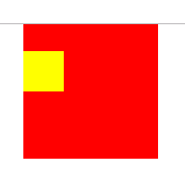

# 1. CSS盒模型（box model）

## 1. 基本概念: 什么是盒模型

CSS盒模型本质上是一个盒子，封装周围的HTML元素，从内到外它包括：
**内容（content）** content： 盒子的内容，显示文本和图像

**内边距（padding）**  padding： 清除内容周围的区域

**边框（border）** border： 包裹内容和内边距的外框

**外边距（margin） **margin： 清除边框外的区域 


------

背景(**background**)默认在*border*的左上角开始

背景图片也一样( **background-image** )

*边框会覆盖背景* ( 从**背景向内**生成 )


*背景图片*会覆盖**背景颜色**  (但是不会覆盖边框)


*padding*不会影响背景属性默认的位置(*border*)

------

文本**内容**默认位置是从*content*开始显示的


## 2. *标准盒模型*和**怪异盒模型**（IE盒模型）的区别

### 1. 标准盒模型


```css
在标准盒模型下，
设置的width和height是content的width和height(不算padding,border)

盒子总宽度 = width + margin(left + right) + border(left + right) + padding(left + right)
盒子总高度 = height + margin(top + bottom) + border(top + bottom) + padding(top + bottom)

```

## 2. 怪异盒模型

**如何触发怪异模式 ?**

*1*. 当不对doctype进行定义时，会触发怪异模式。 

*2*. 设置box-sizing : border-box ;


```css
怪异盒模型（IE盒模型）下，
设置的width和height包括了content、padding和border。 
盒子总宽度 = width 
盒子总高度 = height 
```

# 2. margin塌陷问题

## 什么是**margin** *塌陷*

代码 :

```css
body,html{
    margin: 0;
    padding: 0
}
div{
    width: 100px;
    height:100px;
}
/* 父元素 */
#test1{
    margin:0 auto;
    background:red;
}
/* 子元素 */
#test2{
    margin-top: 20px;
    width: 30px;
    height: 30px;
    background: yellow
}


/*
子元素的边界与父元素（黄色部分）的边界距离并没有增大，
反而是父元素的上边界与浏览器上边界的距离增大了，
也就是父元素带着子元素一起下移了一段距离
*/
```


## 怎么*解决*margin-top**塌陷**

### 1. 给父元素增加边框

不建议使用 *影响外观和尺寸*


### 2. 超出隐藏 *overflow* 

*overflow* 需给**父元素**添加 (子元素添加无效)


### 3. 利用浮动 ( *float* )

给*父元素*的style添加浮动，**但是这种方法不推荐使用。因为会带来未知的错误**

解决了 , 但是**位置会发生变化!** 不建议使用


### 4. 给父元素添加*position:fixed*

将父元素显示在固定位置，就不会受margin-top塌陷的问题影响

解决了 , *但是位置也发生了变化!* 按需求使用


### 5. 给父元素添加*display:table*

位置不会发生变化 (目前本人未发现什么影响)



### 6. 使用*伪元素* (结合display:table)

推荐的解决办法，既能解决margin-top塌陷问题，又不会出现其他附加的未知错误。

**伪元素**之所以被称为伪元素，就是因为他们不是真正的页面元素，html没有与之对应的元素，但是其用法和表现行为和真正的元素一样，所以被成为伪元素。

```css
.clearfix::before{ 
content:""; 
display: table;  
/* 只能结合display:table */
} 
```

### 7.  测试代码

```js
#test1{
			margin:0 auto;
			background:red;
			/* 方法1. 为父元素加边框 */
			/* border: 10px solid blue; */
			/* 方法2. 父元素超出隐藏 */
			/* overflow: hidden; */
			/* 方法3. 父元素浮动 */
			/* float: left; */
			/* 方法4. 父元素position:fixed */
			/* position: fixed */
			/* 方法5. 父元素display:table */
			/* display: table; */
		}
		/* 子元素 */
		#test2{
			margin-top: 30px;
			width: 30px;
			height: 30px;
			background: yellow;
		}
        /* 方法6 */
		.clearfix::before{ 
			content: ""; 
			display: table
		} 
```

------

# 3. 默认**样式**

**浏览器默认样式**

## *1.  页边距* 

IE默认为10px，通过body的margin属性设置 
FF默认为8px，通过body的padding属性设置 
要清除页边距一定要清除这两个属性值 
代码如下:

```css
body {
margin:0;
padding:0;
}
```

## *2. 段间距* 

IE默认为19px，通过p的margin-top属性设置 
FF默认为1.12em，通过p的margin-bottom属性设 
p默认为块状显示，要清除段间距，一般可以设置 
代码如下:

```css
p {
margin-top:0;
margin-bottom:0;
}
```

## *3. 标题样式* 

h1~h6默认加粗显示：font-weight:bold;。 
默认大小请参上表 
还有是这样的写的 
代码如下:

```css
h1{font-size:xx-large;}
h2{font-size:x-large;}
h3{font-size:large;}
h4{font-size:medium;}
h5{font-size:small;}
h6{font-size:x-small;}
```

个大浏览器默认字体大小为16px，即等于medium，h1~h6元素默认以块状显示字体显示为粗体， 
要清除标题样式，一般可以设置 
代码如下:

```css
hx {
font-weight:normal;
font-size:value;
}
```

## *4. 列表样式* 

IE默认为40px，通过ul、ol的margin属性设置 
FF默认为40px，通过ul、ol的padding属性设置 
dl无缩进，但起内部的说明元素dd默认缩进40px，而名称元素dt没有缩进。 
要清除列表样式，一般可以设置 
代码如下:

```css
ul, ol, dd{
list-style-type:none;/*清楚列表样式符*/
margin-left:0;/*清楚IE左缩进*/
padding-left:0;/*清楚非IE左缩进*/
}
```

## *5. 元素居中* 

IE默认为text-align:center; 
FF默认为margin-left:auto;margin-right:auto; 

## *6. 超链接样式* 

a 样式默认带有下划线，显示颜色为蓝色，被访问过的超链接变紫色

清除链接样式，一般可以设置  , 代码如下:

```css
a {
text-decoration:none;
color:#colorname;
}
```

## *7. 鼠标样式* 

IE默认为cursor:hand; 
FF默认为cursor:pointer;。该声明在IE中也有效 

## *8.  图片链接样式* 

IE默认为紫色2px的边框线 
FF默认为蓝色2px的边框线 
要清除图片链接样式，一般可以设置

```css
img {
border:0;
}
```
# 4. 鼠标小手

用 css 添加手状样式 , 鼠标移上去变小手 

```css
cursor:pointer;
```

# 5. 禁止选中文本

```css
// 禁止文字被鼠标选中 
moz-user-select: -moz-none; 
-moz-user-select: none; 
-o-user-select:none; 
-khtml-user-select:none; 
-webkit-user-select:none; 
-ms-user-select:none; 
user-select:none;
```

# 6. 清除浮动(八大种)

### 0 - 最常用的两种

备注: 

```
 清除浮动：根据情况需要来清楚浮动 。

 清除浮动的目的： 就是为了解决 父 盒子高度为0 的问题。
```

#### **伪元素**  (网易搜狐常用)

```css
clearfix:after{
          content:””;
          visibility:hidden; 
          display:block;
          height:0;
          clear:both;
     }
    .clearfix{  //IE6模式下

      zoom:1;

}

清除浮动：  真正的叫法  闭合浮动

```

#### **4、 双伪元素** (小米 , 淘宝常用)

```css
<!DOCTYPE html>
<html lang="en">
<head>
<meta charset="UTF-8">
<title>Document</title>
<style type="text/css">
.father{
width: 600px;
height: auto;
border:1px solid red;
}
.child1,.child2{
background: pink;
width: 250px;
height: 250px;
float: left;
}
/*真正意义上的闭合浮动----------------*/

.clearfix:before,.clearfix:after{  
display: table;
content: "";
}
.clearfix:after{
clear:both;
}
.clearfix{ //IE6
	zoom:1;
}

/*真正意义上的闭合浮动*----------------*/
</style>
</head>
<body>
<div class="father clearfix">
<div class="child1">哥哥</div>
<div class="child2">妹妹</div>
</div>
</body>
</html>

```


### 1 - 父级div定义 height

```html
<style type="text/css"> 
.div1{background:#000080;border:1px solid red;/*解决代码*/height:200px;} 
.left{float:left;width:20%;height:200px;background:#DDD} 
.right{float:right;width:30%;height:80px;background:#DDD} 
</style> 
<div class="div1"> 
<div class="left">Left</div> 
<div class="right">Right</div> 
</div> 


原理：父级div手动定义height，就解决了父级div无法自动获取到高度的问题。 

优点：简单、代码少、容易掌握 

缺点：只适合高度固定的布局，要给出精确的高度，如果高度和父级div不一样时，会产生问题 

建议：不推荐使用，只建议高度固定的布局时使用 

```

### 2  -  结尾处加空div标签 clear:both

```html
<style type="text/css"> 
.div1{background:#000080;border:1px solid red} 
.left{float:left;width:20%;height:200px;background:#DDD} 
.right{float:right;width:30%;height:80px;background:#DDD} 
/*清除浮动代码*/ 
.clearfloat{clear:both} 
</style> 
<div class="div1"> 
<div class="left">Left</div> 
<div class="right">Right</div> 
<div class="clearfloat"></div> 
</div> 

原理：添加一个空div，利用css提高的clear:both清除浮动，让父级div能自动获取到高度 

优点：简单、代码少、浏览器支持好、不容易出现怪问题 

缺点：不少初学者不理解原理；如果页面浮动布局多，就要增加很多空div，让人感觉很不好 

建议：不推荐使用，但此方法是以前主要使用的一种清除浮动方法 
```

### 3 - 父级div定义 伪类:after 和 zoom

```html
<style type="text/css"> 
.div1{background:#000080;border:1px solid red;} 
.left{float:left;width:20%;height:200px;background:#DDD} 
.right{float:right;width:30%;height:80px;background:#DDD} 
/*清除浮动代码*/ 
.clearfloat:after{display:block;clear:both;content:"";visibility:hidden;height:0} 
.clearfloat{zoom:1} 
</style> 
<div class="div1 clearfloat"> 
<div class="left">Left</div> 
<div class="right">Right</div> 
</div> 

原理：IE8以上和非IE浏览器才支持:after，原理和方法2有点类似，zoom(IE转有属性)可解决ie6,ie7浮动问题 

优点：浏览器支持好、不容易出现怪问题（目前：大型网站都有使用，如：腾迅，网易，新浪等等） 

缺点：代码多、不少初学者不理解原理，要两句代码结合使用才能让主流浏览器都支持。 

建议：推荐使用，建议定义公共类，以减少CSS代码。 
```

### 4 - 父级div定义 overflow:hidden

```html
<style type="text/css"> 
.div1{background:#000080;border:1px solid red;/*解决代码*/width:98%;overflow:hidden} 
.left{float:left;width:20%;height:200px;background:#DDD} 
.right{float:right;width:30%;height:80px;background:#DDD} 
</style> 
<div class="div1"> 
<div class="left">Left</div> 
<div class="right">Right</div> 
</div> 

原理：必须定义width或zoom:1，同时不能定义height，使用overflow:hidden时，浏览器会自动检查浮动区域的高度 

优点：简单、代码少、浏览器支持好 

缺点：不能和position配合使用，因为超出的尺寸的会被隐藏。 

建议：只推荐没有使用position或对overflow:hidden理解比较深的朋友使用。 
```

### 5 -  父级div定义 overflow:auto

```html
<style type="text/css"> 
.div1{background:#000080;border:1px solid red;/*解决代码*/width:98%;overflow:auto} 
.left{float:left;width:20%;height:200px;background:#DDD} 
.right{float:right;width:30%;height:80px;background:#DDD} 
</style> 
<div class="div1"> 
<div class="left">Left</div> 
<div class="right">Right</div> 
</div> 

原理：必须定义width或zoom:1，同时不能定义height，使用overflow:auto时，浏览器会自动检查浮动区域的高度 

优点：简单、代码少、浏览器支持好 

缺点：内部宽高超过父级div时，会出现滚动条。 

建议：不推荐使用，如果你需要出现滚动条或者确保你的代码不会出现滚动条就使用吧。 
```

### 6 - 父级div 也一起浮动

```html
<style type="text/css"> 
.div1{background:#000080;border:1px solid red;/*解决代码*/width:98%;margin-bottom:10px;float:left} 
.left{float:left;width:20%;height:200px;background:#DDD} 
.right{float:right;width:30%;height:80px;background:#DDD} 
</style> 
<div class="div1"> 
<div class="left">Left</div> 
<div class="right">Right</div> 
</div> 

原理：所有代码一起浮动，就变成了一个整体 

优点：没有优点 

缺点：会产生新的浮动问题。 

建议：不推荐使用，只作了解。 
```

### 7 - 父级div定义 display:table

```html
<style type="text/css"> 
.div1{background:#000080;border:1px solid red;/*解决代码*/width:98%;display:table;margin-bottom:10px;} 
.left{float:left;width:20%;height:200px;background:#DDD} 
.right{float:right;width:30%;height:80px;background:#DDD} 
</style> 
<div class="div1"> 
<div class="left">Left</div> 
<div class="right">Right</div> 
</div> 

原理：将div属性变成表格 

优点：没有优点 

缺点：会产生新的未知问题。 

建议：不推荐使用，只作了解。 
```

### 8  - 结尾处加 br标签 clear:both

```html
<style type="text/css"> 
.div1{background:#000080;border:1px solid red;margin-bottom:10px;zoom:1} 
.left{float:left;width:20%;height:200px;background:#DDD} 
.right{float:right;width:30%;height:80px;background:#DDD} 
.clearfloat{clear:both} 
</style> 
<div class="div1"> 
<div class="left">Left</div> 
<div class="right">Right</div> 
<br class="clearfloat" /> 
</div> 

原理：父级div定义zoom:1来解决IE浮动问题，结尾处加 br标签 clear:both 

建议：不推荐使用，只作了解。
```

# 7. 超出隐藏...

```css
overflow: hidden;
white-space: nowrap;
text-overflow: ellipsis;
```

