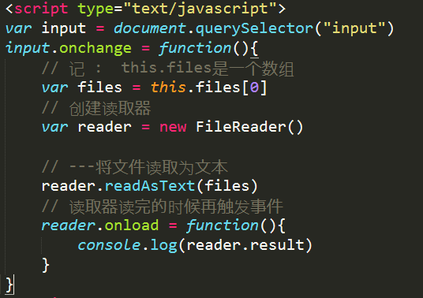

# 01-HTML基础

## 关于HTML5


```html
HTML5属于上一代HTML的新迭代语言，设计HTML5最主要的目的是为了在移动设备上支持多媒体

例如： video 标签和 audio 及 canvas 标记

新特性：
	  1. 取消了过时的显示效果标记  <font></font> 和 <center></center> ...
	  2. 新表单元素引入
	  3. 新语义标签的引入  
	  4. canvas标签（图形设计）
	  5. 本地数据库（本地存储）
	  6. 一些API
```

### 1_HTML全局属性(可用于所有元素)


### 2_网页布局结构标签及兼容处理

```html
HTML5 提供了定义页面不同部分的新语义元素：

<article>
<aside>
<details>
<figcaption>
<figure>
<footer>
<header>
<main>
<mark>
<nav>
<section>
<summary>
<time>

语义化的兼容性: IE8以下不支持

第一种解决方案 : 通过js脚本
( IE ) : 默认将语义化标签定为自定义标签 , 
可以通过js脚本 :
document.creatElement("语义化标签名")来解决
注意 : 默认定义为 行内标签 , 需要加上 display: block  ; 

第二种解决方法 : 通过js插件
如果手动添加创建代码很麻烦 , 用第三方js插件(即可解决)
html5shiv.min.js

上两种解决方法都不够完美 , 如果在不是IE的情况下 , 引入多余的js文件 , 造成影响

第三种解决方法: (只有在指定IE以及指定版本的情况下 , 才引入js脚本)

<!--[if lte IE 8]>
		<script type="text/javascript" src="html5shiv.min.js"></script>
<![endif]-->
```

语义化标签及意义


### 3_多媒体标签及属性介绍

```html
<video></video>  视频 -> IE9以下不支持 
目前，video 元素支持三种视频格式 :Ogg , MP4 , WebM 
为了兼容 , 通常会在里面嵌套 :
<source src="xxx" type="xxx/ogg"></source>
（video的属性仍然是加在video身上）

<audio></audio>  音频 - 和视频一样
```

Audio/Video 方法


### 4_新表单元素及属性

#### 智能表单控件

```html
<input  type="xxx">

 email: 输入合法的邮箱地址
 url：  输入合法的网址
 number： 只能输入数字
 range： 滑块
 color： 拾色器
 date： 显示日期
 month： 显示月份
 week ： 显示第几周
 time：  显示时间
```

#### 表单属性

```html
form属性：	
	autocomplete=on | off          (提示输入过的)自动完成
	novalidate=true | false        (默认开) 是否关闭校验

 input属性：
    *autofocus  ： 自动获取焦点
    form: (input可以不在一个域内 , 绑定指定的表单)	
    list： 用法:
	   <input type="text" list="abc"/>
	 	 <datalist id="abc">
	 	 	<option value="123">12312</option>
	 	 	<option value="123">12312</option>
	 	 	<option value="123">12312</option>
	 	 	<option value="123">12312</option>
	 	</datalist>
    multiple：	 实现多选效果
    *placeholder ： 占位符  （提示信息）
    *required：     必填项

	
```

#### 疑点：

​	解决required自定义提示信息

#### 解决：( 如何修改表单控件中的默认提示信息 )

	 1. 表单验证触发oninvalid事件

2. 通过setCustomValidity方法设置修改内容

   代码演示

   

### 5_HTML5中的新API

#### 获取页面元素

```javascript
document.queryselect("选择器") - 如果多个只会选第一个
document.querySelectAll("选择器") - 选中所有符合的元素(返回列表)
```

#### 类名操作

```js
DOM.classList.add("类名")  -  给当前dom元素添加类样式
DOM.classList.remove("类名") - 给当前dom元素移除类样式
Dom.classList.contains("类名") - 检测是否包含类样式
Dom.classList.toggle("类名") - 切换类样式（有就删除，没有就添加）
```

#### 自定义属性

```html
data-自定义属性名
在标签中 , 凡是以 data- 开头的,都是自定义属性
例如:
<div data-age></div>
<h1 data-yes-no></h1>

如果自定义属性名为data-aaa-bbb时 , 获取的时候 Dom.dataset.aaaBbb

相对应的Dom对象中有dataset属性 , dataset里存放了所有自定义属性的集合
```


##### 1	获取自定义属性

```js
Dom.dataset 返回的是一个对象
Dom.dataset.属性名 或者  Dom.dataset[属性名] 可以获取自定义属性
注: 属性名不需要包含data-
    
```

##### 2	设置自定义属性

```js
Dom.dataset.自定义属性名 = (要设置的)值 或者Dom.dataset[属性名] = 值
```

#### 文件读取 ( FileReader)

```js
	  FileReader	接口有3个用来读取文件方法返回结果在result中 : 
	  
	  readAsBinaryString    ---将文件读取为二进制编码
	  readAsText		   ---将文件读取为文本
	  readAsDataURL		   ---将文件读取为DataURL

 ☞  FileReader (读取器) 提供的事件模型 :　
 
	 onabort	    中断时触发
     onerror	    出错时触发
     onload	    　　文件读取成功完成时触发
     onloadend	　　读取完成触发，无论成功或失败
     onloadstart	读取开始时触发
     onprogress	　　　读取中
```

##### Dom对象中的files属性


##### FileReader (读取器)


FileReader 原型链上的方法:


##### 示例 : 



##### 结果 :


------


#### 获取网络状态

```js
   获取当前网络状态 (是一个属性,返回一个布尔值,不是方法)
		 window.navigator.onLine 返回一个布尔值

   网络状态事件 (方法)
		 1. window.ononline() - 当网络连接的时候触发的事件
		 2. window.onoffline() - 当网络失去连接的的时候触发的事件
```

#### 获取地理定位

```js
	  获取一次当前位置:
	  window.navigator.geolocation.getCurrentPosition(success,error); <-回调函数
	(success回调函数里第二个参数是position对象,position里面有coords属性) : 
	  1. coords.latitude    维度
      2. coords.longitude   经度
      实时获取当前位置:
  	  window.navigator.geolocation.watchPosition(success,error); <-回调函数
```

## Canvas

### 注意事项

```
--- canvas图像的渲染有别于html图像的渲染,

    canvas的渲染极快,不会出现代码覆盖后的延迟渲染的问提

    写canvas代码一定要具有同步思想

---在获取上下文的时候,一定要先判断,

---画布宽高问题

    画布默认高宽300*150

    切记一定要使用html的attribute的形式来定义画布的宽高

    通过css的形式定义会缩放画布内的图像

---绘制矩形的问题

    a.边框宽度的问题,边框的宽度都是在偏移量上下分别渲染一半,可能会出现小数边框,

        一旦出现小数边框都是向上取整

    b.canvas的api只支持一种图像的直接渲染:矩形

2.画布api (只有三个)

    oc.getContext("2d");

    oc.width

    oc.height


```

### canvas_颜色、样式和阴影

| 属性                                                         | 描述                                       |
| :----------------------------------------------------------- | ------------------------------------------ |
| [fillStyle](https://www.runoob.com/tags/canvas-fillstyle.html) | 设置或返回用于填充绘画的颜色、渐变或模式。 |
| [strokeStyle](https://www.runoob.com/tags/canvas-strokestyle.html) | 设置或返回用于笔触的颜色、渐变或模式。     |
| [shadowColor](https://www.runoob.com/tags/canvas-shadowcolor.html) | 设置或返回用于阴影的颜色。                 |
| [shadowBlur](https://www.runoob.com/tags/canvas-shadowblur.html) | 设置或返回用于阴影的模糊级别。             |
| [shadowOffsetX](https://www.runoob.com/tags/canvas-shadowoffsetx.html) | 设置或返回阴影与形状的水平距离。           |
| [shadowOffsetY](https://www.runoob.com/tags/canvas-shadowoffsety.html) | 设置或返回阴影与形状的垂直距离。           |

| 方法                                                         | 描述                                      |
| ------------------------------------------------------------ | ----------------------------------------- |
| [createLinearGradient()](https://www.runoob.com/tags/canvas-createlineargradient.html) | 创建线性渐变（用在画布内容上）。          |
| [createPattern()](https://www.runoob.com/tags/canvas-createpattern.html) | 在指定的方向上重复指定的元素。            |
| [createRadialGradient()](https://www.runoob.com/tags/canvas-createradialgradient.html) | 创建放射状/环形的渐变（用在画布内容上）。 |
| [addColorStop()](https://www.runoob.com/tags/canvas-addcolorstop.html) | 规定渐变对象中的颜色和停止位置。          |

### canvas_线条样式

| 属性                                                         | 描述                                       |
| ------------------------------------------------------------ | ------------------------------------------ |
| [lineCap](https://www.runoob.com/tags/canvas-linecap.html)   | 设置或返回线条的结束端点样式。             |
| [lineJoin](https://www.runoob.com/tags/canvas-linejoin.html) | 设置或返回两条线相交时，所创建的拐角类型。 |
| [lineWidth](https://www.runoob.com/tags/canvas-linewidth.html) | 设置或返回当前的线条宽度。                 |
| [miterLimit](https://www.runoob.com/tags/canvas-miterlimit.html) | 设置或返回最大斜接长度。                   |

### canvas_矩形

| 方法                                                         | 描述                           |
| ------------------------------------------------------------ | ------------------------------ |
| [rect()](https://www.runoob.com/tags/canvas-rect.html)       | 创建矩形。                     |
| [fillRect()](https://www.runoob.com/tags/canvas-fillrect.html) | 绘制"被填充"的矩形。           |
| [strokeRect()](https://www.runoob.com/tags/canvas-strokerect.html) | 绘制矩形（无填充）。           |
| [clearRect()](https://www.runoob.com/tags/canvas-clearrect.html) | 在给定的矩形内清除指定的像素。 |

### canvas_路径

| 方法                                                         | 描述                                                      |
| ------------------------------------------------------------ | --------------------------------------------------------- |
| [fill()](https://www.runoob.com/tags/canvas-fill.html)       | 填充当前绘图（路径）。                                    |
| [stroke()](https://www.runoob.com/tags/canvas-stroke.html)   | 绘制已定义的路径。                                        |
| [beginPath()](https://www.runoob.com/tags/canvas-beginpath.html) | 起始一条路径，或重置当前路径。                            |
| [moveTo()](https://www.runoob.com/tags/canvas-moveto.html)   | 把路径移动到画布中的指定点，不创建线条。                  |
| [closePath()](https://www.runoob.com/tags/canvas-closepath.html) | 创建从当前点回到起始点的路径。                            |
| [lineTo()](https://www.runoob.com/tags/canvas-lineto.html)   | 添加一个新点，然后在画布中创建从该点到最后指定点的线条。  |
| [clip()](https://www.runoob.com/tags/canvas-clip.html)       | 从原始画布剪切任意形状和尺寸的区域。                      |
| [quadraticCurveTo()](https://www.runoob.com/tags/canvas-quadraticcurveto.html) | 创建二次贝塞尔曲线。                                      |
| [bezierCurveTo()](https://www.runoob.com/tags/canvas-beziercurveto.html) | 创建三次贝塞尔曲线。                                      |
| [arc()](https://www.runoob.com/tags/canvas-arc.html)         | 创建弧/曲线（用于创建圆形或部分圆）。                     |
| [arcTo()](https://www.runoob.com/tags/canvas-arcto.html)     | 创建两切线之间的弧/曲线。                                 |
| [isPointInPath()](https://www.runoob.com/tags/canvas-ispointinpath.html) | 如果指定的点位于当前路径中，则返回 true，否则返回 false。 |

### canvas_转换

| 方法                                                         | 描述                                             |
| ------------------------------------------------------------ | ------------------------------------------------ |
| [scale()](https://www.runoob.com/tags/canvas-scale.html)     | 缩放当前绘图至更大或更小。                       |
| [rotate()](https://www.runoob.com/tags/canvas-rotate.html)   | 旋转当前绘图。                                   |
| [translate()](https://www.runoob.com/tags/canvas-translate.html) | 重新映射画布上的 (0,0) 位置。                    |
| [transform()](https://www.runoob.com/tags/canvas-transform.html) | 替换绘图的当前转换矩阵。                         |
| [setTransform()](https://www.runoob.com/tags/canvas-settransform.html) | 将当前转换重置为单位矩阵。然后运行 transform()。 |

### canvas_图像绘制

| 属性                                                         | 描述                                       |
| ------------------------------------------------------------ | ------------------------------------------ |
| [font](https://www.runoob.com/tags/canvas-font.html)         | 设置或返回文本内容的当前字体属性。         |
| [textAlign](https://www.runoob.com/tags/canvas-textalign.html) | 设置或返回文本内容的当前对齐方式。         |
| [textBaseline](https://www.runoob.com/tags/canvas-textbaseline.html) | 设置或返回在绘制文本时使用的当前文本基线。 |

| 方法                                                         | 描述                         |
| ------------------------------------------------------------ | ---------------------------- |
| [fillText()](https://www.runoob.com/tags/canvas-filltext.html) | 在画布上绘制"被填充的"文本。 |
| [strokeText()](https://www.runoob.com/tags/canvas-stroketext.html) | 在画布上绘制文本（无填充）。 |
| [measureText()](https://www.runoob.com/tags/canvas-measuretext.html) | 返回包含指定文本宽度的对象。 |

### canvas_图像绘制

| 方法                                                         | 描述                           |
| ------------------------------------------------------------ | ------------------------------ |
| [drawImage()](https://www.runoob.com/tags/canvas-drawimage.html) | 向画布上绘制图像、画布或视频。 |

### canvas_像素操作

| 属性                                                         | 描述                                                  |
| ------------------------------------------------------------ | ----------------------------------------------------- |
| [width](https://www.runoob.com/tags/canvas-imagedata-width.html) | 返回 ImageData 对象的宽度。                           |
| [height](https://www.runoob.com/tags/canvas-imagedata-height.html) | 返回 ImageData 对象的高度。                           |
| [data](https://www.runoob.com/tags/canvas-imagedata-data.html) | 返回一个对象，其包含指定的 ImageData 对象的图像数据。 |

| 方法                                                         | 描述                                                        |
| ------------------------------------------------------------ | ----------------------------------------------------------- |
| [createImageData()](https://www.runoob.com/tags/canvas-createimagedata.html) | 创建新的、空白的 ImageData 对象。                           |
| [getImageData()](https://www.runoob.com/tags/canvas-getimagedata.html) | 返回 ImageData 对象，该对象为画布上指定的矩形复制像素数据。 |
| [putImageData()](https://www.runoob.com/tags/canvas-putimagedata.html) | 把图像数据（从指定的 ImageData 对象）放回画布上。           |

### canvas_合成

| 属性                                                         | 描述                                     |
| ------------------------------------------------------------ | ---------------------------------------- |
| [globalAlpha](https://www.runoob.com/tags/canvas-globalalpha.html) | 设置或返回绘图的当前 alpha 或透明值。    |
| [globalCompositeOperation](https://www.runoob.com/tags/canvas-globalcompositeoperation.html) | 设置或返回新图像如何绘制到已有的图像上。 |

### canvas_其他

| 方法          | 描述                             |
| ------------- | -------------------------------- |
| save()        | 保存当前环境的状态。             |
| restore()     | 返回之前保存过的路径状态和属性。 |
| createEvent() |                                  |
| getContext()  |                                  |
| toDataURL()   |                                  |

