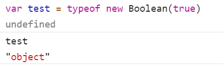
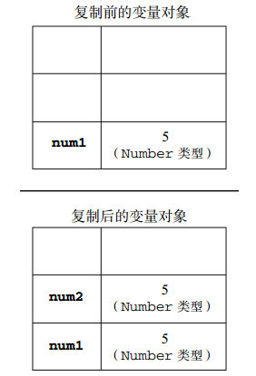
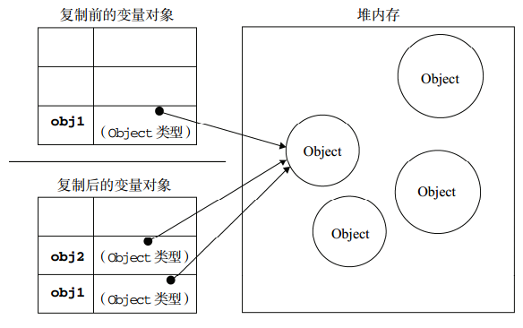

# JS基本介绍

```css
浏览器端JS由以下三个部分组成：

- ECMAScript (又名ES)：基础语法(数据类型、运算符、函数...等)
- BOM(浏览器对象模型)：window、location、history、navigator..等
- DOM(文档对象模型)：div、p、span..等

```

# 数据


## 数据类型

```js
基本数据类型 - (7种) :

    6 种原始类型:
    Boolean
    Null
    Undefined
    Number
    String
    Symbol (ECMAScript 6 新定义)

    1 种引用类型
    Object ( Function 采用引用, 但不属于基本数据类型)

```

```js
    // 如何判断一个数据是否是复杂数据类型？
    // 使用排除法：
    // 看它的值是不是：数字、字符串、布尔值、null、undefined，

    // 如果不是以上5种值，那就是复杂数据类型 : 
    //  举例：
    // [1,3,5]
    //  /abc/
    //  function(){}
    //  new Object();
```


## 数据属性

```
数据属性是键值对，并且每个数据属性拥有下列特性:

```

**数据属性的特性(Attributes of a data property)** 

| 特性             | 数据类型           | 描述                                                         | 默认值    |
| ---------------- | ------------------ | ------------------------------------------------------------ | --------- |
| [[Value]]        | 任何Javascript类型 | 包含这个属性的数据值。                                       | undefined |
| [[Writable]]     | Boolean            | 如果该值为 `false，`则该属性的 [[Value]] 特性 不能被改变。   | true      |
| [[Enumerable]]   | Boolean            | 如果该值为 `true，`则该属性可以用 [for...in](https://developer.mozilla.org/en-US/docs/Web/JavaScript/Reference/Statements/for...in) 循环来枚举。 | true      |
| [[Configurable]] | Boolean            | 如果该值为 `false，`则该属性不能被删除，并且 除了 [[Value]] 和 [[Writable]] 以外的特性都不能被改变。 | true      |

过时的属性(在ECMAScript 3定义的, 在ECMAScript 5被重命名) 

| 属性       | 类型    | 描述                                          |
| ---------- | ------- | --------------------------------------------- |
| Read-only  | Boolean | ES5 [[Writable]] 属性的反状态(Reversed state) |
| DontEnum   | Boolean | ES5 [[Enumerable]]  属性的反状态              |
| DontDelete | Boolean | ES5 [[Configurable]] 属性的反状态             |

## 访问器属性

访问器属性有一个或两个访问器函数 (get 和 set) 来存取数值，并且有以下特性: 

| 特性             | 类型                   | 描述                                                         | 默认值    |
| ---------------- | ---------------------- | ------------------------------------------------------------ | --------- |
| [[Get]]          | 函数对象或者 undefined | 该函数使用一个空的参数列表，能够在有权访问的情况下读取属性值。另见 `get。` | undefined |
| [[Set]]          | 函数对象或者 undefined | 该函数有一个参数，用来写入属性值，另见 `set。`               | undefined |
| [[Enumerable]]   | Boolean                | 如果该值为 `true，则该属性可以用` [for...in](https://developer.mozilla.org/en-US/docs/Web/JavaScript/Reference/Statements/for...in) 循环来枚举。 | true      |
| [[Configurable]] | Boolean                | 如果该值为 `false，则该属性不能被删除，并且不能被转变成一个数据属性。` | true      |

## String

### 属性  :

```js
String.prototype
String.length
```

###  方法  :

[`String.prototype.charAt()`](https://developer.mozilla.org/zh-CN/docs/Web/JavaScript/Reference/Global_Objects/String/charAt)

返回特定位置的字符。

[`String.prototype.charCodeAt()`](https://developer.mozilla.org/zh-CN/docs/Web/JavaScript/Reference/Global_Objects/String/charCodeAt)

返回表示给定索引的字符的Unicode的值。

[`String.prototype.codePointAt()`](https://developer.mozilla.org/zh-CN/docs/Web/JavaScript/Reference/Global_Objects/String/codePointAt)

返回使用UTF-16编码的给定位置的值的非负整数。

[`String.prototype.concat()`](https://developer.mozilla.org/zh-CN/docs/Web/JavaScript/Reference/Global_Objects/String/concat)

连接两个字符串文本，并返回一个新的字符串。

[`String.prototype.includes()`](https://developer.mozilla.org/zh-CN/docs/Web/JavaScript/Reference/Global_Objects/String/includes)

判断一个字符串里是否包含其他字符串。

[`String.prototype.endsWith()`](https://developer.mozilla.org/zh-CN/docs/Web/JavaScript/Reference/Global_Objects/String/endsWith)

判断一个字符串的结尾是否包含其他字符串中的字符。

[`String.prototype.indexOf()`](https://developer.mozilla.org/zh-CN/docs/Web/JavaScript/Reference/Global_Objects/String/indexOf)

从字符串对象中返回首个被发现的给定值的索引值，如果没有找到则返回-1。

[`String.prototype.lastIndexOf()`](https://developer.mozilla.org/zh-CN/docs/Web/JavaScript/Reference/Global_Objects/String/lastIndexOf)

从字符串对象中返回最后一个被发现的给定值的索引值，如果没有找到则返回-1。

[`String.prototype.localeCompare()`](https://developer.mozilla.org/zh-CN/docs/Web/JavaScript/Reference/Global_Objects/String/localeCompare)

返回一个数字表示是否引用字符串在排序中位于比较字符串的前面，后面，或者二者相同。

[`String.prototype.match()`](https://developer.mozilla.org/zh-CN/docs/Web/JavaScript/Reference/Global_Objects/String/match)

使用正则表达式与字符串相比较。

[`String.prototype.normalize()`](https://developer.mozilla.org/zh-CN/docs/Web/JavaScript/Reference/Global_Objects/String/normalize)

返回调用字符串值的Unicode标准化形式。

[`String.prototype.padEnd()`](https://developer.mozilla.org/zh-CN/docs/Web/JavaScript/Reference/Global_Objects/String/padEnd)

在当前字符串尾部填充指定的字符串， 直到达到指定的长度。 返回一个新的字符串。

[`String.prototype.padStart()`](https://developer.mozilla.org/zh-CN/docs/Web/JavaScript/Reference/Global_Objects/String/padStart)

在当前字符串头部填充指定的字符串， 直到达到指定的长度。 返回一个新的字符串。

[`String.prototype.quote()`](https://developer.mozilla.org/zh-CN/docs/Web/JavaScript/Reference/Global_Objects/String/quote) 

设置嵌入引用的引号类型。

[`String.prototype.repeat()`](https://developer.mozilla.org/zh-CN/docs/Web/JavaScript/Reference/Global_Objects/String/repeat)

返回指定重复次数的由元素组成的字符串对象。

[`String.prototype.replace()`](https://developer.mozilla.org/zh-CN/docs/Web/JavaScript/Reference/Global_Objects/String/replace)

被用来在正则表达式和字符串直接比较，然后用新的子串来替换被匹配的子串。

[`String.prototype.search()`](https://developer.mozilla.org/zh-CN/docs/Web/JavaScript/Reference/Global_Objects/String/search)

对正则表达式和指定字符串进行匹配搜索，返回第一个出现的匹配项的下标。

[`String.prototype.slice()`](https://developer.mozilla.org/zh-CN/docs/Web/JavaScript/Reference/Global_Objects/String/slice)

摘取一个字符串区域，返回一个新的字符串。

[`String.prototype.split()`](https://developer.mozilla.org/zh-CN/docs/Web/JavaScript/Reference/Global_Objects/String/split)

通过分离字符串成字串，将字符串对象分割成字符串数组。

[`String.prototype.startsWith()`](https://developer.mozilla.org/zh-CN/docs/Web/JavaScript/Reference/Global_Objects/String/startsWith)

判断字符串的起始位置是否匹配其他字符串中的字符。

[`String.prototype.substr()`](https://developer.mozilla.org/zh-CN/docs/Web/JavaScript/Reference/Global_Objects/String/substr)

通过指定字符数返回在指定位置开始的字符串中的字符。

[`String.prototype.substring()`](https://developer.mozilla.org/zh-CN/docs/Web/JavaScript/Reference/Global_Objects/String/substring)

返回在字符串中指定两个下标之间的字符。

[`String.prototype.toLocaleLowerCase()`](https://developer.mozilla.org/zh-CN/docs/Web/JavaScript/Reference/Global_Objects/String/toLocaleLowerCase)

根据当前区域设置，将符串中的字符转换成小写。对于大多数语言来说，[`toLowerCase`](https://developer.mozilla.org/zh-CN/docs/Web/JavaScript/Reference/Global_Objects/String/toLowerCase)的返回值是一致的。

[`String.prototype.toLocaleUpperCase()`](https://developer.mozilla.org/zh-CN/docs/Web/JavaScript/Reference/Global_Objects/String/toLocaleUpperCase)

根据当前区域设置，将字符串中的字符转换成大写，对于大多数语言来说，[`toUpperCase`](https://developer.mozilla.org/zh-CN/docs/Web/JavaScript/Reference/Global_Objects/String/toUpperCase)的返回值是一致的。

[`String.prototype.toLowerCase()`](https://developer.mozilla.org/zh-CN/docs/Web/JavaScript/Reference/Global_Objects/String/toLowerCase)

将字符串转换成小写并返回。

[`String.prototype.toSource()`](https://developer.mozilla.org/zh-CN/docs/Web/JavaScript/Reference/Global_Objects/String/toSource) 

返回一个对象文字代表着特定的对象。你可以使用这个返回值来创建新的对象。重写 [`Object.prototype.toSource`](https://developer.mozilla.org/zh-CN/docs/Web/JavaScript/Reference/Global_Objects/Object/toSource) 方法。

[`String.prototype.toString()`](https://developer.mozilla.org/zh-CN/docs/Web/JavaScript/Reference/Global_Objects/String/toString)

返回用字符串表示的特定对象。重写 [`Object.prototype.toString`](https://developer.mozilla.org/zh-CN/docs/Web/JavaScript/Reference/Global_Objects/Object/toString) 方法。

[`String.prototype.toUpperCase()`](https://developer.mozilla.org/zh-CN/docs/Web/JavaScript/Reference/Global_Objects/String/toUpperCase)

将字符串转换成大写并返回。

[`String.prototype.trim()`](https://developer.mozilla.org/zh-CN/docs/Web/JavaScript/Reference/Global_Objects/String/trim)

从字符串的开始和结尾去除空格。参照部分 ECMAScript 5 标准。

[`String.prototype.trimStart()`](https://developer.mozilla.org/zh-CN/docs/Web/JavaScript/Reference/Global_Objects/String/trimStart)

[`String.prototype.trimLeft()`](https://developer.mozilla.org/zh-CN/docs/Web/JavaScript/Reference/Global_Objects/String/trimLeft) 

从字符串的左侧去除空格。

[`String.prototype.trimEnd()`](https://developer.mozilla.org/zh-CN/docs/Web/JavaScript/Reference/Global_Objects/String/trimEnd)

[`String.prototype.trimRight()`](https://developer.mozilla.org/zh-CN/docs/Web/JavaScript/Reference/Global_Objects/String/trimRight) 

从字符串的右侧去除空格。

[`String.prototype.valueOf()`](https://developer.mozilla.org/zh-CN/docs/Web/JavaScript/Reference/Global_Objects/String/valueOf)

返回特定对象的原始值。重写 [`Object.prototype.valueOf`](https://developer.mozilla.org/zh-CN/docs/Web/JavaScript/Reference/Global_Objects/Object/valueOf) 方法。

[`String.prototype[@@iterator]()`](https://developer.mozilla.org/zh-CN/docs/Web/JavaScript/Reference/Global_Objects/String/@@iterator)

返回一个新的迭代器对象，该对象遍历字符串值的索引位置，将每个索引值作为字符串值返回。

## Array

### 属性 :

```js
Array.prototype.constructor
所有的数组实例都继承了这个属性，它的值就是 Array，表明了所有的数组都是由 Array 构造出来的。

Array.prototype.length
上面说了，因为 Array.prototype 也是个数组，所以它也有 length 属性，这个值为 0，因为它是个空数组。
```

### 方法  :

####  会改变自身的方法

下面的这些方法会改变调用它们的对象自身的值：

- [`Array.prototype.copyWithin()`](https://developer.mozilla.org/zh-CN/docs/Web/JavaScript/Reference/Global_Objects/Array/copyWithin) 

  在数组内部，将一段元素序列拷贝到另一段元素序列上，覆盖原有的值。

- [`Array.prototype.fill()`](https://developer.mozilla.org/zh-CN/docs/Web/JavaScript/Reference/Global_Objects/Array/fill) 

  将数组中指定区间的所有元素的值，都替换成某个固定的值。

- [`Array.prototype.pop()`](https://developer.mozilla.org/zh-CN/docs/Web/JavaScript/Reference/Global_Objects/Array/pop)

  删除数组的最后一个元素，并返回这个元素。

- [`Array.prototype.push()`](https://developer.mozilla.org/zh-CN/docs/Web/JavaScript/Reference/Global_Objects/Array/push)

  在数组的末尾增加一个或多个元素，并返回数组的新长度。

- [`Array.prototype.reverse()`](https://developer.mozilla.org/zh-CN/docs/Web/JavaScript/Reference/Global_Objects/Array/reverse)

  颠倒数组中元素的排列顺序，即原先的第一个变为最后一个，原先的最后一个变为第一个。

- [`Array.prototype.shift()`](https://developer.mozilla.org/zh-CN/docs/Web/JavaScript/Reference/Global_Objects/Array/shift)

  删除数组的第一个元素，并返回这个元素。

- [`Array.prototype.sort()`](https://developer.mozilla.org/zh-CN/docs/Web/JavaScript/Reference/Global_Objects/Array/sort)

  对数组元素进行排序，并返回a数组。

- [`Array.prototype.splice()`](https://developer.mozilla.org/zh-CN/docs/Web/JavaScript/Reference/Global_Objects/Array/splice)

  在任意的位置给数组添加或删除任意个元素。

- [`Array.prototype.unshift()`](https://developer.mozilla.org/zh-CN/docs/Web/JavaScript/Reference/Global_Objects/Array/unshift)

  在数组的开头增加一个或多个元素，并返回数组的新长度。

#### 不会改变自身的方法

下面的这些方法绝对不会改变调用它们的对象的值，只会返回一个新的数组或者返回一个其它的期望值。

- [`Array.prototype.concat()`](https://developer.mozilla.org/zh-CN/docs/Web/JavaScript/Reference/Global_Objects/Array/concat)

  返回一个由当前数组和其它若干个数组或者若干个非数组值组合而成的新数组。

- [`Array.prototype.includes()`](https://developer.mozilla.org/zh-CN/docs/Web/JavaScript/Reference/Global_Objects/Array/includes) 

  判断当前数组是否包含某指定的值，如果是返回 `true`，否则返回 `false`。

- [`Array.prototype.join()`](https://developer.mozilla.org/zh-CN/docs/Web/JavaScript/Reference/Global_Objects/Array/join)

  连接所有数组元素组成一个字符串。

- [`Array.prototype.slice()`](https://developer.mozilla.org/zh-CN/docs/Web/JavaScript/Reference/Global_Objects/Array/slice)

  抽取当前数组中的一段元素组合成一个新数组。

- [`Array.prototype.toSource()`](https://developer.mozilla.org/zh-CN/docs/Web/JavaScript/Reference/Global_Objects/Array/toSource) 

  返回一个表示当前数组字面量的字符串。遮蔽了原型链上的 [`Object.prototype.toSource()`](https://developer.mozilla.org/zh-CN/docs/Web/JavaScript/Reference/Global_Objects/Object/toSource) 方法。

- [`Array.prototype.toString()`](https://developer.mozilla.org/zh-CN/docs/Web/JavaScript/Reference/Global_Objects/Array/toString)

  返回一个由所有数组元素组合而成的字符串。遮蔽了原型链上的 [`Object.prototype.toString()`](https://developer.mozilla.org/zh-CN/docs/Web/JavaScript/Reference/Global_Objects/Object/toString) 方法。

- [`Array.prototype.toLocaleString()`](https://developer.mozilla.org/zh-CN/docs/Web/JavaScript/Reference/Global_Objects/Array/toLocaleString)

  返回一个由所有数组元素组合而成的本地化后的字符串。遮蔽了原型链上的 [`Object.prototype.toLocaleString()`](https://developer.mozilla.org/zh-CN/docs/Web/JavaScript/Reference/Global_Objects/Object/toLocaleString) 方法。

- [`Array.prototype.indexOf()`](https://developer.mozilla.org/zh-CN/docs/Web/JavaScript/Reference/Global_Objects/Array/indexOf)

  返回数组中第一个与指定值相等的元素的索引，如果找不到这样的元素，则返回 -1。

- [`Array.prototype.lastIndexOf()`](https://developer.mozilla.org/zh-CN/docs/Web/JavaScript/Reference/Global_Objects/Array/lastIndexOf)

  返回数组中最后一个（从右边数第一个）与指定值相等的元素的索引，如果找不到这样的元素，则返回 -1。

#### 遍历方法

[`Array.prototype.forEach()`](https://developer.mozilla.org/zh-CN/docs/Web/JavaScript/Reference/Global_Objects/Array/forEach)

为数组中的每个元素执行一次回调函数。

[`Array.prototype.entries()`](https://developer.mozilla.org/zh-CN/docs/Web/JavaScript/Reference/Global_Objects/Array/entries) 

返回一个数组迭代器对象，该迭代器会包含所有数组元素的键值对。

[`Array.prototype.every()`](https://developer.mozilla.org/zh-CN/docs/Web/JavaScript/Reference/Global_Objects/Array/every)

如果数组中的每个元素都满足测试函数，则返回 `true`，否则返回 `false。`

[`Array.prototype.some()`](https://developer.mozilla.org/zh-CN/docs/Web/JavaScript/Reference/Global_Objects/Array/some)

如果数组中至少有一个元素满足测试函数，则返回 true，否则返回 false。

[`Array.prototype.filter()`](https://developer.mozilla.org/zh-CN/docs/Web/JavaScript/Reference/Global_Objects/Array/filter)

将所有在过滤函数中返回 `true` 的数组元素放进一个新数组中并返回。

[`Array.prototype.find()`](https://developer.mozilla.org/zh-CN/docs/Web/JavaScript/Reference/Global_Objects/Array/find) 

找到第一个满足测试函数的元素并返回那个元素的值，如果找不到，则返回 `undefined`。

[`Array.prototype.findIndex()`](https://developer.mozilla.org/zh-CN/docs/Web/JavaScript/Reference/Global_Objects/Array/findIndex) 

找到第一个满足测试函数的元素并返回那个元素的索引，如果找不到，则返回 `-1`。

[`Array.prototype.keys()`](https://developer.mozilla.org/zh-CN/docs/Web/JavaScript/Reference/Global_Objects/Array/keys) 

返回一个数组迭代器对象，该迭代器会包含所有数组元素的键。

[`Array.prototype.map()`](https://developer.mozilla.org/zh-CN/docs/Web/JavaScript/Reference/Global_Objects/Array/map)

返回一个由回调函数的返回值组成的新数组。

[`Array.prototype.reduce()`](https://developer.mozilla.org/zh-CN/docs/Web/JavaScript/Reference/Global_Objects/Array/reduce)

从左到右为每个数组元素执行一次回调函数，并把上次回调函数的返回值放在一个暂存器中传给下次回调函数，并返回最后一次回调函数的返回值。

[`Array.prototype.reduceRight()`](https://developer.mozilla.org/zh-CN/docs/Web/JavaScript/Reference/Global_Objects/Array/reduceRight)

从右到左为每个数组元素执行一次回调函数，并把上次回调函数的返回值放在一个暂存器中传给下次回调函数，并返回最后一次回调函数的返回值。

[`Array.prototype.values()`](https://developer.mozilla.org/zh-CN/docs/Web/JavaScript/Reference/Global_Objects/Array/values) 

返回一个数组迭代器对象，该迭代器会包含所有数组元素的值。

[`Array.prototype[@@iterator]()`](https://developer.mozilla.org/zh-CN/docs/Web/JavaScript/Reference/Global_Objects/Array/@@iterator) 

和上面的 `values() 方法是同一个函数。`

## Number

#### 方法

- [`Number.isNaN()`](https://developer.mozilla.org/zh-CN/docs/Web/JavaScript/Reference/Global_Objects/Number/isNaN)

  确定传递的值是否是 NaN。

- [`Number.isFinite()`](https://developer.mozilla.org/zh-CN/docs/Web/JavaScript/Reference/Global_Objects/Number/isFinite)

  确定传递的值类型及本身是否是有限数。

- [`Number.isInteger()`](https://developer.mozilla.org/zh-CN/docs/Web/JavaScript/Reference/Global_Objects/Number/isInteger)

  确定传递的值类型是“number”，且是整数。

- [`Number.isSafeInteger()`](https://developer.mozilla.org/zh-CN/docs/Web/JavaScript/Reference/Global_Objects/Number/isSafeInteger)

  确定传递的值是否为安全整数 ( -`(253 - 1)` 至 `253 - 1之间`)。

- [`Number.toInteger()`](https://developer.mozilla.org/zh-CN/docs/Web/JavaScript/Reference/Global_Objects/Number/toInteger) 

  计算传递的值并将其转换为整数 (或无穷大)。

- [`Number.parseFloat()`](https://developer.mozilla.org/zh-CN/docs/Web/JavaScript/Reference/Global_Objects/Number/parseFloat)

  和全局对象 [`parseFloat()`](https://developer.mozilla.org/zh-CN/docs/Web/JavaScript/Reference/Global_Objects/parseFloat) 一样。

- [`Number.parseInt()`](https://developer.mozilla.org/zh-CN/docs/Web/JavaScript/Reference/Global_Objects/Number/parseInt)

  和全局对象 [`parseInt()`](https://developer.mozilla.org/zh-CN/docs/Web/JavaScript/Reference/Global_Objects/parseInt) 一样。

## **Object** 

### 判断数据类型

```js
Object.prototype.toString方法

function test(target){
      var flag = Object.prototype.toString.call(target).slice(8,-1)
      console.log(flag)
    }
test("111") // String


// 但是不能判断构造函数对象示例 , 需要用instanceof来判断
```


### 属性

```
Object.length
值为1。

Object.prototype
可以为所有 Object 类型的对象添加属性。
```

###  方法

[`Object.assign()`](https://developer.mozilla.org/zh-CN/docs/Web/JavaScript/Reference/Global_Objects/Object/assign)

通过复制一个或多个对象来创建一个新的对象。

[`Object.create()`](https://developer.mozilla.org/zh-CN/docs/Web/JavaScript/Reference/Global_Objects/Object/create)

使用指定的原型对象和属性创建一个新对象。

[`Object.defineProperty()`](https://developer.mozilla.org/zh-CN/docs/Web/JavaScript/Reference/Global_Objects/Object/defineProperty)

给对象添加一个属性并指定该属性的配置。

[`Object.defineProperties()`](https://developer.mozilla.org/zh-CN/docs/Web/JavaScript/Reference/Global_Objects/Object/defineProperties)

给对象添加多个属性并分别指定它们的配置。

[`Object.entries()`](https://developer.mozilla.org/zh-CN/docs/Web/JavaScript/Reference/Global_Objects/Object/entries)

返回给定对象自身可枚举属性的`[key, value]`数组。

[`Object.freeze()`](https://developer.mozilla.org/zh-CN/docs/Web/JavaScript/Reference/Global_Objects/Object/freeze)

冻结对象：其他代码不能删除或更改任何属性。

[`Object.getOwnPropertyDescriptor()`](https://developer.mozilla.org/zh-CN/docs/Web/JavaScript/Reference/Global_Objects/Object/getOwnPropertyDescriptor)

返回对象指定的属性配置。

[`Object.getOwnPropertyNames()`](https://developer.mozilla.org/zh-CN/docs/Web/JavaScript/Reference/Global_Objects/Object/getOwnPropertyNames)

返回一个数组，它包含了指定对象所有的可枚举或不可枚举的属性名。

[`Object.getOwnPropertySymbols()`](https://developer.mozilla.org/zh-CN/docs/Web/JavaScript/Reference/Global_Objects/Object/getOwnPropertySymbols)

返回一个数组，它包含了指定对象自身所有的符号属性。

[`Object.getPrototypeOf()`](https://developer.mozilla.org/zh-CN/docs/Web/JavaScript/Reference/Global_Objects/Object/getPrototypeOf)

返回指定对象的原型对象。

[`Object.is()`](https://developer.mozilla.org/zh-CN/docs/Web/JavaScript/Reference/Global_Objects/Object/is)

比较两个值是否相同。所有 NaN 值都相等（这与==和===不同）。

[`Object.isExtensible()`](https://developer.mozilla.org/zh-CN/docs/Web/JavaScript/Reference/Global_Objects/Object/isExtensible)

判断对象是否可扩展。

[`Object.isFrozen()`](https://developer.mozilla.org/zh-CN/docs/Web/JavaScript/Reference/Global_Objects/Object/isFrozen)

判断对象是否已经冻结。

[`Object.isSealed()`](https://developer.mozilla.org/zh-CN/docs/Web/JavaScript/Reference/Global_Objects/Object/isSealed)

判断对象是否已经密封。

[`Object.keys()`](https://developer.mozilla.org/zh-CN/docs/Web/JavaScript/Reference/Global_Objects/Object/keys)

返回一个包含所有给定对象**自身**可枚举属性名称的数组。

[`Object.preventExtensions()`](https://developer.mozilla.org/zh-CN/docs/Web/JavaScript/Reference/Global_Objects/Object/preventExtensions)

防止对象的任何扩展。

[`Object.seal()`](https://developer.mozilla.org/zh-CN/docs/Web/JavaScript/Reference/Global_Objects/Object/seal)

防止其他代码删除对象的属性。

[`Object.setPrototypeOf()`](https://developer.mozilla.org/zh-CN/docs/Web/JavaScript/Reference/Global_Objects/Object/setPrototypeOf)

设置对象的原型（即内部`[[Prototype]]`属性）。

[`Object.values()`](https://developer.mozilla.org/zh-CN/docs/Web/JavaScript/Reference/Global_Objects/Object/values)

返回给定对象自身可枚举值的数组。

## Function

arguments对象 (是**一个数组**)

```js
function sayHi() {
  if (arguments[0] == "bye") {
    return;
  }
  alert(arguments[0]);
}

检测参数个数 属性 arguments.length :

function howManyArgs() {
  alert(arguments.length);
}
```

## Instanceof(判断)

```js
instanceof 用于判断一个变量是否某个对象的实例，
如 var a=new Array();alert(a instanceof Array); 
会返回 true，
同时 alert(a instanceof Object) 也会返回 true;
这是因为 Array 是 object 的子类。

原理:
js的instanceof是根据prototype来判断两个对象是否存在继承关系，
A instanceof B
js会沿着A的原型链查找 直到找到A.__proto__ === B.prototype 返回true
```


## Typeof(判断数据类型)

```js
从实际意义上将:
// typeof运算符，只能判断：数字、字符串、布尔值、undefined、函数

//	typeof null   === "object"
//	typeof {}     === "object"
//	typeof []     === "object"
//	typeof function(){} === "function"
//	typeof /abc/   === "object"	
```

总结 typeof`可能的返回值 : 

| 类型                                        | 结果          |
| ------------------------------------------- | ------------- |
| Undefined                                   | `"undefined"` |
| Null                                        | `"object"`    |
| Boolean                                     | `"boolean"`   |
| Number                                      | `"number"`    |
| String                                      | `"string"`    |
| Symbol （ECMAScript 6 新增）                | `"symbol"`    |
| 函数对象（[[Call]] 在ECMA-262条款中实现了） | `"function"`  |
| 任何其他对象                                | `"object"`    |

示例

```js
// Numbers
typeof 37 === 'number';
typeof 3.14 === 'number';
typeof Math.LN2 === 'number';
typeof Infinity === 'number';
typeof NaN === 'number'; // 尽管NaN是"Not-A-Number"的缩写
typeof Number(1) === 'number'; // 但不要使用这种形式!

// Strings
typeof "" === 'string';
typeof "bla" === 'string';
typeof (typeof 1) === 'string'; // typeof总是返回一个字符串
typeof String("abc") === 'string'; // 但不要使用这种形式!

// Booleans
typeof true === 'boolean';
typeof false === 'boolean';
typeof Boolean(true) === 'boolean'; // 但不要使用这种形式!

// Symbols
typeof Symbol() === 'symbol';
typeof Symbol('foo') === 'symbol';
typeof Symbol.iterator === 'symbol';

// Undefined 
typeof undefined === 'undefined';
typeof declaredButUndefinedVariable === 'undefined'; 
   // declaredButUndefinedVariable 翻译: 已声明未定义的变量
typeof undeclaredVariable === 'undefined'; 
   // typeof undeclaredVariable 翻译: 未声明变量
typeof document.all === 'undefined'

// Objects
typeof {a:1} === 'object';

// 使用Array.isArray 或者 Object.prototype.toString.call
// 区分数组,普通对象
typeof [1, 2, 4] === 'object';

typeof new Date() === 'object';

// 下面的容易令人迷惑，不要使用！
typeof new Boolean(true) === 'object';
typeof new Number(1) === 'object';
typeof new String("abc") === 'object';

// 函数
typeof function(){} === 'function';
typeof class C{} === 'function'
typeof Math.sin === 'function';
typeof new Function() === 'function';

// null
typeof null === 'object'; // 从一开始出现JavaScript就是这样的

// 使用new操作符
var str = new String('String');
var num = new Number(100);
typeof str; // 会返回 'object'
typeof num; // 会返回 'object'

var func = new Function();
typeof func; // It will return 'function'
```

### 关于使用new操作符判断

##### new String()

```js
var str = new String("111")
```

结果 : 

.png)

```js
得到的str 是一个对象: 
String {"111"}
    0: "1"
    1: "1"
    2: "1"
    length: 3
    __proto__: String
    [[PrimitiveValue]]: "111"
```

##### new  Boolean()

```js
var test = typeof new Boolean(true) 
```

结果 : 



```js
得到的test 是一个对象:
"object"
```

##### new Number()

```js
var test = new Number(1)
```

结果 :  也是一个对象

.png)

## 引用类型和基本类型

基本类型的数据是存放在栈内存中的，

引用类型的数据是存放在堆内存中的 

### 复制变量值 

#### 基本类型： 

```js
var p = 1;

var p1 = p;
```

执行结果： 



结论 :

```
基本类型的复制就是在栈内存中开辟出了一个新的存储区域用来存储新的变量，
这个变量有它自己的值，只不过和前面的值一样，所以如果其中一个的值改变，
则不会影响到另一个。 
```

#### 引用类型： 

```js
var object1 = new Object();
var object2 = object1;
```

object2复制了object1的值，但是结果却不是像基本类型复制一样的 

执行结果： 



结论 :

```
定义了一个对象其实是在栈内存中存储了一个指针，这个指针指向堆内存中该对象的存储地址。
复制给另一个对象的过程其实是把该对象的地址复制给了另一个对象变量，两个指针都指向同一个对象，所以若其中一个修改了，则另一个也会改变。
```

#### 知识点 :

基本类型的数据是没有属性和方法的，引用类型才会有，但是为什么String类型却又那么多方法呢？ 例如:

```js
var string = "aaa";
var string2 = string.substring(0));   //aaa
```

本类型的确没有方法和属性，因为一旦创建了属性或者方法就会被立刻销毁，但是为了方便程序员对这类的基本类型数据比较方便的操作，在底层做了一些工作，其实这段代码相当于： 

```js
var string = new String("aaa");
var string2 = string.substring(0);
string = null;

(1)创建一个String类型的实例(使用 new 操作符创建的引用类型的实例，在执行流离开当前作用域之前都一直保存在内存中。而自动创建的基本包装类型的对象，则只存在于一
行代码的执行瞬间，然后立即被销毁 )

(2)在实例上调用指定方法

(3)销毁该实例

经过这三步，字符串值就变得和对象一样了，在Boolean  Number中也是这样

String  Boolean  Number 这三种类型也叫做  基本包装类型
```


# 对象的基本使用

## 对象属性操作

### 获取属性：

备注 : 如果属性是变量的话 , 只能使用 [] 语法

```js
var test = "test"
obj[test] = "test2"
```


```js


第一种方式：.语法
 student.name      获取到name属性的值，为："李白"
 student.say       获取到一个函数(方法)

第二种方式：[]语法
 student["name"]   等价于student.name
 student["say"]    等价于student.say

2种方式的差异
"." 语法 :
  后面不能使用js中的关键字、保留字(class、this、function..)
  后面不能使用数字
  例如:
    var obj={};
    obj.this=5; //语法错误
    obj.0=10;   //语法错误
"[]"语法 :
  ["class"]、["this"]都可以随意使用 obj["this"]=10
  [0]、[1]、[2]也可以使用
  甚至还可以这样用：["[object Array]"]
  也可以这样用：["{abc}"] - 给对象添加了{abc}属性

```

### 设置属性

```js
student["gender"]="男"    等价于：  student.gender="男"
 含义：
 如果student对象中没有gender属性，就添加一个gender属性，值为"男"
 如果student对象中有gender属性， 就修改gender属性的值为"男"

```

### 删除属性

```js
- delete student["gender"]      
- delete student.gender
```

# 通过构造函数创建'' 对象 ''

## 构造函数创建对象例子 

```js
- var xiaoming = new Object()     等价于-->   var xiaoming = {};  (对象字面量)
- var now = new Date() 
- var rooms = new Array(1,3,5)    等价于-->   var rooms = [1,3,5]
- var isMale=/123/;        等价于--> var isMale=new RegExp("123")
  - isMale是通过RegExp构造函数创建出来的对象
  - isMale是RegExp构造函数的实例
- 以上例子中，Object、Date、Array都是内置的构造函数

```

## 自定义一个构造函数来创建对象 

### 构造函数 

```js
    function Person(name,age){
        this.name=name;
        this.age=age;
    }
    var p1=new Person("赵云",18)
    
  //p1就是根据【Person构造函数】创建出来的对象
```

### 构造函数的概念  

```js
- 任何函数都可以当成构造函数
  function CreateFunc(){ }

- 只要把一个函数通过new的方式来进行调用，我们就把这一次函数的调用方式称之为：构造函数的调用

- new CreateFunc(); 此时CreateFunc就是一个构造函数

- CreateFunc();     此时的CreateFunc并不是构造函数

```

### 构造函数的执行过程   


```js
var p1=new Person();

 1、创建一个对象 (我们把这个对象称之为Person构造函数的实例)- _p1
 2、创建一个内部对象，this，将this指向该实例(_p1)
 3、执行函数内部的代码，其中，操作this的部分就是操作了该实例(_p1)
 4、返回值：
   如果函数没有返回值(没有return语句)，那么就会返回构造函数的实例(p1)
   如果函数返回了一个基本数据类型的值，那么本次构造函数的返回值是该实例(_p1)

```

```js
function fn(){
        
    }
    var f1=new fn();    //f1就是fn的实例

    function fn2(){
        return "abc";
    }
    var f2=new fn2();   //f2是fn2构造函数的实例
```

### 构造函数的返回值

如果函数返回了一个复杂数据类型的值，那么本次函数的返回值就是该值 : 

```js
 function fn3(){
        return [1,3,5]; 
        //  数组是一个对象类型的值， !!!
        //  所以数组是一个复杂数据类型的值 !!!
        //-->本次构造函数的真正返回值就是该数组 !!!
        //-->不再是fn3构造函数的实例 !!! 
    }
    var f3=new fn3();   
	//f3还是fn3的实例吗？错 !!!
    //f3值为[1,3,5] !!!

	console.log(f3)
	// 打印是一个数组 , 原型是数组的原型 
	// 所以不再是fn3构造的实例

	

```

### 为何要理解构造函数的返回值

```js
// 为什么要理解构造函数的返回值？
// String是一个内置函数
// String()
// new String()

// 结论：一个函数通过new调用，或者不通过new调用，很多时候会有截然不同的返回值
String(111) - 返回 "111"
new String(111) 返回对象 - 原型是String :
    String {"111"}
    0: "1"
    1: "1"
    2: "1"
    length: 3
    __proto__: String
    [[PrimitiveValue]]: "11
```

### 判断对象是不是某个构造函数的实例

```js
// var isTrue = xxx instanceof Xxxx

例如:
    function Person(){
    }
    var p1=new Person();
    console.log(p1 instanceof Person);
	//true，就是Person的实例

    function Student(){
        return 100;
    }
    var s1=new Student();
    console.log(s1 instanceof Student);
	//true，就是Student的实例

    function Programmer(){
        return [1,3,5]
    }
    var pro=new Programmer();
	//pro并不是Programmer的实例
    console.log(pro instanceof Programmer);//false
	//pro应该是数组的实例
	onsole.log(pro instanceof Array);//true

小技巧:
	如何通过肉眼识别xxx对象时哪个构造函数的实例？
    xxx.__proto__ 属性，也是对象，
    该对象中一般都会有一个constructor属性，
    这个指向AAA函数，那么就可以认为：xxx是AAA构造函数的实例
    
 备注:
 //切记：千万不能使用typeof运算符来判断对象的构造函数
```

# 继承

概念 :

```
js继承 : 
如果你能通过某种方式 , 可以让某个对象访问到其他对象中的属性.方法
我们就把这种方式叫继承
```


## 为什么要有继承

```js
function Person(name,age){
        this.name=name;
        this.age=age;
        this.say=function(){}
}
    var p1=new Person();
    var p2=new Person();
    
    //p1对象和p2对象的say方法是否是同一个方法：false
    console.log(p1.say===p2.say);

    // 由于say方法可能功能相似，但是 不是同一个方法(没有指向同一块内存，会造成内存浪费)
    // 解决方案：
    //把say方法写在他们共同的(父对象)中
    //他们共同的父对象，可以通过：Person.prototype来获取

    //-->只要把say方法写在Person.prototype中，那么say方法就是同一个方法
    Person.prototype.run=function(){
        console.log('时速500KM');
    }
    //此时p1和p2都可以访问到run方法
    p1.run();
    p2.run();
    //验证p1.run和p2.run是否是同一个方法？
    console.log(p1.run == p2.run); //指向同一个方法，这种方法避免了内存的浪费
    
    console.log(p1.run == Person.prototype.run);
    //true

	
```

## 原型对象

```js
//  结论：只要往某个构造函数的prototype对象中添加某个属性、方法，
//  那么这样的属性、方法都可以被所有的构造函数的实例所共享
//  ==>这里的【构造函数的prototype对象】称之为原型对象
//  Person.prototype是 p1 p2 p3 (Person构造函数的【实例】)的原型对象
```

## 知识点

```js
//  Person的原型对象是谁呢？
//  --> 首先要知道Person的构造函数： -->Function
//  --> 所以Person的原型对象是：Function.prototype

//  p1的原型对象是谁呢？
//  -->首先要知道p1是谁创建的？    -->Person
//  -->所以p1的原型对象是：     Person.prototype
```

## 继承的实现方法

### 继承的第一种方式: 原型链继承

```js
function Dog(){

 }
var d1=new Dog();
//	为了让d1有一个叫的方法，
//	错误：d1.say=function(){}
//	正确：
Dog.prototype.say=function(){
    console.log('汪汪汪');
}

缺点:如果添加多个方法,例如
 ↑
Dog.prototype.s1=function(){}
Dog.prototype.s2=function(){}
Dog.prototype.s3=function(){}
Dog.prototype.s4=function(){}

代码产生了不少的冗余(重复) ↑
```

### 继承的第二种方式 :  替换原型对象

```js
function Dog(){

 }
Dog.prototype　=　{
    //一般都会先定义constructor属性,指定构造函数
    constructor:Dog,
    a1:function(){},
    a2:function(){},
    a3:function(){},
    a4:function(){},
    a5:function(){}
    
}
var d1=new Dog();

坑 :
最好先改变原型对象，再创建实例
如果创建后再修改，修改前已经创建的实例会只保存旧的原型对象，并不会被新的原型对象替换

如何解决这个问题？
先改变原型、再创建对象
```

### 继承的第三种方式：拷贝继承(混入继承：mixin) 

使用场景 : 

有时候想使用某个对象中的属性，但是又不能直接修改它，于是就可以创建一个该对象的拷贝

```js
    var o1={ age:2 };

    var o2 = o1;
    o2.age=18;      

//1、修改了o2对象的age属性
//2、由于o2对象跟o1对象是同一个对象
//3、所以此时o1对象的age属性也被修改了
```

实现1:

```js
	var source={name:"李白",age:15}
    var target={};
    target.name=source.name
    target.age=source.age;
```

浅拷贝和深拷贝 : 

```
- 浅拷贝只是拷贝一层属性，没有内部对象
- 深拷贝其实是利用了递归的原理，将对象的若干层属性拷贝出来
```

浅拷贝方法 :

```js
 function extend(target,source){
        for(key in source){  // for in 遍历对象 , key表示属性
            target[key]=source[key];
        }
        return target;
  }
    extend(target,source)
```

Es6中有了 <对象扩展运算符> 仿佛就是专门为了拷贝继承而生：

- 优点：简单

- ```js
  var source={name:"李白",age:15}
  //让target是一个新对象，同时拥有了name、age属性
  var target={ ...source }
  
  // 拷贝后 , 更改age
  var target2={ ...source,age:18 }
  ```

  ### 

### 继承的第四种方式：原型式继承：(道格拉斯在蝴蝶书中提出来的)

```js
var parent={ age:18,gender:"男"};
var student=Object.create(parent);
//student.__proto__===parent

空对象：Object.create(null)
//创建一个纯洁的对象：对象什么属性都没有
```


### 继承的第五种方式 : 借用构造函数实现继承

使用场景 :  适用于2种构造函数之间逻辑有相似的情况

原理 : 函数的call . apply 调用方式

```js
// 使用场景 : 

function Animal(name,age,gender){
    this.name=name;
    this.age=age;
    this.gender=gender;
}
function Person(name,age,gender,say){
    this.name=name;
    this.age=age;
    this.gender=gender;
    this.say=function(){
    
    }
 }
```

```js
 function Animal(name,age,gender){
        this.name=name;
        this.age=age;
        this.gender=gender;
    }
function Person(name,age,gender,say){
    //这段代码调用错误
    //为什么错误？
    //因为这种函数的调用方式，函数内部的this只能指向window
    //Animal(name,age,gender);

    //目的：将Animal函数内部的this指向Person的实例
    //Animal.call(this,name,age,gender)
    Animal.apply(this,[name,age,gender])
    this.say=say;
}
var p1=new Person("宋小宝",15,"男",
                  function(){
});

题外话 : 关于call 和 apply
call(this,xxx)
apply(this,[]) // apply第二个参数传入的必须是数组
```


## 继承顺序的坑

```js
// 情况1.
function Dog (){
    
}
Dog.prototype.say = function(){  // 定义原型对象方法在前
	alert("有这个方法")
}
var D1 = new Dog()  // 创建实例在后
D1.say() 
// 能成功调用

// 情况2.
function Dog (){

}
var D1 = new Dog()   // 创建实例在前
Dog.prototype.say = function(){  // 定义原型对象方法在后
	alert("有这个方法")
}
D1.say()
// 也能成功调用

// 第三种.
function Dog (){

}
var D1 = new Dog()

Dog.prototype = {
	a:function(){
		alert("能调用")
	}
}
D1.a()
// 报错: Dog.a is not a function

// 第四种.
function Dog (){

}
var D1 = new Dog()
Dog.prototype.a = function(){
	alert("我是旧原型对象的方法")
}

Dog.prototype = {
	a:function(){
		alert("我是新方法")
	}
}
D1.a()
// 调用的是旧方法 
// 如果没有旧方法 , D1又在改变原型对象之前创建
// 会报错 

```

## hasOwnProperty方法

IE 5.5+、FireFox、Chrome、Safari、Opera等主流浏览器均支持该函数 

*此方法**不会**检查对象的原型链中是否存在该属性，该属性只有是对象**本身**的一个成员才会返回* 

```js
function Car(wheels){
    this.wheels = wheels
}
Car.prototype = {
    say(){
        console.log("我是say方法")
    },
    age:"18"
}
let car = new Car(4)
console.log(car.hasOwnProperty('wheels'))
// true
console.log(car.hasOwnProperty('age'))
// false
```

# 关于this指向问题

备注 :　

```
this的指向在函数创建的时候是决定不了的，在调用的时候才能决定，谁调用的就指向谁
```


## 例子_1

```js
function a(){
    var user = "追梦子";
    console.log(this.user); //undefined
    console.log(this); //Window
}
a();　　
// 此时a() 等价于 window.a()
```

## 例子_2

```js
var o = {
    user:"追梦子",
    fn:function(){
        console.log(this.user); //追梦子
    }
}
window.o.fn();

这段代码和上面的那段代码几乎是一样的，但是这里的this为什么不是指向window，如果按照上面的理论，最终this指向的是调用它的对象，window是js中的全局对象，我们创建的变量实际上是给window添加属性，所以这里可以用window点o对象。

```

## 例子_3

```js
var o = {
    a:10,
    b:{
        a:12,
        fn:function(){
            console.log(this.a); //12
        }
    }
}
o.b.fn();
```

## 结论1 

```js
情况1：如果一个函数中有this，但是它没有被上一级的对象所调用，那么this指向的就是window，这里需要说明的是在js的严格版中this指向的不是window，但是我们这里不探讨严格版的问题，你想了解可以自行上网查找。

情况2：如果一个函数中有this，这个函数有被上一级的对象所调用，那么this指向的就是上一级的对象。

情况3：如果一个函数中有this，这个函数中包含多个对象，尽管这个函数是被最外层的对象所调用，this指向的也只是它上一级的对象，例子3可以证明
```

## 例子_4

```js
var o = {
    a:10,
    b:{
        a:12,
        fn:function(){
            console.log(this.a); //undefined
            console.log(this); //window
        }
    }
}
var j = o.b.fn;  // 改变的地方
j();
```

## 结论2

```
这里this指向的是window，是不是有些蒙了？其实是因为你没有理解一句话，这句话同样至关重要。

　　this永远指向的是最后调用它的对象，也就是看它执行的时候是谁调用的，例子4中虽然函数fn是被对象b所引用，但是在将fn赋值给变量j的时候并没有执行所以最终指向的是window，这和例子3是不一样的，例子3是直接执行了fn。
```

## 例子_5  (构造函数版this)

```js
情况1 : 

// new关键字可以改变this的指向 , 指向实例对象
function Fn(){
    this.user = "追梦子";
}
var a = new Fn();
console.log(a.user); //追梦子


```

## **当this碰到return时** 

```js
如果返回值是一个对象，那么this指向的就是那个返回的对象(null除外)，
如果返回值是一个空函数 , 只是空函数 , this没执行
如果返回值不是一个对象那么this还是指向函数的实例。

// 情况1
function fn()  
{  
    this.user = '追梦子';  
    return {};  
}
var a = new fn;  
console.log(a.user); //undefined
console.log(a) // a是一个空对象(非纯空) , 打印出Object , 有prototype属性

// 情况2
function fn()  
{  
    this.user = '追梦子';  
    return function(){};
}
var a = new fn;  
console.log(a.user); //undefined
console.log(a) // a是一个纯空 对象 (没有属性&prototype)

// 情况3
function fn()  
{  
    this.user = '追梦子';  
    return 1;
}
var a = new fn;  
console.log(a.user); //追梦子

// 情况4
function fn()  
{  
    this.user = '追梦子';  
    return undefined;
}
var a = new fn;  
console.log(a.user); //追梦子

// 情况5
// 还有一点
// 虽然null也是对象，但是在这里this还是指向那个函数的实例，因为null比较特殊。
function fn()  
{  
    this.user = '追梦子';  
    return null;
}
var a = new fn;  
console.log(a.user); //追梦子

```

## 知识点补充 :

```js
1.在严格版中的默认的this不再是window，而是undefined。

2.new操作符会改变函数this的指向问题

function fn(){
    this.num = 1;
}
var a = new fn();
console.log(a.num); //1

为什么this会指向a？
首先new关键字会创建一个空的对象，
然后会自动调用一个函数apply方法，将this指向这个空对象(实例对象)，
这样的话函数内部的this就会被这个空的对象替代。

// 注意: 当new一个空对象的时候,js内部的实现并不一定是用的apply方法来改变this指向的,
// 这里只是打个比方而已.
```

# 函数的四种调用方式

## 第一种: 函数调用

备注:

函数的第一种调用方式：函数调用 , 函数内部的this指向window

(不在乎在哪儿定义 , 看前面调用对象是谁,如果没有调用对象,那就是默认window)

```js
情况1:

var age=18;
var p={
    age:15,
    say:function(){
        console.log(this.age);
    }
}
var f1 = p.say;   //f1是函数
f1();   
// 函数调用-->this：window       
// -->this.age = 18

情况2:

function Person(name){
        this.name=name;
}
Person("abc");

情况3:

function fn(){
    this.age=18;
}
fn(); 
// window.age = 18
```

## 第二种: 方法调用方式

```js
情况1:
function Person(){
    this.age=20;
}
Person.prototype.run=function(){
    console.log(this.age);
}

var p1 = new Person();
p1.run();       
//打印结果：20

情况2:
var p2={
    height:180,
    travel:function(){
        console.log(this.height);
    }
}
p2.travel()     
//打印结果：180

情况3:
var clear=function(){
    console.log(this.length);
}
var length=50;
var tom={ c:clear,length:100 };
tom.c();  
// 打印结果 : 100
```

## 第三种: 构造函数调用

```js
情况1 :
通过new关键字来调用的，
那么这种方式就是构造函数的构造函数的调用方式，
那么函数内部的this就是该构造函数的实例
function fn(name){
    this.name=name;
}
var test=new fn("小明");  
// test有个name属性，值为：小明

情况2 :
function jQuery(){
    return new jQuery.prototype.init();
     //_init就是一个构造函数 , 
     // 原型链:
     // jQuery() --> _init.__proto__ -->Function (并不是JQuery)
}
jQuery.prototype={
    constructor:jQuery,
    length:100,
    init:function(){
        console.log(this.length);   
    }
}

//this指向init构造函数的实例
//-->1、首先查看本身有没有length属性
//-->2、如果本身没有该属性，那么去它的原型对象中查找
//-->3、如果原型对象中没有，那么就去原型对象的原型对象中查找，最终一直找到根对象（Object.prototype）
//-->4、最终都没有找到的话，我们认为该对象并没有该属性，如果获取该属性的值：undefined

解决方式:
jQuery.prototype.init.prototype = jquery.prototype
// 修改了init函数的默认原型，指向新原型(jquery)的原型对象

```

## 第四种:上下文调用方式

上下文调用方式，有3种，call、apply、bind

### call、apply

```Js
例子1: call()
function f1(){
    console.log(this.name);
}
var obj = {name:"李小明"}

call的第一个参数决定函数this的值
call方法的第一个参数:
    //1、如果是一个对象类型，那么函数内部的this指向该对象
    2、如果是`undefined、null`，那么函数内部的`this指向window`
    //3、如果是数字-->this：对应的Number构造函数的实例
    //      -->   1   --> new Number(1)
    //  如果是字符串-->this：String构造函数的实例
    //      --> "abc"   --> new String("abc")
    //  如果是布尔值-->this：Boolean构造函数的实例
    //      --> false   --> new Boolean(false)

call的第二个参数决定函数的形参
// 记 :  call()使用后相当于执行

f1.call(obj)
// 打印出李小明

例子2: apply()
`非严格模式下`,传给apply第一个参数是`undefined或null`,那么`this就值向全局`


 //call和apply都可以改变函数内部的this的值
 //不同的地方：传参的形式不同 (apply需要传数组)

function toString(a,b,c){
    console.log(a+" "+b+" "+c);
}
toString.call(null,1,3,5)   //"1 3 5"
toString.apply(null,[1,3,5])//"1 3 5"


```

### bind()

```js
//bind基本用法 :
// (bing并不是立刻执行,如果需要立刻执行,使用立即执行函数)

    function speed(){
        console.log(this.seconds);
    }

// 执行了bind方法之后，(返回)产生了一个新函数，
// 这个新函数里面的逻辑和原来还是一样的，
// 唯一的不同是this指向{ seconds:100 }
    var speedBind = speed.bind({ seconds:100 });
    speedBind();    //100

    (function eat(){
        console.log(this.seconds);
    }).bind({ seconds:360 })()  //360
    
 例子:
 var obj={
        name:"西瓜",
        drink:(function(){
            //this指向了：{ name:"橙汁" }
            console.log(this.name);
        }).bind({ name:"橙汁" })
    }
    obj.drink();    //"橙汁"
```

### bind方法的原理(实现)

```js
Function.prototype.bind = function(context) {
 var self = this; // 保存原函数
 return function() { // 返回一个新函数
  return self.apply(context, arguments); // 执行新函数时，将传入的上下文context作为新函数的this
 }
}
```


# 原型链

概念 : JS里面对象可能会有父对象,而它的父对象还可能会有父对象

根本: 继承

​	属性 : 对象中几乎都会有一个proto属性 , 指向他的父对象

​	意义：可以实现让该对象访问到父对象中相关属性

```js
根对象：Object.prototype

理解: 万物继承自Object (js万物皆对象) //这样理解不严谨
```

## 判断数据类型

```js
自己封装的函数  
function test(target){
    if(target){
        var flag = target.__proto__
        switch (flag) {
            case String.prototype:
                return "String";
            case Number.prototype:
                return "Number";
            case Boolean.prototype:
                return "Boolean"
            case Array.prototype:
                return "Array";
            case Object.prototype:
                return "Object"
            case Function.prototype:
                return "Function"
        }
    }else {
        return typeof(target)
    }    
}
```


## String的原型链

```js
var str = '字符串' // 等同于 var str = new String('字符串')
str.__proto__ ---> String
而String的__proto__ ---> Object.__proto__ 
str.__proto__ == String.prototype    // true
str.__proto__.__proto__ == Object.prototype  // true

在全局中:
String.__proto__ == Object.prototype // false
String.__proto__ == Object.__proto__ // true
```

## 对象的原型链

```js
var obj = {age:1} // 等同于 var obj = new Object({age:1})
obj.__proto__ ---> Object

obj.__proto__ === Object.prototype // true 
obj.__proto__ == Object.__proto__ // false Object没有祖先了,为null
```

## 数组的原型链

```js
var arr = [1,2,3] // 等同于 var arr = new Array(1,2,3)  或者 new Array([])
arr.__proto__  ---> Array

arr.__proto__ == Array.prototype //true
arr.__proto__ == Array.__proto__  //false
arr.__proto__ == Object.prototype  //false
arr.__proto__ == Object.__proto__  //false
arr.__proto__.__proto__ == Object.__proto__  //false Object没有祖先了,为null
arr.__proto__.__proto__ == Object.prototype  //true

```

## 布尔的原型链

```js
var bel = true // 等同于 var bel = new Boolean(true)
bel.__proto__  //返回 Boolean {false, constructor: ƒ, toString: ƒ, valueOf: ƒ}
bel.__proto__.__proto__ == Object.prototype // 返回 true
```

## Number的原型链

```JS
var num = 1 // 等同于 var num = new Number(1)
num.__proto__ // 返回 Number {0, constructor: ƒ, toExponential: ƒ, toFixed: ƒ, toPrecision: ƒ, toString: ƒ, …}
num.__proto__.__proto__ == Object.prototype // 返回 true
```

## Function的原型链

```js
情况 1 : (以下为控制台测试结果)

function fun (){}
fun // 返回ƒ fun (){}
fun.__proto__  // ƒ () { [native code] }
fun.__proto__.__proto__ // Object 
fun.__proto__.__proto__.__proto__ // null
fun.__proto__.__proto__ == Object.prototype // true

情况 2 : 
var fun = function(){}
fun.__proto__ // ƒ () { [native code] }
fun.__proto__.__proto__ // Object {constructor: ƒ, __defineGetter__: ƒ, __defineSetter__: ƒ, hasOwnProperty: ƒ, __lookupGetter__: ƒ, …}
fun.__proto__.__proto__.__proto__ // null
fun.__proto__.__proto__ == Object.prototype // true
```

# 作用域(链)

简介：作用域（词法作用域）

## 变量作用域

- 变量作用域的概念：就是一个变量可以使用的范围
- JS中首先有一个最外层的作用域：称之为全局作用域
- JS中还可以通过函数创建出一个独立的作用域，其中函数可以嵌套，所以作用域也可以嵌套

## 作用域链

```
作用域链的意义：查找变量（确定变量来自于哪里，变量是否可以访问）
 - 查看当前作用域，如果当前作用域声明了这个变量，就确定结果
 - 查找当前作用域的上级作用域，也就是当前函数的上级函数，看看上级函数中有没有声明
 - 再查找上级函数的上级函数，直到全局作用域为止
 - 如果全局作用域中也没有，我们就认为这个变量未声明(xxx is not defined)
```


## 难点　（函数作用域）

备注 : 不是看函数在哪里调用，而是看函数在哪里编写(定义的) !

```js
function fn(callback){
        var age=18;
        callback()　／／　找的是全局的
}
    
fn(function(){
    console.log(age);
})

 //　难点:
 //  看上一级作用域，不是看函数在哪里调用，而是看函数在哪里编写(定义的)
 //  因为这种特别，我们通常会把作用域说成是：词法作用域
    
```

# 预编译

js运行三部曲:

 	1. 语法分析  (先大体分析有没有语法错误)
		2. 预编译   预编译发生在函数执行的前一刻
		3. 解释执行

## 预编译四部曲

```
当函数名，变量名 一样的时候，预编译就用来解决这样的问题 : 发生在函数执行的前一刻~

	四部曲：
	1. 创造AO 
	2. 找"形参"和"变量声明",
	   将变量和形参名作为AO属性名,值为undefined (变量名和形参名相同,值都是undefined)
	3. 将 实参值 和 形参统一 (相同的话按执行顺序来)
	4. 在函数体里面找函数声明(不是函数表达式),值赋予函数体


	全局预编译：
	1. 创造GO  （window就是GO）
	2. 找形参和变量声明,将变量和形参名作为AO属性名,值为undefined
	3. 在函数体里面找函数声明,值赋予函数体
```

## 例子_1

```js
function text(a,b){
		console.log(a);
		// 1
		c = 0;
		var c;
		a = 3;
		b = 2;
		console.log(b);
		// 2
		function b (){}
		function d (){}
		console.log(b);
		// 2
	}
	test(1);
```

## 例子_2

```js
function test(a,b){
	 	console.log(a);
	 	// function
	 	console.log(b);
	 	// undefind
	 	var b = 234;
	 	console.log(b);
	 	// 234;
	 	a = 123;
	 	console.log(a);
	 	// 123
	 	function a(){}
	 	var a;
	 	b = 234;
	 	var b = function(){}
	 	console.log(a);
	 	// 123
	 	console.log(b);
	 	// function
	 }
test()
```

## 例子_3

```js
	 console.log(test);
	 // fn
	 function test(test){
	 	console.log(test);
	 	// fn
	 	var test = 234;
	 	console.log(test);
	 	// 234
	 	function test(){}
	 }
	 test(1);
	 var test = 123;
	 console.log(test)
	 // 123
```

# 闭包

## 闭包的案例:

```js
function fn(){
    var a=5;
    return function(){
        a++;
        console.log(a);     
        //a变量肯定是可以访问的
    }
 }
    var f1=fn();        //f1指向匿名函数
    f1();       //6
    f1();       //7
    f1();       //8

一般函数执行完毕，变量就会释放，
但是此时由于js引擎发现匿名函数要使用a变量，
所以a变量并不能得到释放，
而是把a变量放在匿名函数可以访问到的地方去了
```

## 闭包的应用:

```js
//模块化思想：也是一种设计模式
    var ktv=(function KTV(){
        //为了保护leastPrice变量，将它放在函数内部
        var leastPrice=1000;

        var total=0;

        return {
            //购物
            buy:function(price){
                total+=price;
            },
            //结账
            pay:function(){
                if(total<leastPrice){
                    console.log('请继续购物');
                }else{
                    console.log('欢迎下次光临');
                }
            },
            //编辑最低消费
            editLeast:function(id,price){
                if(id===888){
                    leastPrice=price;
                    console.log("现在最低消费金额为：",leastPrice);
                }else{
                    console.log('权限不足');
                }
            }
        }

    })()
```

## 闭包的回收机制

```js
 function f1(){
     var a=5;
     return function(){
         a++;
         console.log(a);
     }
  }
  var q1=f1();
    
  //要想释放q1里面保存的a，只能通过释放q1
    q1=null;    
  //或者
    q1=undefined

js发现q1不再引入使用函数f1()的时候 , 就会对它本身的函数进行释放
```


# 正则表达式

| 元字符       | 描述                                                         |
| ------------ | ------------------------------------------------------------ |
| \            | 将下一个字符标记符、或一个向后引用、或一个八进制转义符。例如，"\\n"匹配\n。"\n"匹配换行符。序列"\\"匹配"\"而"\("则匹配"("。即相当于多种编程语言中都有的"转义字符"的概念。 |
| ^            | 匹配输入字行首。如果设置了RegExp对象的Multiline属性，^也匹配"\n"或"\r"之后的位置。 |
| $            | 匹配输入行尾。如果设置了RegExp对象的Multiline属性，$也匹配"\n"或"\r"之前的位置。 |
| *            | 匹配前面的子表达式任意次。例如，zo*能匹配"z"，也能匹配"zo"以及"zoo"。*等价于{0,}。 |
| +            | 匹配前面的子表达式一次或多次(大于等于1次)。例如，"zo+"能匹配"zo"以及"zoo"，但不能匹配"z"。+等价于{1,}。 |
| ?            | 匹配前面的子表达式零次或一次。例如，"do(es)?"可以匹配"do"或"does"。?等价于{0,1}。 |
| {*n*}        | *n*是一个非负整数。匹配确定的*n*次。例如，"o{2}"不能匹配"Bob"中的"o"，但是能匹配"food"中的两个o。 |
| {*n*,}       | *n*是一个非负整数。至少匹配*n*次。例如，"o{2,}"不能匹配"Bob"中的"o"，但能匹配"foooood"中的所有o。"o{1,}"等价于"o+"。"o{0,}"则等价于"o*"。 |
| {*n*,*m*}    | *m*和*n*均为非负整数，其中*n*<=*m*。最少匹配*n*次且最多匹配*m*次。例如，"o{1,3}"将匹配"fooooood"中的前三个o为一组，后三个o为一组。"o{0,1}"等价于"o?"。请注意在逗号和两个数之间不能有空格。 |
| ?            | 当该字符紧跟在任何一个其他限制符(*,+,?，{*n*}，{*n*,}，{*n*,*m*})后面时，匹配模式是非贪婪的。非贪婪模式尽可能少地匹配所搜索的字符串，而默认的贪婪模式则尽可能多地匹配所搜索的字符串。例如，对于字符串"oooo"，"o+"将尽可能多地匹配"o"，得到结果["oooo"]，而"o+?"将尽可能少地匹配"o"，得到结果 ['o', 'o', 'o', 'o'] |
| .点          | 匹配除"\n"和"\r"之外的任何单个字符。要匹配包括"\n"和"\r"在内的任何字符，请使用像"[\s\S]"的模式。 |
| (pattern)    | 匹配pattern并获取这一匹配。所获取的匹配可以从产生的Matches集合得到，在VBScript中使用SubMatches集合，在JScript中则使用$0…$9属性。要匹配圆括号字符，请使用"\("或"\)"。 |
| (?:pattern)  | 非获取匹配，匹配pattern但不获取匹配结果，不进行存储供以后使用。这在使用或字符"(\|)"来组合一个模式的各个部分时很有用。例如"industr(?:y\|ies)"就是一个比"industry\|industries"更简略的表达式。 |
| (?=pattern)  | 非获取匹配，正向肯定预查，在任何匹配pattern的字符串开始处匹配查找字符串，该匹配不需要获取供以后使用。例如，"Windows(?=95\|98\|NT\|2000)"能匹配"Windows2000"中的"Windows"，但不能匹配"Windows3.1"中的"Windows"。预查不消耗字符，也就是说，在一个匹配发生后，在最后一次匹配之后立即开始下一次匹配的搜索，而不是从包含预查的字符之后开始。 |
| (?!pattern)  | 非获取匹配，正向否定预查，在任何不匹配pattern的字符串开始处匹配查找字符串，该匹配不需要获取供以后使用。例如"Windows(?!95\|98\|NT\|2000)"能匹配"Windows3.1"中的"Windows"，但不能匹配"Windows2000"中的"Windows"。 |
| (?<=pattern) | 非获取匹配，反向肯定预查，与正向肯定预查类似，只是方向相反。例如，"(?<=95\|98\|NT\|2000)Windows"能匹配"2000Windows"中的"Windows"，但不能匹配"3.1Windows"中的"Windows"。"(?<=95\|98\|NT\|2000)Windows"目前在python3.6中re模块测试会报错，用"\|"连接的字符串长度必须一样，这里"95\|98\|NT"的长度都是2，"2000"的长度是4，会报错。 |
| (?<!patte_n) | 非获取匹配，反向否定预查，与正向否定预查类似，只是方向相反。例如"(?<!95\|98\|NT\|2000)Windows"能匹配"3.1Windows"中的"Windows"，但不能匹配"2000Windows"中的"Windows"。这个地方不正确，有问题此处用或任意一项都不能超过2位，如"(?<!95\|98\|NT\|20)Windows正确，"(?<!95\|980\|NT\|20)Windows 报错，若是单独使用则无限制，如(?<!2000)Windows 正确匹配。同上，这里在python3.6中re模块中字符串长度要一致，并不是一定为2，比如"(?<!1995\|1998\|NTNT\|2000)Windows"也是可以的。 |
| x\|y         | 匹配x或y。例如，"z\|food"能匹配"z"或"food"(此处请谨慎)。"[zf]ood"则匹配"zood"或"food"。 |
| [xyz]        | 字符集合。匹配所包含的任意一个字符。例如，"[abc]"可以匹配"plain"中的"a"。 |
| [^xyz]       | 负值字符集合。匹配未包含的任意字符。例如，"[^abc]"可以匹配"plain"中的"plin"任一字符。 |
| [a-z]        | 字符范围。匹配指定范围内的任意字符。例如，"[a-z]"可以匹配"a"到"z"范围内的任意小写字母字符。注意:只有连字符在字符组内部时,并且出现在两个字符之间时,才能表示字符的范围; 如果出字符组的开头,则只能表示连字符本身. |
| [^a-z]       | 负值字符范围。匹配任何不在指定范围内的任意字符。例如，"[^a-z]"可以匹配任何不在"a"到"z"范围内的任意字符。 |
| \b           | 匹配一个单词的边界，也就是指单词和空格间的位置(即正则表达式的"匹配"有两种概念，一种是匹配字符，一种是匹配位置，这里的\b就是匹配位置的)。例如，"er\b"可以匹配"never"中的"er"，但不能匹配"verb"中的"er";"\b1_"可以匹配"1_23"中的"1_"，但不能匹配"21_3"中的"1_"。 |
| \B           | 匹配非单词边界。"er\B"能匹配"verb"中的"er"，但不能匹配"never"中的"er"。 |
| \cx          | 匹配由x指明的控制字符。例如，\cM匹配一个Control-M或回车符。x的值必须为A-Z或a-z之一。否则，将c视为一个原义的"c"字符。 |
| \d           | 匹配一个数字字符。等价于[0-9]。grep 要加上-P，perl正则支持   |
| \D           | 匹配一个非数字字符。等价于[^0-9]。grep要加上-P，perl正则支持 |
| \f           | 匹配一个换页符。等价于\x0c和\cL。                            |
| \n           | 匹配一个换行符。等价于\x0a和\cJ。                            |
| \r           | 匹配一个回车符。等价于\x0d和\cM。                            |
| \s           | 匹配任何不可见字符，包括空格、制表符、换页符等等。等价于[ \f\n\r\t\v]。 |
| \S           | 匹配任何可见字符。等价于[^ \f\n\r\t\v]。                     |
| \t           | 匹配一个制表符。等价于\x09和\cI。                            |
| \v           | 匹配一个垂直制表符。等价于\x0b和\cK。                        |
| \w           | 匹配包括下划线的任何单词字符。类似但不等价于"[A-Za-z0-9_]"，这里的"单词"字符使用Unicode字符集。 |
| \W           | 匹配任何非单词字符。等价于"[^A-Za-z0-9_]"。                  |
| \x*n*        | 匹配*n*，其中*n*为十六进制转义值。十六进制转义值必须为确定的两个数字长。例如，"\x41"匹配"A"。"\x041"则等价于"\x04&1"。正则表达式中可以使用ASCII编码。 |
| \*num*       | 匹配*num*，其中*num*是一个正整数。对所获取的匹配的引用。例如，"(.)\1"匹配两个连续的相同字符。 |
| \*n*         | 标识一个八进制转义值或一个向后引用。如果\*n*之前至少*n*个获取的子表达式，则*n*为向后引用。否则，如果*n*为八进制数字(0-7)，则*n*为一个八进制转义值。 |
| \*nm*        | 标识一个八进制转义值或一个向后引用。如果\*nm*之前至少有*nm*个获得子表达式，则*nm*为向后引用。如果\*nm*之前至少有*n*个获取，则*n*为一个后跟文字*m*的向后引用。如果前面的条件都不满足，若*n*和*m*均为八进制数字(0-7)，则\*nm*将匹配八进制转义值*nm*。 |
| \*nml*       | 如果*n*为八进制数字(0-7)，且*m*和*l*均为八进制数字(0-7)，则匹配八进制转义值*nml*。 |
| \u*n*        | 匹配*n*，其中*n*是一个用四个十六进制数字表示的Unicode字符。例如，\u00A9匹配版权符号(&copy;)。 |
| \p{P}        | 小写 p 是 property 的意思，表示 Unicode 属性，用于 Unicode 正表达式的前缀。中括号内的"P"表示Unicode 字符集七个字符属性之一:标点字符。其他六个属性:L:字母;M:标记符号(一般不会单独出现);Z:分隔符(比如空格、换行等);S:符号(比如数学符号、货币符号等);N:数字(比如阿拉伯数字、罗马数字等);C:其他字符。**注:此语法部分语言不支持，例:javascript。* |
| \<\>         | 匹配词(word)的开始(\<)和结束(\>)。例如正则表达式\<the\>能够匹配字符串"for the wise"中的"the"，但是不能匹配字符串"otherwise"中的"the"。注意:这个元字符不是所有的软件都支持的。 |
| ( )          | 将( 和 ) 之间的表达式定义为"组"(group)，并且将匹配这个表达式的字符保存到一个临时区域(一个正则表达式中最多可以保存9个)，它们可以用 \1 到\9 的符号来引用。 |
| \|           | 将两个匹配条件进行逻辑"或"(Or)运算。例如正则表达式(him\|her) 匹配"it belongs to him"和"it belongs to her"，但是不能匹配"it belongs to them."。注意:这个元字符不是所有的软件都支持的。 |