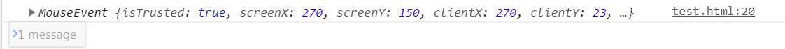
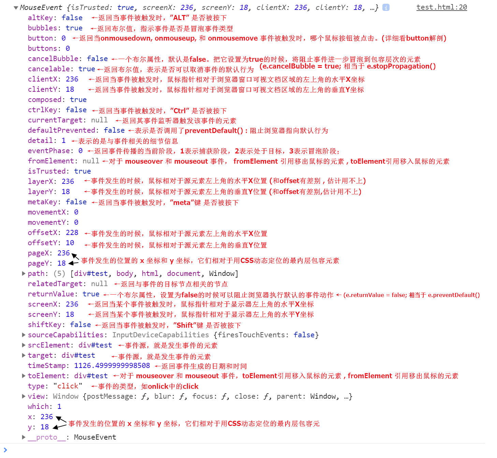

# 1. window.onload()

```js
// 情况1.  作用域的问题

<script>
let a = {
    name:"黄"
}
window.onload = function(){
    let b = {
        name:"李"
    }
}
</script>
// 在控制台环境下 (全局) : 
// 控制台访问a.name "黄"
// 访问b.name 会报错 b is not defined

//window.onload表示页面加载完成：
// -->DOM元素加载完成：所以我们可以访问到页面中所有的DOM
// -->页面中引用的资源文件也已经加载完成：图片、css、js、mp3、mp4。。。
// window只有在所以文件加载完成后 , 才会执行

// 但是! 这个你访问变量没有丝毫一点关系
// 所以报错

// 情况2.  控制台调试断点情况下
<script>
let a = {
    name:"黄"
}
window.onload = function(){
  console.log(a)
   var a = "彭"
   var b = "果冻"  //<-如果断点在这里
}
</script>
// 如果断点在函数内部的话 , 控制台是可以访问到其函数内部的属性的 如 : a "彭"
```


------

# 2. console.dir()

**console.dir()可以显示一个对象的所有属性和方法** 

在调试JavaScript程序时，有时需要dump某些对象的详细信息。

通过手工编写JavaScript代码可以完成这一工作：针对对象的属性进行循环，将循环到的每一个属性值打印出来；

可见，这一过程是比较繁琐的。

在具备调试工具的浏览器上，这一工作可以通过console.dir()语句来方便的完成。 

------

# 3. 封装类似jquery的小库

## 基础代码

```js
 	版本1.
	// (function (global) {
    //     function fn(args) {
    //         this.node = document.querySelectorAll(args)
    //     }
    //     fn.prototype = {
    //         css: function (arg1, arg2) {
    //             for (let a = 0; a < this.node.length; a++) {
    //                 this.node[a].style[arg1] = arg2
    //             }
    //         }
    //     }
    //     window.$ = window.jQuery = function (target) {
    //         return new fn(target)
    //     }
    // })(window)
    // $("#test").css("color", "red")

    版本2.
    // (function (global) {
    //     function fn(args) {
    //        let count = document.querySelectorAll(args)
    //        let count_length = count.length
    //        for(let a = 0;a < count_length ;a++){
    //            this[0] = count[0]
    //        }
    //        this.length= count_length;
    //     }
    //     fn.prototype = {
    //         css(arg1, arg2) {
    //             for (let a = 0; a < this.length; a++) {
    //                 this[a].style[arg1] = arg2
    //             }
    //         }
    //     }
    //     window.$ = window.jQuery = function (target) {
    //         return new fn(target)
    //     }
    // })(window)
    // $("#test").css("color", "red")

    版本3.
    // (function (global) {
    //     function jQuery  (target) {
    //         return new jQuery.prototype.init(target)
    //     }
    //     jQuery.prototype = {
    //         init:function(target){
    //             let count = document.querySelectorAll(target)
    //             let count_length = count.length
    //             for(let a = 0;a < count_length ;a++){
    //                 this[0] = count[0]
    //             }
    //             this.length= count_length;
    //         },
    //         css(arg1, arg2){
    //             for (let a = 0; a < this.length; a++) {
    //                 this[a].style[arg1] = arg2
    //             }
    //         }
    //     }
    //     jQuery.prototype.init.prototype = jQuery.prototype
    //     window.$ = window.jQuery = jQuery
    // })(window)
    // $("#test").css("color", "red")

    版本4.
    (function (global) {
        function jQuery  (target) {
            return new jQuery.prototype.init(target)
        }
         //给jquery添加了一个fn属性，fn属性等价于prototype属性
        jQuery.nn = jQuery.prototype = {
            constructor:jQuery,
            init:function(target){
                let count = document.querySelectorAll(target)
                let count_length = count.length
                for(let a = 0;a < count_length ;a++){
                    this[0] = count[0]
                }
                this.length= count_length;
            },
            css(arg1, arg2){
                for (let a = 0; a < this.length; a++) {
                    this[a].style[arg1] = arg2
                }
            }
        }
        jQuery.nn.init.prototype = jQuery.nn
        window.$ = window.jQuery = jQuery
    })(window)
    $("#test").css("color", "red")

	// 实现jquery的两种extend方法
	1.案例
	//  (function (global) {
    //     function jQuery  (target) {
    //         return new jQuery.prototype.init(target)
    //     }
    //      //给jquery添加了一个fn属性，fn属性等价于prototype属性
    //     jQuery.nn = jQuery.prototype = {
    //         constructor:jQuery,
    //         init:function(target){
    //             let count = document.querySelectorAll(target)
    //             let count_length = count.length
    //             for(let a = 0;a < count_length ;a++){
    //                 this[0] = count[0]
    //             }
    //             this.length= count_length;
    //         },
    //         css(arg1, arg2){
    //             for (let a = 0; a < this.length; a++) {
    //                 this[a].style[arg1] = arg2
    //             }
    //         }
    //     }
    //     jQuery.nn.init.prototype = jQuery.nn
    //     // jQuery.extend 方法:
    //     // 将参数的多余参数里的对象复制到第一个对象身上
    //     jQuery.extend = function(...args){
    //         let target = args[0]
    //         for(let i = 1;i<args.length;i++){
    //             for (let key in args[i]) {
    //                 target[key] = args[i][key]
    //             }
    //         }
    //         return target
    //     }
    2.案例
    //     jQuery.extend = function(...args){
    //         for(let i = 0;i<args.length;i++){
    //             // for (let key in args[i]) {
    //             //     target[key] = args[i][key]
    //             // }
    //             args[0] = {...args[0],...args[i]}
    //         }
    //         return args[0]
    //    }
    3.案例
    //    jQuery.extend = function(...args){
    //        let obj = {}
    //         for(let i = 0;i<args.length;i++){
    //             obj = {...obj,...args[i]}
    //         }
    //         for (let key in obj) {
    //             args[0][key] = obj[key]
    //         }
    //         return args[0]
    //    }
    //     window.$ = window.jQuery = jQuery
    // })(window)
    // var p = {name:'li'};
    // var a = $.extend(p,{a:10},{b:20},{c:30})
    // a {name: "li", a: 10, b: 20, c: 30}

	4.案例
    (function (global) {
        function jQuery  (target) {
            return new jQuery.prototype.init(target)
        }
         //给jquery添加了一个nn属性，nn属性等价于prototype属性
        jQuery.nn = jQuery.prototype = {
            constructor:jQuery,
            init:function(target){
                let count = document.querySelectorAll(target)
                let count_length = count.length
                for(let a = 0;a < count_length ;a++){
                    this[0] = count[0]
                }
                this.length= count_length;
            },
            css(arg1, arg2){
                for (let a = 0; a < this.length; a++) {
                    this[a].style[arg1] = arg2
                }
            }
        }
        jQuery.nn.init.prototype = jQuery.nn
        jQuery.nn.extend = jQuery.extend = function(...args){
            let target,source = []
            source = [...args]
            if(this === jQuery){
                //$.extend
                target = args[0]
                source.splice(0,1) // 删除第一个元素
            }else{
                //$.fn.extend
                target = this
            }
            // 公用的循环遍历方法
            for(let i = 0;i<args.length;i++){
                for(let item in args[i]){
                    target[item] = args[i][item]
                }
            }
        }

        window.$ = window.jQuery = jQuery
    })(window)

    // 测试-------
    let a  = {}
    jQuery.extend(a,{name:'彭'})
    // 实现了往自己身上增加方法
    $.nn.extend({
        say(){
            console.log("say")
        }
    })

	5.案例 
     (function (global) {
        function jQuery  (target) {
            return new jQuery.prototype.init(target)
        }
         //给jquery添加了一个nn属性，nn属性等价于prototype属性
        jQuery.nn = jQuery.prototype = {
            constructor:jQuery,
            init:function(target){
                let count = document.querySelectorAll(target)
                let count_length = count.length
                for(let a = 0;a < count_length ;a++){
                    this[0] = count[0]
                }
                this.length= count_length;
            },
            css(arg1, arg2){
                for (let a = 0; a < this.length; a++) {
                    this[a].style[arg1] = arg2
                }
            }
        }
        jQuery.nn.init.prototype = jQuery.nn
        jQuery.nn.extend = jQuery.extend = function(...args){
            let target,source = []
            source = [...args]
            if(source.length == 1){
                target = this

            }else{
                target = source
                // 删除第一个元素
                source.splice(0,1)
            }
            // 公用的循环遍历方法
            for(let i = 0;i<args.length;i++){
                for(let item in args[i]){
                    target[item] = args[i][item]
                }
            }
        }

        window.$ = window.jQuery = jQuery
    })(window)
	
	
	6.案例*(最后版)
    (function (global) {
        function jQuery  (target) {
            return new jQuery.prototype.init(target)
        }
        //给jquery添加了一个nn属性，nn属性等价于prototype属性
        jQuery.nn = jQuery.prototype = {
            constructor:jQuery,
            init:function(target){
                let count = document.querySelectorAll(target)
                let count_length = count.length
                for(let a = 0;a < count_length ;a++){
                    this[0] = count[0]
                }
                this.length= count_length;
            },
            css(arg1, arg2){
                for (let a = 0; a < this.length; a++) {
                    this[a].style[arg1] = arg2
                }
            }
        }
        jQuery.nn.init.prototype = jQuery.nn
        jQuery.nn.extend = jQuery.extend = function(...args){
            let target,source = []
            source = [...args]
            if(source.length == 1){
                target = this

            }else{
                target = args[0]
                // 删除第一个元素
                source.splice(0,1)
            }
            // 公用的循环遍历方法
            // for(let i = 0;i<args.length;i++){
            //     for(let item in args[i]){
            //         target[item] = args[i][item]
            //     }
            // }
            Object.assign(target,...source)
        }

        window.$ = window.jQuery = jQuery
    })(window)
jQuery.extend({
    say(){
        console.log('say')
    }
})
```

------

## 增加each方法

```js
jQuery.extend({
        // 可以遍历对象和数组(类数组)
		each(obj,callback){
            if(length in obj && obj.length>=0){
                for(let i = 0;i<obj.length;i++){
                    // callback(i,obj[i])
                    // 此时的callback里的this'是指向window
                    // jquery的each方法里的this是指向属性本身
                    callback.call(obj[i],i,obj[i])
                    
                }
            }else{
                for(let i in obj){
                        callback.call(obj[i],i,obj[i])
                }
            }
        }
	})
	
	// 这里不能用立即执行函数 , 不然this改变不了
    jQuery.each([{name:'hhe'}],function(i,v){
        console.log(this)
        // {name: "hhe"}
    })
```

## **最终版**(显示隐藏切换)

```js
  (function (global) {
        function jQuery  (target) {
            return new jQuery.prototype.init(target)
        }
        jQuery.nn = jQuery.prototype = {
            constructor:jQuery,
            init:function(target){
                if(typeof(target)== 'string'){
                    let count = document.querySelectorAll(target)
                    let count_length = count.length
                    for(let a = 0;a < count_length ;a++){
                        this[0] = count[0]
                    }
                    this.length= count_length;
                }else if(target.nodeType){
                    this[0] = target
                    this.length=1
                }
                
            }
        }
        jQuery.nn.init.prototype = jQuery.nn
        jQuery.nn.extend = jQuery.extend = function(...args){
            let target,source = []
            source = [...args]
            if(source.length == 1){
                target = this
            }else{
                target = args[0]
                source.splice(0,1)
            }
            Object.assign(target,...source)
        }
        window.$ = window.jQuery = jQuery
    })(window)
    jQuery.extend({
		each(obj,callback){
            if(length in obj && obj.length>=0){
                for(let i = 0;i<obj.length;i++){
                    callback.call(obj[i],i,obj[i])        
                }
            }else{
                for(let i in obj){
                        callback.call(obj[i],i,obj[i])
                }
            }
        },
	})
    jQuery.nn.extend({
        css(...args){
            let argflag = args[0]
            let $this = this
            if(args.length>=2){
                jQuery.each($this,function(i,v){
                   this.style[argflag] = args[1]
                })
            }else
            if(typeof(argflag)=='string'){
                    return window.getComputedStyle(this[0])[argflag]
            }else if(typeof(argflag)=='object'){
               jQuery.each(argflag,(i,v)=>{
                    this.css(i,v)
               })
            }
            return this
        },
        show(){
            this.css('display','block')
            return this
        },
        hidden(){
            this.css('display','none')
            return this
        },
        each(callback){
            jQuery.each(this,callback)
            return this
        },
        toggle(){
            this.each(function(){
                let $this = jQuery(this)
                $this[$this.css('display')==='none'?'show':'hidden']()
            })
        }
            
    })
```


# 4. 获取/设置Dom元素的css样式

## 1. window.getComputedStyle()

默认返回获取指定Dom元素的**所有**样式 , 但是不可以设置

需要单个获取(制定的属性值) : window.getComputedStyle(dom)[属性名]

```js
window.getComputedStyle(div)['background']
window.getComputedStyle(div).background
```

------


## 2. *cssText 属性* (**设置**元素属性值)

**cssText** 本质：**设置** HTML 元素的 style 属性值 (**会将原有的cssText清掉** )

```js
var div = document.querySelector('div')
div.style.cssText = 'background:blue;'
// 返回值 "background:blue;" 
// 设定什么就返回什么
```

*采用cssText累加的方法* 

```js
var div = document.querySelector('div')
// 累加的方法  +=
div.style.cssText += 'background:blue;'
```

# 5. JS事件

## 1. JS的事件处理机制 

### 1. *事件流*

​	指从页面中接收事件的顺序，有**冒泡流**和**捕获流**。 


------

### 2. 事件处理程序 

例如: click , load , mouseover 都是事件的名字，

**响应某个事件的函数**就是*事件处理程序*（事件侦听器）。

事件处理程序的名字以 *on* 开头，比如 onclick . onmouseover 等。 (都是小写)

------

#### **（1）HTML事件处理程序**

某个元素支持的每种事件，都可以用一个相应事件处理程序同名的HTML特性来决定。

```html
<input type="button" value="click" onclick="alert('clicked')"/>
<input type="button" value="click" onclick="alert(event.type)"/>
```

------


#### **（2）*event*** 

动态创建的函数中会有一个局部变量event，也就是事件对象。 

```js
    var div = document.querySelectorAll('div')[0]
    div.onclick = function(e){
        console.log(e)
    }
```

##### 1. **深剖event对象**





##### 2. **event对象的事件**

```js
e.preventDefault()
// 通知浏览器不要执行与事件关联的默认动作；
e.stopPropagation()
// 不再派发事件；
```

##### 3. Event对象的一些*兼容性*处理

###### 1. **获得event对象兼容性写法** 

```js
event || (event = window.event);
```

###### 2. **获得target兼容型写法** 

```js
event.target||event.srcElement
```

###### 3. **阻止浏览器默认行为兼容性写法** 

```js
event.preventDefault ? event.preventDefault() : (event.returnValue = false);
```

###### 4. **阻止冒泡写法**

```js
event.stopPropagation ? event.stopPropagation() : (event.cancelBubble = true);
```

##### 4.  Event -> button 剖析

button：返回当onmousedown, onmouseup, 和 onmousemove 事件被触发时，哪个鼠标按钮被点击。

对其他事件，不管鼠标状态如何，都返回 0（比如onclick）。整数，1代表左键，2代表右键，4代表中键，

如果按下多个键，酒把这些值加起来，所以3就代表左右键同时按下（firefox中 0代表左键，1代表中间键，2代表右键）； 

```
可能的值： 
0 没按键
1 按左键
2 按右键
3 按左右键
4 按中间键
5 按左键和中间键
6 按右键和中间键
7 按所有的键
```

------

#### **（3）*this*** 

事件动态创建的函数 , 里面的this都是默认绑定事件对象的

```js
    var div1 = document.querySelectorAll('div')[0]
    div1.onclick = function(e){
        console.log(this)
        // 打印出 div1
    }
```

------

#### **（4） ** **DOM**  *0* 级事件处理程序

基于**DOM0**的事件，*对于同一个dom节点而言，只能注册一个*，**后边注册的 同种事件 会覆盖之前注册的**。

*利用这个原理*我们可以**解除事件，btn5.onclick＝null;**   其中this就是绑定事件的那个元素；

这里添加的事件处理程序是在其依附的元素的作用域中运行。

DOM 0级对每个事件只支持一个事件处理程序。

------

#### **（5）** **DOM**  *2* 级事件处理程序

**DOM2**支持同一dom元素**注册多个同种事件**，事件发生的顺序**按照添加的顺序依次触发**（*IE是相反的*）。

DOM2事件通过 **addEventListener** 和 **removeEventListener** 管理。

------

 **DOM2级事件定义了两个方法**，用于**处理指定**和*删除事件*处理程序的操作：**addEventListener**(*eventName,handlers,boolean*)和**removeEventListener()**,

两个方法都一样**接收三个参数** : 

**第一个**要处理的事件名 , 

**第二个**是事件处理程序函数 , 

**第三个**值为布尔值。
布尔值是true时,表示在捕获阶段调用事件处理程序。

布尔值为false时,表示在事件冒泡阶段调用事件处理程序, 一般建议在冒泡阶段使用,特殊情况才在捕获阶段;

------

**注意：通过addEventListener()添加的事件处理程序只能用removeEventListener()来移除**，

并且移除时传入的参数必须与添加时传入的参数一样；

通过addEventListener()添加的匿名函数将无法移除。

------

### 3. 事件委托

**因为冒泡机制**，比如既然点击子元素，也会触发父元素的点击事件，

那我们完全可以将子元素的事件要做的事写到父元素的事件里，

也就是将子元素的事件处理程序写到父元素的事件处理程序中，这就是事件委托；

利用事件委托，只指定一个事件处理程序，就可以管理某一个类型的所有事件； 

------

示例1.

```html
<ul id="ul1">
    <li>111</li>
    <li>222</li>
    <li>333</li>
    <li>444</li>
</ul>
```

使用事件委托：

```js
window.onload = function(){
    var oUl = document.getElementById("ul1")
    // 这里用父级ul做事件处理 
    // 由于冒泡原理，事件就会冒泡到ul上
    // 因为ul上有点击事件，所以事件就会触发
   oUl.onclick = function(){
        alert(123);
    }
   // 这里因为绑定在ul上 , 
   // 所以当点击ul的时候，也是会触发的
}

如果想让只有点击li才会触发 : 
// Event对象提供了一个属性叫target，
// 可以返回事件的目标节点(事件源)

window.onload = function(){
　　var oUl = document.getElementById("ul1");
　　oUl.onclick = function(ev){
　　　　var ev = ev || window.event;
　　　　var target = ev.target || ev.srcElement;
      	// 只有是li元素的时候 , 才会触发事件
　　　　if(target.nodeName.toLowerCase() == 'li'){
       	 // nodeName 返回节点的标签名字
　 　　　　　　 alert(123);
　　　　　　　  alert(target.innerHTML);
　　　　}
　　}
}
```


------

# 6. 元素

**console.dir(div)**

```js
div#div1
accessKey: ""
align: ""
assignedSlot: null
attributeStyleMap: StylePropertyMap {size: 0}
attributes: NamedNodeMap {0: id, id: id, length: 1}
autocapitalize: ""
baseURI: "file:///C:/Users/Administrator/Desktop/test.html"
childElementCount: 1
childNodes: NodeList(3) [text, div#div2, text]
children: HTMLCollection [div#div2, div2: div#div2]
classList: DOMTokenList [value: ""]
className: ""
clientHeight: 500
clientLeft: 0
clientTop: 0
clientWidth: 500
contentEditable: "inherit"
dataset: DOMStringMap {}
dir: ""
draggable: false
firstChild: text
firstElementChild: div#div2
hidden: false
id: "div1"
innerHTML: "我是div1↵        <div id="div2">我是div2子</div>↵    "
innerText: "我是div1↵我是div2子"
inputMode: ""
isConnected: true
isContentEditable: false
lang: ""
lastChild: text
lastElementChild: div#div2
localName: "div"
namespaceURI: "http://www.w3.org/1999/xhtml"
nextElementSibling: script
nextSibling: text
nodeName: "DIV"
nodeType: 1
nodeValue: null
nonce: ""
offsetHeight: 500
offsetLeft: 0
offsetParent: body
offsetTop: 0
offsetWidth: 500
onabort: null
onauxclick: null
onbeforecopy: null
onbeforecut: null
onbeforepaste: null
onblur: null
oncancel: null
oncanplay: null
oncanplaythrough: null
onchange: null
onclick: null
onclose: null
oncontextmenu: null
oncopy: null
oncuechange: null
oncut: null
ondblclick: null
ondrag: null
ondragend: null
ondragenter: null
ondragleave: null
ondragover: null
ondragstart: null
ondrop: null
ondurationchange: null
onemptied: null
onended: null
onerror: null
onfocus: null
onfullscreenchange: null
onfullscreenerror: null
ongotpointercapture: null
oninput: null
oninvalid: null
onkeydown: null
onkeypress: null
onkeyup: null
onload: null
onloadeddata: null
onloadedmetadata: null
onloadstart: null
onlostpointercapture: null
onmousedown: null
onmouseenter: null
onmouseleave: null
onmousemove: null
onmouseout: null
onmouseover: null
onmouseup: null
onmousewheel: null
onpaste: null
onpause: null
onplay: null
onplaying: null
onpointercancel: null
onpointerdown: null
onpointerenter: null
onpointerleave: null
onpointermove: null
onpointerout: null
onpointerover: null
onpointerup: null
onprogress: null
onratechange: null
onreset: null
onresize: null
onscroll: null
onsearch: null
onseeked: null
onseeking: null
onselect: null
onselectionchange: null
onselectstart: null
onstalled: null
onsubmit: null
onsuspend: null
ontimeupdate: null
ontoggle: null
onvolumechange: null
onwaiting: null
onwebkitfullscreenchange: null
onwebkitfullscreenerror: null
onwheel: null
outerHTML: "<div id="div1">我是div1↵        <div id="div2">我是div2子</div>↵    </div>"
outerText: "我是div1↵我是div2子"
ownerDocument: document
parentElement: body
parentNode: body
prefix: null
previousElementSibling: null
previousSibling: text
scrollHeight: 500
scrollLeft: 0
scrollTop: 0
scrollWidth: 500
shadowRoot: null
slot: ""
spellcheck: true
style: CSSStyleDeclaration {alignContent: "", alignItems: "", alignSelf: "", alignmentBaseline: "", all: "", …}
tabIndex: -1
tagName: "DIV"
textContent: "我是div1↵        我是div2子↵    "
title: ""
translate: true
__proto__: HTMLDivElement
```

## \__proto__ : HTMLDivElement

```js
 HTMLDivElement
accessKey: ""
align: ""
assignedSlot: null
attributeStyleMap: StylePropertyMap
attributes: NamedNodeMap
autocapitalize: ""
baseURI: "file:///C:/Users/Administrator/Desktop/test.html"
childElementCount: 1
childNodes: NodeList(3)
children: HTMLCollection(1)
classList: DOMTokenList(0)
className: ""
clientHeight: 500
clientLeft: 0
clientTop: 0
clientWidth: (...)
contentEditable: "inherit"
dataset: DOMStringMap
dir: ""
draggable: false
firstChild: text
firstElementChild: div#div2
hidden: false
id: "div1"
innerHTML: "我是div1↵        <div id="div2">我是div2子</div>↵    "
innerText: "我是div1↵我是div2子"
inputMode: ""
isConnected: true
isContentEditable: false
lang: ""
lastChild: text
lastElementChild: div#div2
localName: "div"
namespaceURI: "http://www.w3.org/1999/xhtml"
nextElementSibling: script
nextSibling: text
nodeName: "DIV"
nodeType: 1
nodeValue: null
nonce: ""
offsetHeight: 500
offsetLeft: 0
offsetParent: body
offsetTop: 0
offsetWidth: 500
onabort: null
onauxclick: null
onbeforecopy: null
onbeforecut: null
onbeforepaste: null
onblur: null
oncancel: null
oncanplay: null
oncanplaythrough: null
onchange: null
onclick: null
onclose: null
oncontextmenu: null
oncopy: null
oncuechange: null
oncut: null
ondblclick: null
ondrag: null
ondragend: null
ondragenter: null
ondragleave: null
ondragover: null
ondragstart: null
ondrop: null
ondurationchange: null
onemptied: null
onended: null
onerror: null
onfocus: null
onfullscreenchange: null
onfullscreenerror: null
ongotpointercapture: null
oninput: null
oninvalid: null
onkeydown: null
onkeypress: null
onkeyup: null
onload: null
onloadeddata: null
onloadedmetadata: null
onloadstart: null
onlostpointercapture: null
onmousedown: null
onmouseenter: null
onmouseleave: null
onmousemove: null
onmouseout: null
onmouseover: (...)
onmouseup: null
onmousewheel: null
onpaste: null
onpause: null
onplay: null
onplaying: null
onpointercancel: null
onpointerdown: null
onpointerenter: null
onpointerleave: null
onpointermove: null
onpointerout: null
onpointerover: null
onpointerup: null
onprogress: null
onratechange: null
onreset: null
onresize: null
onscroll: null
onsearch: null
onseeked: null
onseeking: null
onselect: null
onselectionchange: null
onselectstart: null
onstalled: null
onsubmit: null
onsuspend: null
ontimeupdate: null
ontoggle: null
onvolumechange: null
onwaiting: null
onwebkitfullscreenchange: null
onwebkitfullscreenerror: null
onwheel: null
outerHTML: "<div id="div1">我是div1↵        <div id="div2">我是div2子</div>↵    </div>"
outerText: "我是div1↵我是div2子"
ownerDocument: document
parentElement: body
parentNode: body
prefix: null
previousElementSibling: null
previousSibling: text
scrollHeight: 500
scrollLeft: 0
scrollTop: 0
scrollWidth: 500
shadowRoot: null
slot: ""
spellcheck: true
style: CSSStyleDeclaration
tabIndex: -1
tagName: "DIV"
textContent: "我是div1↵        我是div2子↵    "
title: ""
translate: true
constructor: ƒ HTMLDivElement()
Symbol(Symbol.toStringTag): "HTMLDivElement"
get align: ƒ align()
set align: ƒ align()
__proto__: HTMLElement
```

## \__proto__ : HTMLElement

```js
HTMLElement
accessKey: ""
assignedSlot: null
attributeStyleMap: StylePropertyMap
attributes: NamedNodeMap
autocapitalize: ""
baseURI: "file:///C:/Users/Administrator/Desktop/test.html"
blur: ƒ blur()
childElementCount: 1
childNodes: NodeList(3)
children: HTMLCollection(1)
classList: DOMTokenList(0)
className: ""
click: ƒ click()
clientHeight: 500
clientLeft: 0
clientTop: 0
clientWidth: 500
contentEditable: "inherit"
dataset: DOMStringMap
dir: ""
draggable: false
firstChild: text
firstElementChild: div#div2
focus: ƒ focus()
hidden: false
id: "div1"
innerHTML: "我是div1↵        <div id="div2">我是div2子</div>↵    "
innerText: "我是div1↵我是div2子"
inputMode: ""
isConnected: true
isContentEditable: false
lang: ""
lastChild: text
lastElementChild: div#div2
localName: "div"
namespaceURI: "http://www.w3.org/1999/xhtml"
nextElementSibling: script
nextSibling: text
nodeName: "DIV"
nodeType: 1
nodeValue: null
nonce: ""
offsetHeight: 500
offsetLeft: 0
offsetParent: body
offsetTop: 0
offsetWidth: 500
onabort: null
onauxclick: null
onbeforecopy: null
onbeforecut: null
onbeforepaste: null
onblur: null
oncancel: null
oncanplay: null
oncanplaythrough: null
onchange: null
onclick: null
onclose: null
oncontextmenu: null
oncopy: null
oncuechange: null
oncut: null
ondblclick: null
ondrag: null
ondragend: null
ondragenter: null
ondragleave: null
ondragover: null
ondragstart: null
ondrop: null
ondurationchange: null
onemptied: null
onended: null
onerror: null
onfocus: null
onfullscreenchange: null
onfullscreenerror: null
ongotpointercapture: null
oninput: null
oninvalid: null
onkeydown: null
onkeypress: null
onkeyup: null
onload: null
onloadeddata: null
onloadedmetadata: null
onloadstart: null
onlostpointercapture: null
onmousedown: null
onmouseenter: null
onmouseleave: null
onmousemove: null
onmouseout: null
onmouseover: null
onmouseup: null
onmousewheel: null
onpaste: null
onpause: null
onplay: null
onplaying: null
onpointercancel: null
onpointerdown: null
onpointerenter: null
onpointerleave: null
onpointermove: null
onpointerout: null
onpointerover: null
onpointerup: null
onprogress: null
onratechange: null
onreset: null
onresize: null
onscroll: null
onsearch: null
onseeked: null
onseeking: null
onselect: null
onselectionchange: null
onselectstart: null
onstalled: null
onsubmit: null
onsuspend: null
ontimeupdate: null
ontoggle: null
onvolumechange: null
onwaiting: null
onwebkitfullscreenchange: null
onwebkitfullscreenerror: null
onwheel: null
outerHTML: "<div id="div1">我是div1↵        <div id="div2">我是div2子</div>↵    </div>"
outerText: "我是div1↵我是div2子"
ownerDocument: document
parentElement: body
parentNode: body
prefix: null
previousElementSibling: null
previousSibling: text
scrollHeight: 500
scrollLeft: 0
scrollTop: 0
scrollWidth: 500
shadowRoot: null
slot: ""
spellcheck: true
style: CSSStyleDeclaration
tabIndex: -1
tagName: "DIV"
textContent: "我是div1↵        我是div2子↵    "
title: ""
translate: true
constructor: ƒ HTMLElement()
Symbol(Symbol.toStringTag): "HTMLElement"
get accessKey: ƒ accessKey()
set accessKey: ƒ accessKey()
get autocapitalize: ƒ autocapitalize()
set autocapitalize: ƒ autocapitalize()
get contentEditable: ƒ contentEditable()
set contentEditable: ƒ contentEditable()
get dataset: ƒ dataset()
get dir: ƒ dir()
set dir: ƒ dir()
get draggable: ƒ draggable()
set draggable: ƒ draggable()
get hidden: ƒ hidden()
set hidden: ƒ hidden()
get innerText: ƒ innerText()
set innerText: ƒ innerText()
get inputMode: ƒ inputMode()
set inputMode: ƒ inputMode()
get isContentEditable: ƒ isContentEditable()
get lang: ƒ lang()
set lang: ƒ lang()
get nonce: ƒ nonce()
set nonce: ƒ nonce()
get offsetHeight: ƒ offsetHeight()
get offsetLeft: ƒ offsetLeft()
get offsetParent: ƒ offsetParent()
get offsetTop: ƒ offsetTop()
get offsetWidth: ƒ offsetWidth()
get onabort: ƒ onabort()
set onabort: ƒ onabort()
get onauxclick: ƒ onauxclick()
set onauxclick: ƒ onauxclick()
get onblur: ƒ onblur()
set onblur: ƒ onblur()
get oncancel: ƒ oncancel()
set oncancel: ƒ oncancel()
get oncanplay: ƒ oncanplay()
set oncanplay: ƒ oncanplay()
get oncanplaythrough: ƒ oncanplaythrough()
set oncanplaythrough: ƒ oncanplaythrough()
get onchange: ƒ onchange()
set onchange: ƒ onchange()
get onclick: ƒ onclick()
set onclick: ƒ onclick()
get onclose: ƒ onclose()
set onclose: ƒ onclose()
get oncontextmenu: ƒ oncontextmenu()
set oncontextmenu: ƒ oncontextmenu()
get oncopy: ƒ oncopy()
set oncopy: ƒ oncopy()
get oncuechange: ƒ oncuechange()
set oncuechange: ƒ oncuechange()
get oncut: ƒ oncut()
set oncut: ƒ oncut()
get ondblclick: ƒ ondblclick()
set ondblclick: ƒ ondblclick()
get ondrag: ƒ ondrag()
set ondrag: ƒ ondrag()
get ondragend: ƒ ondragend()
set ondragend: ƒ ondragend()
get ondragenter: ƒ ondragenter()
set ondragenter: ƒ ondragenter()
get ondragleave: ƒ ondragleave()
set ondragleave: ƒ ondragleave()
get ondragover: ƒ ondragover()
set ondragover: ƒ ondragover()
get ondragstart: ƒ ondragstart()
set ondragstart: ƒ ondragstart()
get ondrop: ƒ ondrop()
set ondrop: ƒ ondrop()
get ondurationchange: ƒ ondurationchange()
set ondurationchange: ƒ ondurationchange()
get onemptied: ƒ onemptied()
set onemptied: ƒ onemptied()
get onended: ƒ onended()
set onended: ƒ onended()
get onerror: ƒ onerror()
set onerror: ƒ onerror()
get onfocus: ƒ onfocus()
set onfocus: ƒ onfocus()
get ongotpointercapture: ƒ ongotpointercapture()
set ongotpointercapture: ƒ ongotpointercapture()
get oninput: ƒ oninput()
set oninput: ƒ oninput()
get oninvalid: ƒ oninvalid()
set oninvalid: ƒ oninvalid()
get onkeydown: ƒ onkeydown()
set onkeydown: ƒ onkeydown()
get onkeypress: ƒ onkeypress()
set onkeypress: ƒ onkeypress()
get onkeyup: ƒ onkeyup()
set onkeyup: ƒ onkeyup()
get onload: ƒ onload()
set onload: ƒ onload()
get onloadeddata: ƒ onloadeddata()
set onloadeddata: ƒ onloadeddata()
get onloadedmetadata: ƒ onloadedmetadata()
set onloadedmetadata: ƒ onloadedmetadata()
get onloadstart: ƒ onloadstart()
set onloadstart: ƒ onloadstart()
get onlostpointercapture: ƒ onlostpointercapture()
set onlostpointercapture: ƒ onlostpointercapture()
get onmousedown: ƒ onmousedown()
set onmousedown: ƒ onmousedown()
get onmouseenter: ƒ onmouseenter()
set onmouseenter: ƒ onmouseenter()
get onmouseleave: ƒ onmouseleave()
set onmouseleave: ƒ onmouseleave()
get onmousemove: ƒ onmousemove()
set onmousemove: ƒ onmousemove()
get onmouseout: ƒ onmouseout()
set onmouseout: ƒ onmouseout()
get onmouseover: ƒ onmouseover()
set onmouseover: ƒ onmouseover()
get onmouseup: ƒ onmouseup()
set onmouseup: ƒ onmouseup()
get onmousewheel: ƒ onmousewheel()
set onmousewheel: ƒ onmousewheel()
get onpaste: ƒ onpaste()
set onpaste: ƒ onpaste()
get onpause: ƒ onpause()
set onpause: ƒ onpause()
get onplay: ƒ onplay()
set onplay: ƒ onplay()
get onplaying: ƒ onplaying()
set onplaying: ƒ onplaying()
get onpointercancel: ƒ onpointercancel()
set onpointercancel: ƒ onpointercancel()
get onpointerdown: ƒ onpointerdown()
set onpointerdown: ƒ onpointerdown()
get onpointerenter: ƒ onpointerenter()
set onpointerenter: ƒ onpointerenter()
get onpointerleave: ƒ onpointerleave()
set onpointerleave: ƒ onpointerleave()
get onpointermove: ƒ onpointermove()
set onpointermove: ƒ onpointermove()
get onpointerout: ƒ onpointerout()
set onpointerout: ƒ onpointerout()
get onpointerover: ƒ onpointerover()
set onpointerover: ƒ onpointerover()
get onpointerup: ƒ onpointerup()
set onpointerup: ƒ onpointerup()
get onprogress: ƒ onprogress()
set onprogress: ƒ onprogress()
get onratechange: ƒ onratechange()
set onratechange: ƒ onratechange()
get onreset: ƒ onreset()
set onreset: ƒ onreset()
get onresize: ƒ onresize()
set onresize: ƒ onresize()
get onscroll: ƒ onscroll()
set onscroll: ƒ onscroll()
get onseeked: ƒ onseeked()
set onseeked: ƒ onseeked()
get onseeking: ƒ onseeking()
set onseeking: ƒ onseeking()
get onselect: ƒ onselect()
set onselect: ƒ onselect()
get onselectionchange: ƒ onselectionchange()
set onselectionchange: ƒ onselectionchange()
get onselectstart: ƒ onselectstart()
set onselectstart: ƒ onselectstart()
get onstalled: ƒ onstalled()
set onstalled: ƒ onstalled()
get onsubmit: ƒ onsubmit()
set onsubmit: ƒ onsubmit()
get onsuspend: ƒ onsuspend()
set onsuspend: ƒ onsuspend()
get ontimeupdate: ƒ ontimeupdate()
set ontimeupdate: ƒ ontimeupdate()
get ontoggle: ƒ ontoggle()
set ontoggle: ƒ ontoggle()
get onvolumechange: ƒ onvolumechange()
set onvolumechange: ƒ onvolumechange()
get onwaiting: ƒ onwaiting()
set onwaiting: ƒ onwaiting()
get onwheel: ƒ onwheel()
set onwheel: ƒ onwheel()
get outerText: ƒ outerText()
set outerText: ƒ outerText()
get spellcheck: ƒ spellcheck()
set spellcheck: ƒ spellcheck()
get style: ƒ style()
set style: ƒ style()
get tabIndex: ƒ tabIndex()
set tabIndex: ƒ tabIndex()
get title: ƒ title()
set title: ƒ title()
get translate: ƒ translate()
set translate: ƒ translate()
__proto__: Element
```

## \__proto__ : Element

```js
Element
after: ƒ after()
animate: ƒ animate()
append: ƒ append()
assignedSlot: null
attachShadow: ƒ attachShadow()
attributeStyleMap: StylePropertyMap
attributes: NamedNodeMap
baseURI: "file:///C:/Users/Administrator/Desktop/test.html"
before: ƒ before()
childElementCount: 1
childNodes: NodeList(3)
children: HTMLCollection(1)
classList: DOMTokenList(0)
className: ""
clientHeight: 500
clientLeft: 0
clientTop: 0
clientWidth: 500
closest: ƒ closest()
computedStyleMap: ƒ computedStyleMap()
createShadowRoot: ƒ createShadowRoot()
firstChild: text
firstElementChild: div#div2
getAttribute: ƒ getAttribute()
getAttributeNS: ƒ getAttributeNS()
getAttributeNames: ƒ getAttributeNames()
getAttributeNode: ƒ getAttributeNode()
getAttributeNodeNS: ƒ getAttributeNodeNS()
getBoundingClientRect: ƒ getBoundingClientRect()
getClientRects: ƒ getClientRects()
getDestinationInsertionPoints: ƒ getDestinationInsertionPoints()
getElementsByClassName: ƒ getElementsByClassName()
getElementsByTagName: ƒ getElementsByTagName()
getElementsByTagNameNS: ƒ getElementsByTagNameNS()
hasAttribute: ƒ hasAttribute()
hasAttributeNS: ƒ hasAttributeNS()
hasAttributes: ƒ hasAttributes()
hasPointerCapture: ƒ hasPointerCapture()
id: "div1"
innerHTML: "我是div1↵        <div id="div2">我是div2子</div>↵    "
insertAdjacentElement: ƒ insertAdjacentElement()
insertAdjacentHTML: ƒ insertAdjacentHTML()
insertAdjacentText: ƒ insertAdjacentText()
isConnected: true
lastChild: text
lastElementChild: div#div2
localName: "div"
matches: ƒ matches()
namespaceURI: "http://www.w3.org/1999/xhtml"
nextElementSibling: script
nextSibling: text
nodeName: "DIV"
nodeType: 1
nodeValue: null
onbeforecopy: null
onbeforecut: null
onbeforepaste: null
onfullscreenchange: null
onfullscreenerror: null
onsearch: null
onwebkitfullscreenchange: null
onwebkitfullscreenerror: null
outerHTML: "<div id="div1">我是div1↵        <div id="div2">我是div2子</div>↵    </div>"
ownerDocument: document
parentElement: body
parentNode: body
prefix: null
prepend: ƒ prepend()
previousElementSibling: null
previousSibling: text
querySelector: ƒ querySelector()
querySelectorAll: ƒ querySelectorAll()
releasePointerCapture: ƒ releasePointerCapture()
remove: ƒ remove()
removeAttribute: ƒ removeAttribute()
removeAttributeNS: ƒ removeAttributeNS()
removeAttributeNode: ƒ removeAttributeNode()
replaceWith: ƒ replaceWith()
requestFullscreen: ƒ requestFullscreen()
requestPointerLock: ƒ requestPointerLock()
scroll: ƒ scroll()
scrollBy: ƒ scrollBy()
scrollHeight: 500
scrollIntoView: ƒ scrollIntoView()
scrollIntoViewIfNeeded: ƒ scrollIntoViewIfNeeded()
scrollLeft: 0
scrollTo: ƒ scrollTo()
scrollTop: 0
scrollWidth: 500
setAttribute: ƒ setAttribute()
setAttributeNS: ƒ setAttributeNS()
setAttributeNode: ƒ setAttributeNode()
setAttributeNodeNS: ƒ setAttributeNodeNS()
setPointerCapture: ƒ setPointerCapture()
shadowRoot: null
slot: ""
tagName: "DIV"
textContent: "我是div1↵        我是div2子↵    "
toggleAttribute: ƒ toggleAttribute()
webkitMatchesSelector: ƒ webkitMatchesSelector()
webkitRequestFullScreen: ƒ webkitRequestFullScreen()
webkitRequestFullscreen: ƒ webkitRequestFullscreen()
Symbol(Symbol.unscopables): {after: true, append: true, before: true, prepend: true, remove: true, …}
constructor: ƒ Element()
Symbol(Symbol.toStringTag): "Element"
get assignedSlot: ƒ assignedSlot()
get attributeStyleMap: ƒ attributeStyleMap()
get attributes: ƒ attributes()
get childElementCount: ƒ childElementCount()
get children: ƒ children()
get classList: ƒ classList()
set classList: ƒ classList()
get className: ƒ className()
set className: ƒ className()
get clientHeight: ƒ clientHeight()
get clientLeft: ƒ clientLeft()
get clientTop: ƒ clientTop()
get clientWidth: ƒ clientWidth()
get firstElementChild: ƒ firstElementChild()
get id: ƒ id()
set id: ƒ id()
get innerHTML: ƒ innerHTML()
set innerHTML: ƒ innerHTML()
get lastElementChild: ƒ lastElementChild()
get localName: ƒ localName()
get namespaceURI: ƒ namespaceURI()
get nextElementSibling: ƒ nextElementSibling()
get onbeforecopy: ƒ onbeforecopy()
set onbeforecopy: ƒ onbeforecopy()
get onbeforecut: ƒ onbeforecut()
set onbeforecut: ƒ onbeforecut()
get onbeforepaste: ƒ onbeforepaste()
set onbeforepaste: ƒ onbeforepaste()
get onfullscreenchange: ƒ onfullscreenchange()
set onfullscreenchange: ƒ onfullscreenchange()
get onfullscreenerror: ƒ onfullscreenerror()
set onfullscreenerror: ƒ onfullscreenerror()
get onsearch: ƒ onsearch()
set onsearch: ƒ onsearch()
get onwebkitfullscreenchange: ƒ onwebkitfullscreenchange()
set onwebkitfullscreenchange: ƒ onwebkitfullscreenchange()
get onwebkitfullscreenerror: ƒ onwebkitfullscreenerror()
set onwebkitfullscreenerror: ƒ onwebkitfullscreenerror()
get outerHTML: ƒ outerHTML()
set outerHTML: ƒ outerHTML()
get prefix: ƒ prefix()
get previousElementSibling: ƒ previousElementSibling()
get scrollHeight: ƒ scrollHeight()
get scrollLeft: ƒ scrollLeft()
set scrollLeft: ƒ scrollLeft()
get scrollTop: ƒ scrollTop()
set scrollTop: ƒ scrollTop()
get scrollWidth: ƒ scrollWidth()
get shadowRoot: ƒ shadowRoot()
get slot: ƒ slot()
set slot: ƒ slot()
get tagName: ƒ tagName()
__proto__: Node
```

## \__proto__: Node

```js
Node
ATTRIBUTE_NODE: 2
CDATA_SECTION_NODE: 4
COMMENT_NODE: 8
DOCUMENT_FRAGMENT_NODE: 11
DOCUMENT_NODE: 9
DOCUMENT_POSITION_CONTAINED_BY: 16
DOCUMENT_POSITION_CONTAINS: 8
DOCUMENT_POSITION_DISCONNECTED: 1
DOCUMENT_POSITION_FOLLOWING: 4
DOCUMENT_POSITION_IMPLEMENTATION_SPECIFIC: 32
DOCUMENT_POSITION_PRECEDING: 2
DOCUMENT_TYPE_NODE: 10
ELEMENT_NODE: 1
ENTITY_NODE: 6
ENTITY_REFERENCE_NODE: 5
NOTATION_NODE: 12
PROCESSING_INSTRUCTION_NODE: 7
TEXT_NODE: 3
appendChild: ƒ appendChild()
baseURI: "file:///C:/Users/Administrator/Desktop/test.html"
childNodes: NodeList(3)
cloneNode: ƒ cloneNode()
compareDocumentPosition: ƒ compareDocumentPosition()
contains: ƒ contains()
firstChild: text
getRootNode: ƒ getRootNode()
hasChildNodes: ƒ hasChildNodes()
insertBefore: ƒ insertBefore()
isConnected: true
isDefaultNamespace: ƒ isDefaultNamespace()
isEqualNode: ƒ isEqualNode()
isSameNode: ƒ isSameNode()
lastChild: text
lookupNamespaceURI: ƒ lookupNamespaceURI()
lookupPrefix: ƒ lookupPrefix()
nextSibling: text
nodeName: "DIV"
nodeType: 1
nodeValue: null
normalize: ƒ normalize()
ownerDocument: document
parentElement: body
parentNode: body
previousSibling: text
removeChild: ƒ removeChild()
replaceChild: ƒ replaceChild()
textContent: "我是div1↵        我是div2子↵    "
constructor: ƒ Node()
Symbol(Symbol.toStringTag): "Node"
get baseURI: ƒ baseURI()
get childNodes: ƒ childNodes()
get firstChild: ƒ firstChild()
get isConnected: ƒ isConnected()
get lastChild: ƒ lastChild()
get nextSibling: ƒ nextSibling()
get nodeName: ƒ nodeName()
get nodeType: ƒ nodeType()
get nodeValue: ƒ nodeValue()
set nodeValue: ƒ nodeValue()
get ownerDocument: ƒ ownerDocument()
get parentElement: ƒ parentElement()
get parentNode: ƒ parentNode()
get previousSibling: ƒ previousSibling()
get textContent: ƒ textContent()
set textContent: ƒ textContent()
__proto__: EventTarget
```

## \__proto__ : EventTarget

```js
EventTarget
addEventListener: ƒ addEventListener()
dispatchEvent: ƒ dispatchEvent()
removeEventListener: ƒ removeEventListener()
constructor: ƒ EventTarget()
Symbol(Symbol.toStringTag): "EventTarget"
__proto__: Object
```

# 7. 判断pc或移动端

```js
var browser={  
    versions:function(){   
           var u = navigator.userAgent, app = navigator.appVersion;   
           return {//移动终端浏览器版本信息   
                trident: u.indexOf('Trident') > -1, //IE内核  
                presto: u.indexOf('Presto') > -1, //opera内核  
                webKit: u.indexOf('AppleWebKit') > -1, //苹果、谷歌内核  
                gecko: u.indexOf('Gecko') > -1 && u.indexOf('KHTML') == -1, //火狐内核  
                mobile: !!u.match(/AppleWebKit.*Mobile.*/), //是否为移动终端  
                ios: !!u.match(/\(i[^;]+;( U;)? CPU.+Mac OS X/), //ios终端  
                android: u.indexOf('Android') > -1 || u.indexOf('Linux') > -1, //android终端或者uc浏览器  
                iPhone: u.indexOf('iPhone') > -1 , //是否为iPhone或者QQHD浏览器  
                iPad: u.indexOf('iPad') > -1, //是否iPad    
                webApp: u.indexOf('Safari') == -1, //是否web应该程序，没有头部与底部  
                weixin: u.indexOf('MicroMessenger') > -1, //是否微信   
                qq: u.match(/\sQQ/i) == " qq" //是否QQ  
            };  
         }(),  
         language:(navigator.browserLanguage || navigator.language).toLowerCase()  
}   
  
  if(browser.versions.mobile || browser.versions.ios || browser.versions.android ||   
    browser.versions.iPhone || browser.versions.iPad){        
        window.location = "http://m.zhaizhainv.com";      
  }else{
      alert('你的是电脑端')
  }

```

------

# 8. null  为何是 "object"？

原理是这样的 : 

不同的对象在底层都表示为二进制，

在 JavaScript 中二进制前三位都为 0 的话会被判 断为 object 类型，

null 的二进制表示是全 0，自然前三位也是 0，所以执行 *typeof*  null  时会返回 “ *object* ”

------

# 9. *跨域* 和 *jsonp*和**cors**

## **什么是跨域？**

跨域，指的是浏览器不能执行其他网站的脚本。

它是由浏览器的同源策略造成的，是**浏览器施加的**安全限制。

所谓同源是指，域名，协议，端口均相同，不明白没关系，举个栗子：

http://www.123.com/index.html 调用 http://www.123.com/server.php （非跨域）

http://www.123.com/index.html 调用 http://www.456.com/server.php （主域名不同:123/456，跨域）

http://abc.123.com/index.html 调用 http://def.123.com/server.php （子域名不同:abc/def，跨域）

http://www.123.com:8080/index.html 调用 http://www.123.com:8081/server.php （端口不同:8080/8081，跨域）

http://www.123.com/index.html 调用 https://www.123.com/server.php （协议不同:http/https，跨域）

请注意：localhost和127.0.0.1虽然都指向本机，但也属于跨域。

------

解决办法：

1、JSONP：

使用方式就不赘述了，但是要注意*JSONP只支持GET*请求，不支持POST请求。

2、代理：

例如www.123.com/index.html需要调用www.456.com/server.php，可以写一个接口www.123.com/server.php，由这个接口在后端去调用www.456.com/server.php并拿到返回值，然后再返回给index.html，这就是一个代理的模式。

相当于绕过了浏览器端，自然就不存在跨域问题。

3、PHP端修改header（XHR2方式）

在*php接口脚本中加入以下两句*即可：

```php
header('Access-Control-Allow-Origin:*');//允许所有来源访问

header('Access-Control-Allow-Method:POST,GET');//允许访问的方式
```

------

## jsonp

------

JSONP是怎么产生的：

1、一个总所周知的问题，*Ajax直接请求普通文件存在跨域无权限访问的问题*，甭管你是静态页面、动态网页、web服务、WCF，只要是跨域请求，一律不准。

2、不过我们又发现，Web页面上调用js文件时则不受是否跨域的影响（不仅如此，我们还发现*凡是拥有”src”这个属性的标签都拥有跨域的能力，比如<\script>、<\img>、<\iframe>*）。

3、于是可以判断，当前阶段如果想通过纯web端（ActiveX控件、服务端代理、属于未来的HTML5之Websocket等方式不算）跨域访问数据就只有一种可能，那就是在远程服务器上设法把数据装进js格式的文件里，供客户端调用和进一步处理。

4、恰巧我们已经知道有一种叫做JSON的纯字符数据格式可以简洁的描述复杂数据，更妙的是JSON还被js原生支持，所以在客户端几乎可以随心所欲的处理这种格式的数据。

5、这样子解决方案就呼之欲出了，web客户端通过与调用脚本一模一样的方式，来调用跨域服务器上动态生成的js格式文件（一般以JSON为后缀），显而易见，服务器之所以要动态生成JSON文件，目的就在于把客户端需要的数据装入进去。

6、客户端在对JSON文件调用成功之后，也就获得了自己所需的数据，剩下的就是按照自己需求进行处理和展现了，这种获取远程数据的方式看起来非常像AJAX，但其实并不一样。

7、为了便于客户端使用数据，逐渐形成了一种非正式传输协议，人们把它称作JSONP，该协议的一个要点就是允许用户传递一个callback参数给服务端，然后服务端返回数据时会将这个callback参数作为函数名来包裹住JSON数据，这样客户端就可以随意定制自己的函数来自动处理返回数据了。

------

### JSONP的客户端具体实现

*简单明了 :*

```js
通过script标签的src属性发callback函数以src的形式发送过去,

后端接收后 , 返回一串 ` 字符串 / 对象 ` 数据 : 调用回调函数 , 把数据传进去 
```

------

## **cors**

Cross-Origin Resource Sharing（CORS）跨来源资源共享是一份浏览器技术的规范，提供了 Web 服务从不同域传来*沙盒脚本*的方法，以避开浏览器的同源策略，是 JSONP 模式的现代版。

与 JSONP 不同，*CORS 除了 GET 要求方法以外也支持其他的 HTTP 要求*(post) , 用 CORS 可以*让网页设计师用一般的 XMLHttpRequest*，这种方式的错误处理比 JSONP 要来的好。另一方面，JSONP 可以在不支持 CORS 的老旧浏览器上运作。现代的浏览器都支持 CORS。

### CORS 对比 JSONP

都能解决 Ajax直接请求普通文件存在跨域无权限访问的问题

```
1. JSONP只能实现GET请求，而CORS支持所有类型的HTTP请求
2. 使用CORS，开发者可以使用普通的XMLHttpRequest发起请求和获得数据，比起JSONP有更好的错误处理
3. JSONP主要被老的浏览器支持，它们往往不支持CORS，而绝大多数现代浏览器都已经支持了CORS
```

### CORS 实现思路

CORS背后的基本思想是使用自定义的HTTP头部允许浏览器和服务器相互了解对方，从而决定请求或响应成功与否

------

### CORS 几种解决方案

*设置响应头*

CORS背后的基本思想是使用自定义的HTTP头部允许浏览器和服务器相互了解对方，从而决定请求或响应成功与否.

*Access-Control-Allow-Origin* : **指定授权访问的域**
*Access-Control-Allow-Methods*：**授权请求的方法**（GET, POST, PUT, DELETE，OPTIONS等)

------

# 10. XMLHttpRequest

------


## 一、什么是XMLHttpRequest

1 . XMLHttpRequest是 AJAX 的基础。

2 . 所有现代浏览器均支持 XMLHttpRequest对象（IE5 和 IE6 使用 ActiveXObject）。

3 . XMLHttpRequest用于在后台与服务器交换数据。

4 . 这意味着可以在不重新加载整个网页的情况下，对网页的某部分进行更新。

5 . XMLHttpRequest对象用于和服务器交换数据。

------

## 二、为什么使用XMLHttpRequest

​       1、本质来说，XMLHttpRequest返回的是一个数据，传统页面返回的是一个页面。

　　2、在不重新加载页面的情况下更新网页，在后台向服务器发送数据，实现异步

　　3、在页面已加载后从服务器请求或接收数据

------

## 三、*五步使用XMLHttpRequest*

### （一）、建立XMLHttpRequest对象

IE7以上的浏览器，跟*普通的对象*一样，*new就可以了*。

```js
xmlhttp = new XMLHttpRequest();
```

　　特别注意的是IE6以下版本的浏览器：

```js
xmlhttp = new ActiveXObject("Microsoft.XMLHTTP");
```

------

### （二）、注册回调函数

```js
xmlhttp.onreadystatechange = callback;
```

Callback 函数是一种以参数形式传递给另一个函数的函数。

如果存在多个 AJAX 任务，那应该为创建 XMLHttpRequest 对象编写一个标准的函数，并为每个 AJAX 任务调用该函数。

该函数调用应该包含 URL 以及发生 onreadystatechange 事件时执行的任务（每次调用可能不尽相同）

------

### （三）、使用open方法设置和服务器端交互的基本信息

```js
xmlhttp.open("GET","Ajax?name=" + userName,true ); 
```

```js

xmlhttp.open("post", "Ajax", true);  

//post方式交互所需要增加的代码
xmlhttp.setRequestHeader("Content-Type","application/x-www-form-urlencoded");
```

------

### （四）、设置发送的数据，开始和服务器端交互

```js
xmlhttp.send(null);　　//get 参数是null，因上一步（open）已经提交

xmlhttp.send("name=" + userName);  //post需要填写提交的数据
```

如上所示，如需将请求发送到服务器，*我们使用 XMLHttpRequest对象的 open() 和 send() 方法*

*建议*：


　1、GET 方式的安全性较Post方式要差些，包含机密信息的话，建议用Post数据提交方式

　2、GET 更简单也更快，在做数据查询时，建议用GET 方式；而在做数据添加、修改或删除时，建议用Post方式

　3、在以下情况中，请使用 POST 请求：无法使用缓存文件（更新服务器上的文件或数据库），向服务器发送大量数据（POST 没有数据量限制），发送包含未知字符的用户输入时，POST 比 GET 更稳定也更可靠

------

### （五）、在回调函数中判断交互是否结束，响应是否正确，并据需要获取服务器端返回的数据，更新页面内容

```js
xmlhttp.readyState == 4　　　//状态＝４响应数据接收成功
```

```js
xmlhttp.status==200        //服务器返回成功码
```

------

### 例子：

```html
<!DOCTYPE html>
<!--
To change this license header, choose License Headers in Project Properties.
To change this template file, choose Tools | Templates
and open the template in the editor.
-->
<html>
    <head>
        <title>TODO supply a title</title>
        <meta charset="UTF-8">
        <meta name="viewport" content="width=device-width, initial-scale=1.0">
        <script type="text/javascript">
            var xmlhttp;
            function submit(){
                //alert("te st");
                //1.创建XMLHttpRequest对象
                if (window.XMLHttpRequest) {
                    xmlhttp = new XMLHttpRequest();
                    if (xmlhttp.overrideMimeType) {
                        xmlhttp.overrideMimeType("text/xml");
                    }
                }else if (window.ActiveXObject) {
                    var activexName=["MSXML.2.XMLHTTP.6.0","MSXML.2.XMLHTTP.5.0",
                                    "MSXML.2.XMLHTTP.4.0","MSXML.2.XMLHTTP.3.0",
                                    "MSXML.2.XMLHTTP","Miscrosoft.XMLHTTP"];
                    for (var i = 0; i <activexName.length; i++) {
                        try {
                            xmlhttp=new ActiveXObject(activexName[i]);
                        } catch (e) {
 
                        }
                    }
                }
                if (xmlhttp==undefined || xmlhttp==null) {
                    alert("当前浏览器不支持创建XMLHttpRequest对象，请更换浏览器");
                    return;
                }
                //alert(xmlhttp);
                
                //2.注册回调方法
                xmlhttp.onreadystatechange=callback;
                
                //固定用法，获取文本框中用户输入的内容
                var userName=document.getElementById("UserName").value;
                //userName=encodeURI(encodeURI(userName));
                // alert(userName);
                /*
                //3.设置和服务器端交互的相应参数
                xmlhttp.open("GET","Ajax?name=" + userName,true );                      
                //4.设置向服务器端发送的数据，启动和服务器端的交互
                xmlhttp.send(null);
                */
        
                //3.设置和服务器端交互的相应参数
                xmlhttp.open("post", "Ajax", true);  
                //post方式交互所需要增加的代码
                xmlhttp.setRequestHeader("Content-Type","application/x-www-form-urlencoded");
                //4.设置向服务器端发送的数据，启动和服务器端的交互
                xmlhttp.send("name=" + userName);
            }
            
            function callback(){
                //5.判断和服务器端的交互是否完成，还要判断服务器端是否正确返回了数据
                if (xmlhttp.readyState == 4) {
                    //表示和服务器端的交互已经完成
                    if (xmlhttp.status==200) {
                        //表示和服务器的响应代码是200，正确的返回了数据
                        //纯文本数据的接受方法 
                        var message =xmlhttp.responseText;
                        //Xml数据对应的Dom对象的接受方法
                        //使用的前提是，服务器端需要设置content-type为text/xml
                        //var domXml=xmlhttp.responseXML;
 
                        //向div标签中填充文本内容的方法
                        var div=document.getElementById("message");
                        div.innerHTML=message;
                    }
                }
            }
        </script>
    </head>
    <body>
        <input type="text" id="UserName" />
        <input type="button" onclick="submit()" value="校验用户名"/>
        <div id="message"></div>
    </body>
</html>
```

------

## 四、常用属性与方法

.png)

.png)

## 五、小结

XMLHttpRequest是AJAX技术应用中的核心对象，

可以让我们的前台在不向服务器提交整个页面的情况下，现局部的刷新。

可以同步或是异步的返回web服务器的响应，

返回的数据不限于XML文档，

可以是任何形式的文档。

大大提高了客户端到Web服务器端的响应效率，提高了用户的体验度。

------

# 11. HTTP状态码

------

*1开头*：（**被接受，需要继续处理。**）
这一类型的状态码，代表请求已被接受，需要继续处理。这类响应是临时响应，只包含状态行和某些可选的响应头信息，并以空行结束。

*2开头* （**请求成功**）
这一类型的状态码，代表请求已成功被服务器接收、理解、并接受

*3开头* （**请求被重定向**）
这类状态码代表需要客户端采取进一步的操作才能完成请求。通常，这些状态码用来重定向，后续的请求地址（重定向目标）在本次响应的 Location 域中指明。

*4开头*：（**请求错误**）
这类的状态码代表了客户端看起来可能发生了错误，妨碍了服务器的处理。除非响应的是一个 HEAD 请求，否则服务器就应该返回一个解释当前错误状况的实体，以及这是临时的还是永久性的状况。这些状态码适用于任何请求方法。浏览器应当向用户显示任何包含在此类错误响应中的实体内容。

*5开头*：（**服务器错误**）
这类状态码代表了服务器在处理请求的过程中有错误或者异常状态发生，也有可能是服务器意识到以当前的软硬件资源无法完成对请求的处理。除非这是一个HEAD 请求，否则服务器应当包含一个解释当前错误状态以及这个状况是临时的还是永久的解释信息实体。浏览器应当向用户展示任何在当前响应中被包含的实体。

------

### 1 开头：（被接受，需要继续处理。）

*这一类型的状态码，代表请求已被接受，需要继续处理。*这类响应是临时响应，只包含状态行和某些可选的响应头信息，并以空行结束。由于 HTTP/1.0 协议中没有定义任何 1xx 状态码，所以除非在某些试验条件下，服务器禁止向此类客户端发送 1xx 响应。

100（*客户端继续发送请求，这是临时响应*）：这个临时响应是用来通知客户端它的部分请求已经被服务器接收，且仍未被拒绝。客户端应当继续发送请求的剩余部分，或者如果请求已经完成，忽略这个响应。服务器必须在请求完成后向客户端发送一个最终响应。

101 **服务器根据客户端的请求切换协议**。*只能切换到更高级的协议*，例如，切换到HTTP的新版本协议。

102 (代表处理将被继续执行) 由WebDAV（RFC 2518）扩展的状态码，代表处理将被继续执行。

### 2 开头 这一类型的状态码，代表请求已成功被服务器接收、理解、并接受。

*200 （成功） 服务器已成功处理了请求。* 通常，这表示服务器提供了请求的网页。

201 （已创建） *请求成功*并且服务器**创建了新的资源**。

202 （已接受） 服务器*已接受请求*，**但尚未处理**。

203 （*非授权信息*） 服务器已成功处理了请求，*但返回的信息可能来自另一来源*。

204 （*无内容*） 服务器**成功处理了请求**，*但没有返回任何内容*。

205 （*重置内容*） 服务器**成功处理了请求**，*但没有返回任何内容*。

206 （**部分内容**） 服务器成功**处理了部分 GET 请求**。

207 (代表之后的消息体将是一个XML消息)，并且可能依照之前子请求数量的不同，包含一系列独立的响应代码。

### 3 开头 （请求被重定向）表示要完成请求，需要进一步操作。 通常，这些状态代码用来重定向。

300 （多种选择） 针对请求，服务器可执行多种操作。 服务器可根据请求者 (user agent) 选择一项操作，或提供操作列表供请求者选择。

301 （永久移动） 请求的网页已永久移动到新位置。 服务器返回此响应（对 GET 或 HEAD 请求的响应）时，会自动将请求者转到新位置。

302 （临时移动） 服务器目前从不同位置的网页响应请求，但请求者应继续使用原有位置来进行以后的请求。

303 （查看其他位置） 请求者应当对不同的位置使用单独的 GET 请求来检索响应时，服务器返回此代码。

304 （未修改）自从上次请求后，请求的网页未修改过。 服务器返回此响应时，不会返回网页内容。

305 （使用代理） 请求者只能使用代理访问请求的网页。 如果服务器返回此响应，还表示请求者应使用代理。

307 （临时重定向） 服务器目前从不同位置的网页响应请求，但请求者应继续使用原有位置来进行以后的请求。

### 4开头 （请求错误）这些状态代码表示请求可能出错，妨碍了服务器的处理。

**400** （错误请求） *服务器不理解请求的语法*。

*401 （未授权）* 请求**要求身份验证**。 *对于需要登录的网页，服务器可能返回此响应*。

403 （禁止） 服务器拒绝请求。

*404 （未找到） 服务器找不到请求的网页*。

*405* （**方法禁用**） **禁用请求中指定的方法**。

406 （不接受） 无法使用请求的内容特性响应请求的网页。

407 （需要代理授权） 此状态代码与 401（未授权）类似，但指定请求者应当授权使用代理。

**408 （请求超时）** *服务器等候请求时发生超时*。

409 （冲突） 服务器在完成请求时发生冲突。 服务器必须在响应中包含有关冲突的信息。

*410 （已删除） 如果请求的资源已永久删除，服务器就会返回此响应。*

411 （需要有效长度） 服务器不接受不含有效内容长度标头字段的请求。

412 （未满足前提条件） 服务器未满足请求者在请求中设置的其中一个前提条件。

413 （*请求实体过大*） 服务器无法处理请求，**因为请求实体过大，超出服务器的处理能力**。

**414 （请求的 URI 过长） 请求的 URI（通常为网址）过长，服务器无法处理。**

415 （不支持的媒体类型） 请求的格式不受请求页面的支持。

416 （请求范围不符合要求） 如果页面无法提供请求的范围，则服务器会返回此状态代码。

417 （未满足期望值） 服务器未满足"期望"请求标头字段的要求。

### 5 开头（服务器错误）这些状态代码表示服务器在尝试处理请求时发生内部错误。

*这些错误可能是服务器本身的错误，而不是请求出错。!!!!!!*

500 （服务器内部错误） 服务器遇到错误，无法完成请求。

501 （尚未实施） 服务器不具备完成请求的功能。 例如，服务器无法识别请求方法时可能会返回此代码。

502 （错误网关） 服务器作为网关或代理，从上游服务器收到无效响应。

503 （服务不可用） 服务器目前无法使用（由于超载或停机维护）。 通常，这只是暂时状态。

504 （网关超时） 服务器作为网关或代理，但是没有及时从上游服务器收到请求。

505 （HTTP 版本不受支持） 服务器不支持请求中所用的 HTTP 协议版本。


------


| 状态码 | 含义                                                         |
| :----- | :----------------------------------------------------------- |
| 100    | 客户端应当继续发送请求。这个临时响应是用来通知客户端它的部分请求已经被服务器接收，且仍未被拒绝。客户端应当继续发送请求的剩余部分，或者如果请求已经完成，忽略这个响应。服务器必须在请求完成后向客户端发送一个最终响应。 |
| 101    | 服务器已经理解了客户端的请求，并将通过Upgrade 消息头通知客户端采用不同的协议来完成这个请求。在发送完这个响应最后的空行后，服务器将会切换到在Upgrade 消息头中定义的那些协议。 　　只有在切换新的协议更有好处的时候才应该采取类似措施。例如，切换到新的HTTP 版本比旧版本更有优势，或者切换到一个实时且同步的协议以传送利用此类特性的资源。 |
| 102    | 由WebDAV（RFC 2518）扩展的状态码，代表处理将被继续执行。     |
| *200*  | 请求已成功，请求所希望的响应头或数据体将随此响应返回。       |
| 201    | 请求已经被实现，而且有一个新的资源已经依据请求的需要而建立，且其 URI 已经随Location 头信息返回。假如需要的资源无法及时建立的话，应当返回 '202 Accepted'。 |
| 202    | 服务器已接受请求，但尚未处理。正如它可能被拒绝一样，最终该请求可能会也可能不会被执行。在异步操作的场合下，没有比发送这个状态码更方便的做法了。 　　返回202状态码的响应的目的是允许服务器接受其他过程的请求（例如某个每天只执行一次的基于批处理的操作），而不必让客户端一直保持与服务器的连接直到批处理操作全部完成。在接受请求处理并返回202状态码的响应应当在返回的实体中包含一些指示处理当前状态的信息，以及指向处理状态监视器或状态预测的指针，以便用户能够估计操作是否已经完成。 |
| 203    | 服务器已成功处理了请求，但返回的实体头部元信息不是在原始服务器上有效的确定集合，而是来自本地或者第三方的拷贝。当前的信息可能是原始版本的子集或者超集。例如，包含资源的元数据可能导致原始服务器知道元信息的超级。使用此状态码不是必须的，而且只有在响应不使用此状态码便会返回200 OK的情况下才是合适的。 |
| 204    | 服务器成功处理了请求，但不需要返回任何实体内容，并且希望返回更新了的元信息。响应可能通过实体头部的形式，返回新的或更新后的元信息。如果存在这些头部信息，则应当与所请求的变量相呼应。 　　如果客户端是浏览器的话，那么用户浏览器应保留发送了该请求的页面，而不产生任何文档视图上的变化，即使按照规范新的或更新后的元信息应当被应用到用户浏览器活动视图中的文档。 　　由于204响应被禁止包含任何消息体，因此它始终以消息头后的第一个空行结尾。 |
| 205    | 服务器成功处理了请求，且没有返回任何内容。但是与204响应不同，返回此状态码的响应要求请求者重置文档视图。该响应主要是被用于接受用户输入后，立即重置表单，以便用户能够轻松地开始另一次输入。 　　与204响应一样，该响应也被禁止包含任何消息体，且以消息头后的第一个空行结束。 |
| 206    | 服务器已经成功处理了部分 GET 请求。类似于 FlashGet 或者迅雷这类的 HTTP 下载工具都是使用此类响应实现断点续传或者将一个大文档分解为多个下载段同时下载。 　　该请求必须包含 Range 头信息来指示客户端希望得到的内容范围，并且可能包含 If-Range 来作为请求条件。 　　响应必须包含如下的头部域： 　　Content-Range 用以指示本次响应中返回的内容的范围；如果是 Content-Type 为 multipart/byteranges 的多段下载，则每一 multipart 段中都应包含 Content-Range 域用以指示本段的内容范围。假如响应中包含 Content-Length，那么它的数值必须匹配它返回的内容范围的真实字节数。 　　Date 　　ETag 和/或 Content-Location，假如同样的请求本应该返回200响应。 　　Expires, Cache-Control，和/或 Vary，假如其值可能与之前相同变量的其他响应对应的值不同的话。 　　假如本响应请求使用了 If-Range 强缓存验证，那么本次响应不应该包含其他实体头；假如本响应的请求使用了 If-Range 弱缓存验证，那么本次响应禁止包含其他实体头；这避免了缓存的实体内容和更新了的实体头信息之间的不一致。否则，本响应就应当包含所有本应该返回200响应中应当返回的所有实体头部域。 　　假如 ETag 或 Last-Modified 头部不能精确匹配的话，则客户端缓存应禁止将206响应返回的内容与之前任何缓存过的内容组合在一起。 　　任何不支持 Range 以及 Content-Range 头的缓存都禁止缓存206响应返回的内容。 |
| 207    | 由WebDAV(RFC 2518)扩展的状态码，代表之后的消息体将是一个XML消息，并且可能依照之前子请求数量的不同，包含一系列独立的响应代码。 |
| 300    | 被请求的资源有一系列可供选择的回馈信息，每个都有自己特定的地址和浏览器驱动的商议信息。用户或浏览器能够自行选择一个首选的地址进行重定向。 　　除非这是一个 HEAD 请求，否则该响应应当包括一个资源特性及地址的列表的实体，以便用户或浏览器从中选择最合适的重定向地址。这个实体的格式由 Content-Type 定义的格式所决定。浏览器可能根据响应的格式以及浏览器自身能力，自动作出最合适的选择。当然，RFC 2616规范并没有规定这样的自动选择该如何进行。 　　如果服务器本身已经有了首选的回馈选择，那么在 Location 中应当指明这个回馈的 URI；浏览器可能会将这个 Location 值作为自动重定向的地址。此外，除非额外指定，否则这个响应也是可缓存的。 |
| 301    | 被请求的资源已永久移动到新位置，并且将来任何对此资源的引用都应该使用本响应返回的若干个 URI 之一。如果可能，拥有链接编辑功能的客户端应当自动把请求的地址修改为从服务器反馈回来的地址。除非额外指定，否则这个响应也是可缓存的。 　　新的永久性的 URI 应当在响应的 Location 域中返回。除非这是一个 HEAD 请求，否则响应的实体中应当包含指向新的 URI 的超链接及简短说明。 　　如果这不是一个 GET 或者 HEAD 请求，因此浏览器禁止自动进行重定向，除非得到用户的确认，因为请求的条件可能因此发生变化。 　　注意：对于某些使用 HTTP/1.0 协议的浏览器，当它们发送的 POST 请求得到了一个301响应的话，接下来的重定向请求将会变成 GET 方式。 |
| 302    | 请求的资源现在临时从不同的 URI 响应请求。由于这样的重定向是临时的，客户端应当继续向原有地址发送以后的请求。只有在Cache-Control或Expires中进行了指定的情况下，这个响应才是可缓存的。 　　新的临时性的 URI 应当在响应的 Location 域中返回。除非这是一个 HEAD 请求，否则响应的实体中应当包含指向新的 URI 的超链接及简短说明。 　　如果这不是一个 GET 或者 HEAD 请求，那么浏览器禁止自动进行重定向，除非得到用户的确认，因为请求的条件可能因此发生变化。 　　注意：虽然RFC 1945和RFC 2068规范不允许客户端在重定向时改变请求的方法，但是很多现存的浏览器将302响应视作为303响应，并且使用 GET 方式访问在 Location 中规定的 URI，而无视原先请求的方法。状态码303和307被添加了进来，用以明确服务器期待客户端进行何种反应。 |
| 303    | 对应当前请求的响应可以在另一个 URI 上被找到，而且客户端应当采用 GET 的方式访问那个资源。这个方法的存在主要是为了允许由脚本激活的POST请求输出重定向到一个新的资源。这个新的 URI 不是原始资源的替代引用。同时，303响应禁止被缓存。当然，第二个请求（重定向）可能被缓存。 　　新的 URI 应当在响应的 Location 域中返回。除非这是一个 HEAD 请求，否则响应的实体中应当包含指向新的 URI 的超链接及简短说明。 　　注意：许多 HTTP/1.1 版以前的 浏览器不能正确理解303状态。如果需要考虑与这些浏览器之间的互动，302状态码应该可以胜任，因为大多数的浏览器处理302响应时的方式恰恰就是上述规范要求客户端处理303响应时应当做的。 |
| 304    | 如果客户端发送了一个带条件的 GET 请求且该请求已被允许，而文档的内容（自上次访问以来或者根据请求的条件）并没有改变，则服务器应当返回这个状态码。304响应禁止包含消息体，因此始终以消息头后的第一个空行结尾。 　　该响应必须包含以下的头信息： 　　Date，除非这个服务器没有时钟。假如没有时钟的服务器也遵守这些规则，那么代理服务器以及客户端可以自行将 Date 字段添加到接收到的响应头中去（正如RFC 2068中规定的一样），缓存机制将会正常工作。 　　ETag 和/或 Content-Location，假如同样的请求本应返回200响应。 　　Expires, Cache-Control，和/或Vary，假如其值可能与之前相同变量的其他响应对应的值不同的话。 　　假如本响应请求使用了强缓存验证，那么本次响应不应该包含其他实体头；否则（例如，某个带条件的 GET 请求使用了弱缓存验证），本次响应禁止包含其他实体头；这避免了缓存了的实体内容和更新了的实体头信息之间的不一致。 　　假如某个304响应指明了当前某个实体没有缓存，那么缓存系统必须忽视这个响应，并且重复发送不包含限制条件的请求。 　　假如接收到一个要求更新某个缓存条目的304响应，那么缓存系统必须更新整个条目以反映所有在响应中被更新的字段的值。 |
| 305    | 被请求的资源必须通过指定的代理才能被访问。Location 域中将给出指定的代理所在的 URI 信息，接收者需要重复发送一个单独的请求，通过这个代理才能访问相应资源。只有原始服务器才能建立305响应。 　　注意：RFC 2068中没有明确305响应是为了重定向一个单独的请求，而且只能被原始服务器建立。忽视这些限制可能导致严重的安全后果。 |
| 306    | 在最新版的规范中，306状态码已经不再被使用。                  |
| 307    | 请求的资源现在临时从不同的URI 响应请求。由于这样的重定向是临时的，客户端应当继续向原有地址发送以后的请求。只有在Cache-Control或Expires中进行了指定的情况下，这个响应才是可缓存的。 　　新的临时性的URI 应当在响应的 Location 域中返回。除非这是一个HEAD 请求，否则响应的实体中应当包含指向新的URI 的超链接及简短说明。因为部分浏览器不能识别307响应，因此需要添加上述必要信息以便用户能够理解并向新的 URI 发出访问请求。 　　如果这不是一个GET 或者 HEAD 请求，那么浏览器禁止自动进行重定向，除非得到用户的确认，因为请求的条件可能因此发生变化。 |
| 400    | 1、语义有误，当前请求无法被服务器理解。除非进行修改，否则客户端不应该重复提交这个请求。 　　2、请求参数有误。 |
| 401    | 当前请求需要用户验证。该响应必须包含一个适用于被请求资源的 WWW-Authenticate 信息头用以询问用户信息。客户端可以重复提交一个包含恰当的 Authorization 头信息的请求。如果当前请求已经包含了 Authorization 证书，那么401响应代表着服务器验证已经拒绝了那些证书。如果401响应包含了与前一个响应相同的身份验证询问，且浏览器已经至少尝试了一次验证，那么浏览器应当向用户展示响应中包含的实体信息，因为这个实体信息中可能包含了相关诊断信息。参见RFC 2617。 |
| 402    | 该状态码是为了将来可能的需求而预留的。                       |
| 403    | 服务器已经理解请求，但是拒绝执行它。与401响应不同的是，身份验证并不能提供任何帮助，而且这个请求也不应该被重复提交。如果这不是一个 HEAD 请求，而且服务器希望能够讲清楚为何请求不能被执行，那么就应该在实体内描述拒绝的原因。当然服务器也可以返回一个404响应，假如它不希望让客户端获得任何信息。 |
| 404    | 请求失败，请求所希望得到的资源未被在服务器上发现。没有信息能够告诉用户这个状况到底是暂时的还是永久的。假如服务器知道情况的话，应当使用410状态码来告知旧资源因为某些内部的配置机制问题，已经永久的不可用，而且没有任何可以跳转的地址。404这个状态码被广泛应用于当服务器不想揭示到底为何请求被拒绝或者没有其他适合的响应可用的情况下。 |
| 405    | 请求行中指定的请求方法不能被用于请求相应的资源。该响应必须返回一个Allow 头信息用以表示出当前资源能够接受的请求方法的列表。 　　鉴于 PUT，DELETE 方法会对服务器上的资源进行写操作，因而绝大部分的网页服务器都不支持或者在默认配置下不允许上述请求方法，对于此类请求均会返回405错误。 |
| 406    | 请求的资源的内容特性无法满足请求头中的条件，因而无法生成响应实体。 　　除非这是一个 HEAD 请求，否则该响应就应当返回一个包含可以让用户或者浏览器从中选择最合适的实体特性以及地址列表的实体。实体的格式由 Content-Type 头中定义的媒体类型决定。浏览器可以根据格式及自身能力自行作出最佳选择。但是，规范中并没有定义任何作出此类自动选择的标准。 |
| 407    | 与401响应类似，只不过客户端必须在代理服务器上进行身份验证。代理服务器必须返回一个 Proxy-Authenticate 用以进行身份询问。客户端可以返回一个 Proxy-Authorization 信息头用以验证。参见RFC 2617。 |
| 408    | 请求超时。客户端没有在服务器预备等待的时间内完成一个请求的发送。客户端可以随时再次提交这一请求而无需进行任何更改。 |
| 409    | 由于和被请求的资源的当前状态之间存在冲突，请求无法完成。这个代码只允许用在这样的情况下才能被使用：用户被认为能够解决冲突，并且会重新提交新的请求。该响应应当包含足够的信息以便用户发现冲突的源头。 　　冲突通常发生于对 PUT 请求的处理中。例如，在采用版本检查的环境下，某次 PUT 提交的对特定资源的修改请求所附带的版本信息与之前的某个（第三方）请求向冲突，那么此时服务器就应该返回一个409错误，告知用户请求无法完成。此时，响应实体中很可能会包含两个冲突版本之间的差异比较，以便用户重新提交归并以后的新版本。 |
| 410    | 被请求的资源在服务器上已经不再可用，而且没有任何已知的转发地址。这样的状况应当被认为是永久性的。如果可能，拥有链接编辑功能的客户端应当在获得用户许可后删除所有指向这个地址的引用。如果服务器不知道或者无法确定这个状况是否是永久的，那么就应该使用404状态码。除非额外说明，否则这个响应是可缓存的。 　　410响应的目的主要是帮助网站管理员维护网站，通知用户该资源已经不再可用，并且服务器拥有者希望所有指向这个资源的远端连接也被删除。这类事件在限时、增值服务中很普遍。同样，410响应也被用于通知客户端在当前服务器站点上，原本属于某个个人的资源已经不再可用。当然，是否需要把所有永久不可用的资源标记为'410 Gone'，以及是否需要保持此标记多长时间，完全取决于服务器拥有者。 |
| 411    | 服务器拒绝在没有定义 Content-Length 头的情况下接受请求。在添加了表明请求消息体长度的有效 Content-Length 头之后，客户端可以再次提交该请求。 |
| 412    | 服务器在验证在请求的头字段中给出先决条件时，没能满足其中的一个或多个。这个状态码允许客户端在获取资源时在请求的元信息（请求头字段数据）中设置先决条件，以此避免该请求方法被应用到其希望的内容以外的资源上。 |
| 413    | 服务器拒绝处理当前请求，因为该请求提交的实体数据大小超过了服务器愿意或者能够处理的范围。此种情况下，服务器可以关闭连接以免客户端继续发送此请求。 　　如果这个状况是临时的，服务器应当返回一个 Retry-After 的响应头，以告知客户端可以在多少时间以后重新尝试。 |
| 414    | 请求的URI 长度超过了服务器能够解释的长度，因此服务器拒绝对该请求提供服务。这比较少见，通常的情况包括： 　　本应使用POST方法的表单提交变成了GET方法，导致查询字符串（Query String）过长。 　　重定向URI “黑洞”，例如每次重定向把旧的 URI 作为新的 URI 的一部分，导致在若干次重定向后 URI 超长。 　　客户端正在尝试利用某些服务器中存在的安全漏洞攻击服务器。这类服务器使用固定长度的缓冲读取或操作请求的 URI，当 GET 后的参数超过某个数值后，可能会产生缓冲区溢出，导致任意代码被执行[1]。没有此类漏洞的服务器，应当返回414状态码。 |
| 415    | 对于当前请求的方法和所请求的资源，请求中提交的实体并不是服务器中所支持的格式，因此请求被拒绝。 |
| 416    | 如果请求中包含了 Range 请求头，并且 Range 中指定的任何数据范围都与当前资源的可用范围不重合，同时请求中又没有定义 If-Range 请求头，那么服务器就应当返回416状态码。 　　假如 Range 使用的是字节范围，那么这种情况就是指请求指定的所有数据范围的首字节位置都超过了当前资源的长度。服务器也应当在返回416状态码的同时，包含一个 Content-Range 实体头，用以指明当前资源的长度。这个响应也被禁止使用 multipart/byteranges 作为其 Content-Type。 |
| 417    | 在请求头 Expect 中指定的预期内容无法被服务器满足，或者这个服务器是一个代理服务器，它有明显的证据证明在当前路由的下一个节点上，Expect 的内容无法被满足。 |
| 421    | 从当前客户端所在的IP地址到服务器的连接数超过了服务器许可的最大范围。通常，这里的IP地址指的是从服务器上看到的客户端地址（比如用户的网关或者代理服务器地址）。在这种情况下，连接数的计算可能涉及到不止一个终端用户。 |
| 422    | 从当前客户端所在的IP地址到服务器的连接数超过了服务器许可的最大范围。通常，这里的IP地址指的是从服务器上看到的客户端地址（比如用户的网关或者代理服务器地址）。在这种情况下，连接数的计算可能涉及到不止一个终端用户。 |
| 422    | 请求格式正确，但是由于含有语义错误，无法响应。（RFC 4918 WebDAV）423 Locked 　　当前资源被锁定。（RFC 4918 WebDAV） |
| 424    | 由于之前的某个请求发生的错误，导致当前请求失败，例如 PROPPATCH。（RFC 4918 WebDAV） |
| 425    | 在WebDav Advanced Collections 草案中定义，但是未出现在《WebDAV 顺序集协议》（RFC 3658）中。 |
| 426    | 客户端应当切换到TLS/1.0。（RFC 2817）                        |
| 449    | 由微软扩展，代表请求应当在执行完适当的操作后进行重试。       |
| 500    | 服务器遇到了一个未曾预料的状况，导致了它无法完成对请求的处理。一般来说，这个问题都会在服务器的程序码出错时出现。 |
| 501    | 服务器不支持当前请求所需要的某个功能。当服务器无法识别请求的方法，并且无法支持其对任何资源的请求。 |
| 502    | 作为网关或者代理工作的服务器尝试执行请求时，从上游服务器接收到无效的响应。 |
| 503    | 由于临时的服务器维护或者过载，服务器当前无法处理请求。这个状况是临时的，并且将在一段时间以后恢复。如果能够预计延迟时间，那么响应中可以包含一个 Retry-After 头用以标明这个延迟时间。如果没有给出这个 Retry-After 信息，那么客户端应当以处理500响应的方式处理它。 　　注意：503状态码的存在并不意味着服务器在过载的时候必须使用它。某些服务器只不过是希望拒绝客户端的连接。 |
| 504    | 作为网关或者代理工作的服务器尝试执行请求时，未能及时从上游服务器（URI标识出的服务器，例如HTTP、FTP、LDAP）或者辅助服务器（例如DNS）收到响应。 　　注意：某些代理服务器在DNS查询超时时会返回400或者500错误 |
| 505    | 服务器不支持，或者拒绝支持在请求中使用的 HTTP 版本。这暗示着服务器不能或不愿使用与客户端相同的版本。响应中应当包含一个描述了为何版本不被支持以及服务器支持哪些协议的实体。 |
| 506    | 由《透明内容协商协议》（RFC 2295）扩展，代表服务器存在内部配置错误：被请求的协商变元资源被配置为在透明内容协商中使用自己，因此在一个协商处理中不是一个合适的重点。 |
| 507    | 服务器无法存储完成请求所必须的内容。这个状况被认为是临时的。WebDAV (RFC 4918) |
| 509    | 服务器达到带宽限制。这不是一个官方的状态码，但是仍被广泛使用。 |
| 510    | 获取资源所需要的策略并没有没满足。（RFC 2774）               |

------

# 12. 防抖、节流和rAF

## 为什么要防抖和节流？

**防抖**和**节流**是两个相似的技术，都是为了减少一个函数无用的触发次数，以便提高性能或者说避免资源浪费。

我们都知道js在操作DOM的时候，代价非常昂贵，相对于非DOM操作需要更多的内存和和CPU时间，

假如我们一个函数是在滚动滚动条或者更改更改窗口大小的时候频繁触发，还是会出现页面卡顿，

如果是一套复杂的操作DOM逻辑，可能还会引起浏览器崩溃。

所以我们需要控制一下触发的次数，来优化一下代码执行情况。

**例子 :** 

.gif)

```html
<!DOCTYPE html>
<html lang="en">
<head>
  <meta charset="UTF-8">
  <meta name="viewport" content="width=device-width, initial-scale=1.0">
  <meta http-equiv="X-UA-Compatible" content="ie=edge">
  <title>我要节流</title>
  <style>
    body{ height: 3000px; }
    #centerNum { width: 100px; height: 100px; line-height: 100px; text-align: center; position: fixed; left: 50%; top: 50%; transform: translate(-50%, -50%); }
  </style>
</head>
<body>
  <h1 id="centerNum">0</h1>
  <script>
    var num = 0;
    window.onscroll = function () {
      var root = document.getElementsByTagName('body'),
      h = document.getElementById('centerNum');
      h.innerHTML = num;
      num ++;
    }
  </script>
</body>
</html>

我们来一个window.onscroll的函数，只要滚动，就改变一次<h1>标签中的数，
在上面的图中，我们能看到这个触发是非常频繁的，
如果我们不加以干涉的话，让这个函数肆意触发，岂不是要上天了
```

## 如何实现Debounce 防抖

### 基本形式

下面是这个防抖实现的最基本的形式，也是我们在《JavaScript高级程序设计》中看到的样子⬇️

```js
var processor = {
  timeoutId: null, // 相当于延时setTimeout的一个标记，方便清除的时候使用

  // 实际进行处理的方法
  // 连续触发停止以后需要触发的代码
  performProcessiong: function () {
    // 实际执行的代码
    // 这里实际就是需要在停止触发的时候执行的代码
  },

  // 初始处理调用的方法
  // 在实际需要触发的代码外面包一层延时clearTimeout方法，以便控制连续触发带来的无用调用
  process: function () {
    clearTimeout(this.timeoutId); // 先清除之前的延时，并在下面重新开始计算时间

    var that = this; // 我们需要保存作用域，因为下面的setTimeout的作用域是在window，调用不要我们需要执行的this.performProcessiong方法
    this.timeoutId = setTimeout(function () { // 100毫秒以后执行performProcessiong方法
      that.performProcessiong();
    }, 100) // 如果还没有执行就又被触发，会根据上面的clearTimeout来清除并重新开始计算
  }
};

// 尝试开始执行
processor.process(); // 需要重新绑定在一个触发条件里
```

------

## 前摇

在我们连续触发一个方法的时候，是在`setTimeout`结束后才去真正执行，

但是还有一种情况，

那就是我们在连续触发一个方法的时候，第一次触发就执行了，然后后面的连续触发不再执行，

等连续触发停止，经过延时以后，再次触发才会真正执行。

------

在连续触发的一开始就执行了，

然后往后的连续触发不执行，

连续触发停止后再经过延时时间后触发才会再次执行

_2.gif)

```js
<script>
    var personNum = 0; // 电梯人数
    var okNext = true; // 是否可进行下次执行
    var timeoutFn = null;
    var addBtn = document.getElementById('addBtn'); // 获取添加人数按钮
    var personNumP = document.getElementById('personNum'); // 获取显示人数的标签
    var resetBtn = document.getElementById('resetBtn'); // 获取重置按钮
    /**
     * @method 电梯添加人数
     * @description 电梯可以上人，但是上人以后就不能再上了，不管怎么触发都不行，除非停止触发500毫秒以后，再触发的时候才可以继续执行
     */
    function addPerson() {
      if (okNext) {
        okNext = false;
        personNum ++
        personNumP.innerHTML = `电梯人数：${personNum}（假设电梯可以无限装人）`
      }
      clearTimeout(timeoutFn);
      timeoutFn = setTimeout(function () {
        okNext = true;
      }, 500)
    }

    addBtn.addEventListener('click', addPerson);
  </script>
```

------

## rAF(requestAnimationFrame)

**window.requestAnimationFrame()** 告诉浏览器——你希望执行一个动画，并且要求浏览器在下次重绘之前调用**指定的回调函数更新动画**。

**该方法需要传入一个回调函数作为参数，该回调函数会在浏览器下一次重绘之前执行**

**优点**

1. 目标是60fps（16毫秒的一帧），浏览器将决定如何安排渲染的最佳时间。
2. 相对简单和标准的API，未来不会改变，减少维护成本。

**缺点**

1. rAF是内部api，所以我们并不方便修改
2. 如果浏览器选项卡没有激活，就用不了
3. 兼容性不好，在IE9，Opera Mini和旧Android中仍然不支持
4. node中不能使用

```
回调函数会被传入DOMHighResTimeStamp参数，
DOMHighResTimeStamp指示由RequestAnimationFrame（）排队的回调开始触发的时间。
指示当前被 requestAnimationFrame() 排序的回调函数被触发的时间。
在同一个帧中的多个回调函数，它们每一个都会接受到一个相同的时间戳，即使在计算上一个回调函数的工作负载期间已经消耗了一些时间。
该时间戳是一个十进制数，单位毫秒，最小精度为1ms(1000μs)。
```

```js
window.requestAnimationFrame(callback);

callback
下一次重绘之前更新动画帧所调用的函数(即上面所说的回调函数)。
该回调函数会被传入DOMHighResTimeStamp参数，该参数与performance.now()的返回值相同，它表示requestAnimationFrame() 开始去执行回调函数的时刻。

返回值:
一个 long 整数，请求 ID ，是回调列表中唯一的标识。是个非零值，没别的意义。你可以传这个值给 window.cancelAnimationFrame() 以取消回调函数。
```


## 总结

rAF是一个内部api，固定的16毫秒执行一次，因为人眼接受60fps的动画就会感到很流畅了，如果我们需要改变rAF的执行时间，那我们只能自己去写动画的方法，节流还是防抖，看个人爱好了

## 收官

防抖：连续触发一个函数，不管是触发开始执行还是结束执行，只要在连续触发，就只执行一次

节流：规定时间内只执行一次，不管是规定时间内被触发了多少次

rAF：也算是一种节流手段，原生api，旨在使动画在尽量少占用资源的情况下使动画流畅

------

# 13. hasOwnProperty

**hasOwnProperty()**  方法会返回一个布尔值，指示对象**自身**属性中是否具有指定的属性

```js
function Test (){
		this.a = 'a'
	}
	let obj = {
		b:'b'
	}
	Test.prototype = obj
	let test = new Test()
	console.log(test.hasOwnProperty('a')) // true
	console.log(test.hasOwnProperty('b')) // false
```

